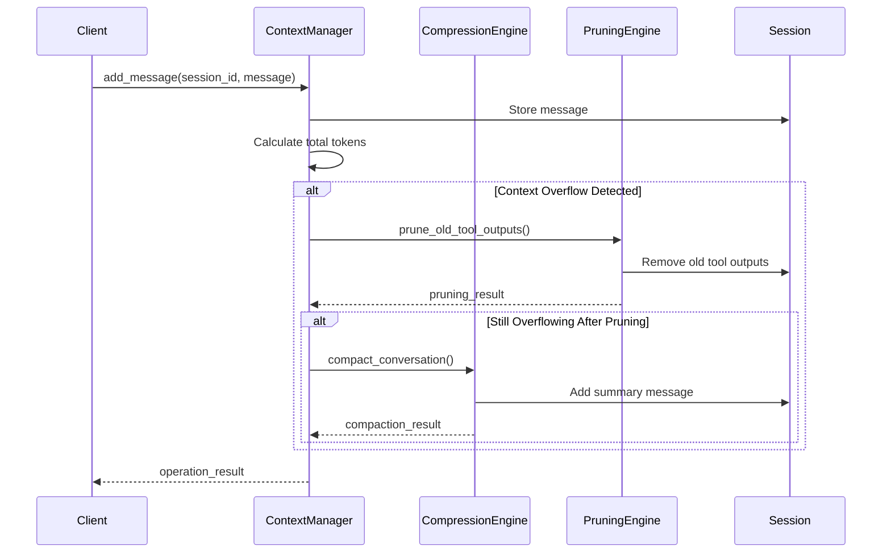
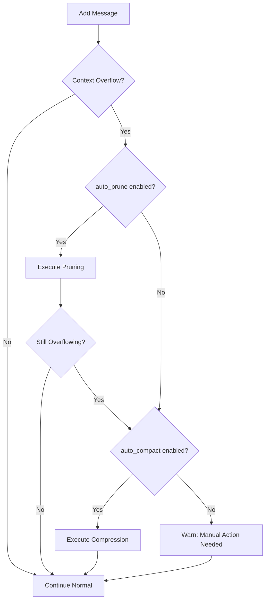

# Architecture: OpenCode-style Context Management System

## Overview

This document details the architecture of the OpenCode-style context management system, which provides intelligent conversation context management for AI agents with automatic compression and pruning capabilities.

## System Architecture

### High-Level Design

```
┌─────────────────────────────────────────────────────────────┐
│                    Application Layer                         │
├─────────────────────────────────────────────────────────────┤
│  AI Agent / Client Application                               │
│  • Sends messages to context manager                         │
│  • Receives compressed/optimized context                     │
└───────────────────────┬─────────────────────────────────────┘
                        │
┌───────────────────────┴─────────────────────────────────────┐
│                    Context Manager Layer                      │
├─────────────────────────────────────────────────────────────┤
│  OpenCodeContextManager                                      │
│  • Main orchestrator                                         │
│  • Session management                                        │
│  • Operation coordination                                    │
└───────────────┬──────────────────────────────┬──────────────┘
                │                              │
┌───────────────┴──────────────┐  ┌───────────┴──────────────┐
│      Compression Engine       │  │      Pruning Engine      │
├───────────────────────────────┤  ├──────────────────────────┤
│ • Conversation summarization  │  │ • Tool output management │
│ • Adaptive strategies         │  │ • Selective forgetting   │
│ • Cache management            │  │ • Token optimization     │
└───────────────┬───────────────┘  └───────────┬──────────────┘
                │                              │
┌───────────────┴──────────────────────────────┴──────────────┐
│                    Data Model Layer                          │
├─────────────────────────────────────────────────────────────┤
│  SessionState, Message, MessagePart, TokenCount              │
│  • Type-safe data structures                                 │
│  • Token tracking                                            │
│  • State management                                          │
└───────────────┬──────────────────────────────────────────────┘
                │
┌───────────────┴──────────────────────────────────────────────┐
│                    Event System Layer                         │
├─────────────────────────────────────────────────────────────┤
│  EventBus, ContextEventBus                                   │
│  • Pub/sub communication                                     │
│  • Loose coupling                                            │
│  • Monitoring and logging                                    │
└─────────────────────────────────────────────────────────────┘
```

## Core Components

### 1. OpenCodeContextManager

The main orchestrator that coordinates all context management operations.

**Responsibilities:**
- Session lifecycle management (create, update, delete)
- Message addition with automatic overflow handling
- Coordination between compression and pruning engines
- Configuration management
- Monitoring and statistics collection

**Key Methods:**
- `create_session()` - Initialize new conversation session
- `add_message()` - Add message with automatic overflow handling
- `manual_compact()` - Manually trigger compression
- `manual_prune()` - Manually trigger pruning
- `get_session_stats()` - Retrieve session statistics

### 2. CompressionEngine

Implements intelligent conversation summarization (compaction) based on OpenCode's approach.

**Algorithm:**
1. **Context Selection**: Selects relevant messages for summarization
   - Always includes last 5 messages
   - Includes messages with important tool calls
   - Excludes already compressed summary messages

2. **Strategy Selection**: Chooses compression strategy based on conversation type
   - Debugging: Focus on errors and fixes (30% compression)
   - Code Review: Balance between detail and compression (50% compression)
   - Research: Preserve citations and findings (70% compression)
   - Default: General-purpose compression (50% compression)

3. **Summary Generation**: Creates comprehensive summary preserving:
   - What was accomplished
   - Current state
   - Next steps
   - Important context (decisions, constraints, assumptions)

4. **Cache Management**: Caches similar summaries to avoid redundant processing

### 3. PruningEngine

Implements selective pruning of old tool outputs to free up tokens.

**Algorithm (based on OpenCode implementation):**
```
PRUNE_PROTECT = 40,000 tokens  # Protect recent tokens
PRUNE_MINIMUM = 20,000 tokens  # Minimum tokens to trigger pruning
PROTECTED_TOOLS = ["skill"]    # Tools whose outputs are never pruned

procedure prune_old_tool_outputs(session):
    total_tokens = 0
    turns_count = 0
    
    for message in reversed(session.messages):
        if message.role == "user":
            turns_count++
            if turns_count < 2:
                continue  # Protect recent conversation
        
        if message.summary:
            break  # Stop at first summary
        
        for part in reversed(message.parts):
            if part.type == "tool" and part.state.status == "completed":
                if part.tool in PROTECTED_TOOLS:
                    continue
                
                if part.state.time.compacted:
                    break  # Stop at already compacted
                
                tokens = estimate_tokens(part.state.output)
                total_tokens += tokens
                
                if total_tokens > PRUNE_PROTECT:
                    part.state.output = "[PRUNED]"
                    part.state.time.compacted = now()
    
    if total_tokens_pruned > PRUNE_MINIMUM:
        update_session_tokens()
```

### 4. Data Models

#### SessionState
Represents a complete conversation session.

```python
@dataclass
class SessionState:
    id: str                    # Session identifier
    messages: List[Message]    # Conversation messages
    config: SessionConfig      # Compression/pruning configuration
    model_limits: ModelLimits  # LLM token limits
    total_tokens: int          # Current token count
    last_compaction_time: Optional[float]
    last_pruning_time: Optional[float]
    compaction_count: int
    pruned_tokens_total: int
```

#### Message
Represents a single message in the conversation with multi-part support.

```python
@dataclass
class Message:
    id: str
    role: MessageType          # user, assistant, system, compaction
    parts: List[MessagePart]   # Text, tool, file, reasoning parts
    tokens: TokenCount         # Token breakdown
    timestamp: float
    parent_id: Optional[str]   # For threaded conversations
    summary: bool              # Whether this is a summary message
```

#### TokenCount
Detailed token accounting for accurate overflow detection.

```python
@dataclass
class TokenCount:
    input: int       # Input tokens
    output: int      # Output tokens
    reasoning: int   # Reasoning tokens (for models with reasoning)
    cache_read: int  # Cache read tokens
    cache_write: int # Cache write tokens
    
    @property
    def total(self):
        return sum of all categories
```

### 5. Event System

#### EventBus
Pub/sub system for loose coupling between components.

**Event Types:**
- `session.created` - New session created
- `session.updated` - Session updated
- `compaction.started` - Compression started
- `compaction.completed` - Compression completed
- `pruning.started` - Pruning started
- `pruning.completed` - Pruning completed
- `context.overflow` - Context overflow detected

**Benefits:**
- Decouples components for easier testing and extension
- Enables monitoring and logging
- Supports event-driven workflows

## Workflow Diagrams

### Normal Message Flow



### Compression Decision Flow



## Configuration System

### SessionConfig

```python
@dataclass
class SessionConfig:
    auto_compact: bool = True           # Enable automatic compression
    auto_prune: bool = True             # Enable automatic pruning
    prune_protect_tokens: int = 40000   # Protect recent tokens
    prune_minimum_tokens: int = 20000   # Minimum pruning threshold
    output_token_max: int = 32000       # Max output tokens to reserve
    protected_tools: List[str] = ["skill", "code_search"]
    enable_caching: bool = True         # Cache compression results
    background_pruning: bool = True     # Non-blocking pruning
    incremental_counting: bool = True   # Efficient token counting
```

### ModelLimits

```python
@dataclass
class ModelLimits:
    context_limit: int   # Total context (e.g., 128000 for GPT-4)
    input_limit: int     # Input token limit
    output_limit: int    # Output token limit
    
    @property
    def usable_context(self):
        # Formula from OpenCode: context_limit - min(output_limit, 32000)
        return self.context_limit - min(self.output_limit, 32000)
```

## Token Management

### Overflow Detection

The system uses OpenCode's overflow detection formula:

```
is_overflow = total_tokens > usable_context
usable_context = model.context_limit - min(model.output_limit, 32000)
```

Where `32000` is OpenCode's `OUTPUT_TOKEN_MAX` constant.

### Token Counting Strategies

1. **Incremental Counting** (default):
   - Add/subtract tokens as messages are added/pruned
   - O(1) operation
   - Requires careful tracking

2. **Recalculation** (fallback):
   - Sum all message tokens when needed
   - O(n) operation
   - Accurate but expensive for large sessions

## Performance Considerations

### Caching Strategy

The compression engine implements LRU caching for summarization results:

1. **Cache Key Generation**: Based on message IDs, types, and tool usage
2. **Cache Size Management**: Configurable limit with LRU eviction
3. **Cache Invalidation**: Manual or based on message updates

### Background Operations

- **Pruning**: Can run in background thread to avoid blocking
- **Monitoring**: Periodic cleanup of expired sessions
- **Statistics**: Async calculation of session metrics

### Memory Management

1. **Session Limits**: Maximum sessions and session timeout
2. **Message Limits**: Optional limits on messages per session
3. **Cleanup**: Automatic cleanup of expired sessions

## Integration Patterns

### With AI Agent Frameworks

```python
class AIAgentWithContext:
    def __init__(self):
        self.context_manager = OpenCodeContextManager()
        self.llm_client = LLMClient()
    
    async def chat(self, user_input: str):
        # 1. Add user message to context
        user_msg = create_message(user_input, role="user")
        await self.context_manager.add_message(self.session_id, user_msg)
        
        # 2. Check for recent compression
        if self.context_manager.get_recent_compactions(self.session_id):
            # Include summary in prompt
            prompt = self.build_prompt_with_summary()
        else:
            prompt = self.build_normal_prompt()
        
        # 3. Generate response
        response = await self.llm_client.complete(prompt)
        
        # 4. Add assistant response to context
        assistant_msg = create_message(response, role="assistant")
        await self.context_manager.add_message(self.session_id, assistant_msg)
        
        return response
```

### With Vector Databases

Combine with vector search for enhanced context retrieval:

```python
class HybridContextManager:
    async def get_relevant_context(self, query: str):
        # 1. Get recent messages
        recent = self.context_manager.get_recent_messages(limit=20)
        
        # 2. Search vector DB for historical context
        similar = await self.vector_db.search(query, limit=5)
        
        # 3. Apply compression if needed
        if self._exceeds_limit(recent + similar):
            compressed = await self.context_manager.compress_context(recent)
            return compressed + similar
        else:
            return recent + similar
```

## Monitoring and Observability

### Metrics Collected

1. **Session Metrics**:
   - Total messages and tokens
   - Compression/pruning counts
   - Token usage percentage
   - Operation effectiveness

2. **System Metrics**:
   - Total sessions managed
   - Cache hit rates
   - Operation latencies
   - Error rates

3. **Event History**:
   - All system events with timestamps
   - Operation results and statistics
   - Warnings and errors

### Export Capabilities

- **Session Summary**: Comprehensive session state export
- **Compression History**: Timeline of compression operations
- **Statistics Report**: Aggregated metrics and insights
- **Event Logs**: Complete event history for debugging

## Best Practices

### Configuration Guidelines

1. **Start Conservative**:
   - Begin with higher protection thresholds
   - Gradually adjust based on observed patterns
   - Monitor compression effectiveness

2. **Tool Protection**:
   - Identify critical tools for your use case
   - Protect tools whose outputs remain relevant
   - Review tool usage patterns regularly

3. **Model-Specific Tuning**:
   - Adjust thresholds based on model context limits
   - Consider model-specific behaviors (reasoning tokens, etc.)
   - Test with actual model interactions

### Performance Optimization

1. **Enable Caching**: For repeated conversation patterns
2. **Use Background Pruning**: For better responsiveness
3. **Implement Incremental Counting**: For large sessions
4. **Set Session Limits**: To prevent memory growth

### Testing Strategies

1. **Unit Tests**: Individual component testing
2. **Integration Tests**: End-to-end workflow testing
3. **Load Tests**: Performance under heavy usage
4. **Effectiveness Tests**: Quality of compression results

## Limitations and Considerations

### Known Limitations

1. **Summary Quality**: Compression relies on AI summarization quality
2. **Tool Output Understanding**: Pruning may remove potentially relevant tool outputs
3. **Conversation Type Detection**: Simple keyword-based detection has limitations
4. **Token Estimation**: Character-based token estimation is approximate

### Future Enhancements

1. **Advanced NLP**: Better conversation analysis and topic detection
2. **Learning Systems**: Adaptive strategies based on user feedback
3. **Multi-modal Support**: Compression of images, code, and other content types
4. **Distributed Sessions**: Support for very large conversations across multiple sessions

## References

- [OpenCode GitHub Repository](https://github.com/anomalyco/opencode)
- [OpenCode Compaction Implementation](/packages/opencode/src/session/compaction.ts)
- [Model Context Protocol](https://spec.modelcontextprotocol.io/)
- [LLM Context Window Research](https://arxiv.org/abs/2307.03172)
