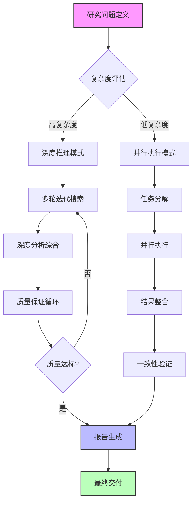
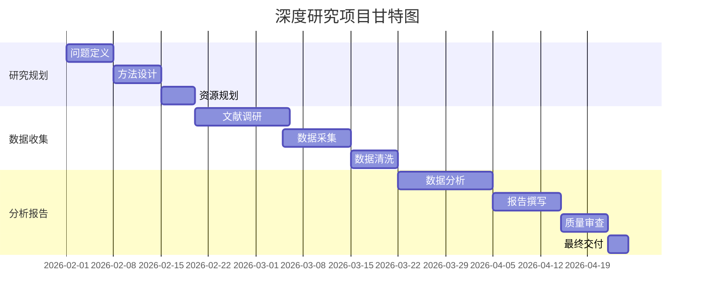
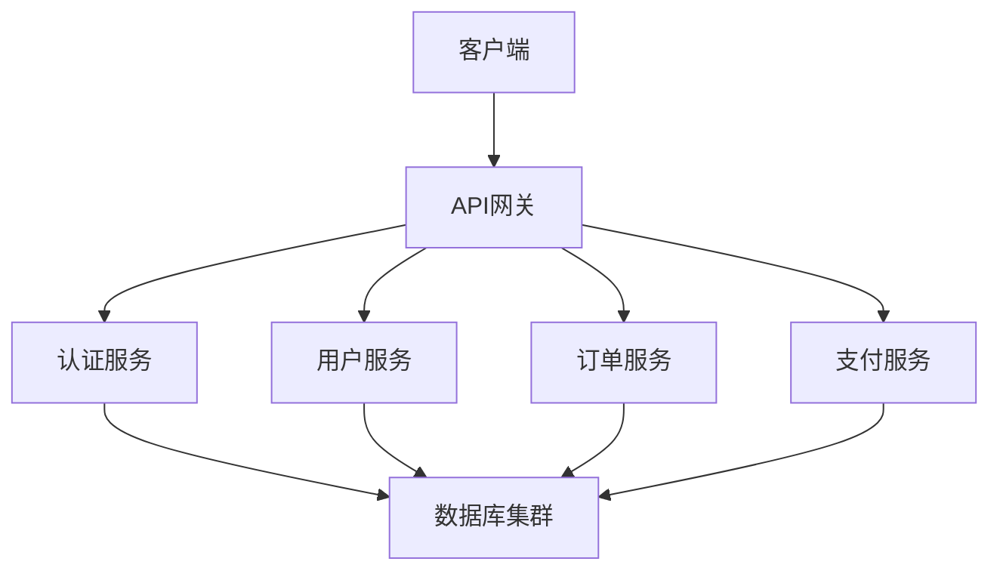

# 2025新一代深度研究数据可视化指南

## 🎯 概述

本指南提供了2025年新一代深度研究智能体系统的数据可视化最佳实践，整合了传统可视化原则与AI驱动的智能可视化技术。基于现代研究报告中可视化需求，提供了从基础图表到高级交互式可视化的完整方法论，确保研究成果以最有效、最直观的方式呈现。

---

## 📊 可视化设计原则

### 1. 核心设计原则
| 原则 | 描述 | 关键实践 | 质量检查 |
|------|------|----------|----------|
| **清晰性** | 每个可视化传达一个清晰的洞察 | 单一焦点、明确标题、简化装饰 | 10秒内能理解核心信息 |
| **准确性** | 准确反映数据，无误导性呈现 | 适当比例轴、完整标签、避免扭曲 | 数据与视觉呈现一致 |
| **效率性** | 用最少视觉元素传达最多信息 | 数据墨水比最大化、去除冗余 | 信息密度与可读性平衡 |
| **美观性** | 视觉吸引力但不分散注意力 | 协调配色、平衡布局、专业字体 | 符合目标受众审美 |
| **可访问性** | 所有用户都能访问和理解 | 色盲友好配色、足够对比度、文字替代 | 通过可访问性测试 |

### 2. 目标受众适配
**不同受众的可视化策略**：
| 受众类型 | 可视化重点 | 复杂度 | 交互性 | 技术细节 |
|----------|------------|--------|--------|----------|
| **高管决策者** | 关键指标、趋势、影响 | 低 | 有限 | 最小化 |
| **技术专家** | 细节数据、方法、比较 | 高 | 中等 | 详细 |
| **学术研究者** | 严谨性、方法论、引用 | 中高 | 有限 | 适当 |
| **普通公众** | 故事性、直观性、情感 | 低 | 高 | 简化 |

---

## 📈 图表选择矩阵

### 1. 基于数据类型的图表选择
| 数据类型 | 比较 | 分布 | 关系 | 构成 | 趋势 | 地理 |
|----------|------|------|------|------|------|------|
| **分类数据** | 条形图 | 直方图 | 散点图 | 堆叠条形图 | 折线图 | 地理气泡图 |
| **数值数据** | 箱形图 | 密度图 | 散点图 | 堆叠面积图 | 折线图 | 等值线图 |
| **时间序列** | 分组条形图 | 时间直方图 | 热力图 | 堆叠面积图 | 折线图 | 动画地图 |
| **层次数据** | 树状图 | 旭日图 | 网络图 | 矩形树图 | 时间树 | 地理层级图 |

### 2. 基于分析目的的图表选择
```python
# 智能图表选择算法
def select_chart_type(data_type, analysis_purpose, audience_level):
    """基于数据类型和分析目的智能选择图表类型"""
    chart_selection_matrix = {
        ('categorical', 'comparison', 'executive'): 'grouped_bar_chart',
        ('categorical', 'comparison', 'technical'): 'multi_bar_chart',
        ('numerical', 'distribution', 'executive'): 'histogram_simple',
        ('numerical', 'distribution', 'technical'): 'box_plot_detailed',
        ('time_series', 'trend', 'executive'): 'line_chart_highlight',
        ('time_series', 'trend', 'technical'): 'multi_line_chart',
        ('mixed', 'relationship', 'executive'): 'scatter_plot_simple',
        ('mixed', 'relationship', 'technical'): 'scatter_plot_matrix',
        ('hierarchical', 'composition', 'executive'): 'treemap_simple',
        ('hierarchical', 'composition', 'technical'): 'sunburst_chart'
    }
    
    key = (data_type, analysis_purpose, audience_level)
    return chart_selection_matrix.get(key, 'bar_chart')  # 默认值
```

### 3. 复杂场景的图表组合
**多维度分析可视化策略**：
| 分析维度 | 可视化组合 | 布局策略 | 交互特性 |
|----------|------------|----------|----------|
| **时间+分类+数值** | 分组折线图 + 热力图 | 上下布局 | 时间滑块 + 分类筛选 |
| **地理+时间+强度** | 动画地图 + 时间轴 | 主次布局 | 播放控制 + 强度调节 |
| **网络+属性+时间** | 力导向图 + 属性面板 | 并列布局 | 节点筛选 + 时间切片 |
| **层次+数值+分布** | 矩形树图 + 直方图 | 主辅布局 | 层级钻取 + 分布对比 |

---

## 🎨 高级可视化技术

### 1. 交互式可视化框架
```python
# 交互式可视化组件框架
class InteractiveVisualization:
    def __init__(self, data, chart_type, audience):
        self.data = data
        self.chart_type = chart_type
        self.audience = audience
        self.interactive_elements = []
    
    def add_filter(self, dimension, filter_type='range'):
        """添加数据筛选器"""
        filter_component = {
            'type': 'filter',
            'dimension': dimension,
            'filter_type': filter_type,
            'interaction': '实时更新'
        }
        self.interactive_elements.append(filter_component)
        return self
    
    def add_drilldown(self, hierarchy_levels):
        """添加层级钻取功能"""
        drilldown_component = {
            'type': 'drilldown',
            'levels': hierarchy_levels,
            'interaction': '点击钻取/上卷'
        }
        self.interactive_elements.append(drilldown_component)
        return self
    
    def add_comparison(self, comparison_mode='side_by_side'):
        """添加比较功能"""
        comparison_component = {
            'type': 'comparison',
            'mode': comparison_mode,
            'interaction': '多选比较'
        }
        self.interactive_elements.append(comparison_component)
        return self
    
    def generate_config(self):
        """生成可视化配置"""
        return {
            'chart_type': self.chart_type,
            'audience_optimized': True,
            'interactive_elements': self.interactive_elements,
            'accessibility_features': ['colorblind_friendly', 'keyboard_nav']
        }
```

### 2. 动画与叙事可视化
**数据叙事框架**：
```python
# 数据叙事可视化脚本
def create_data_story(data_points, narrative_flow):
    """创建数据叙事可视化"""
    story_steps = []
    
    for i, (data_step, narrative) in enumerate(zip(data_points, narrative_flow)):
        step = {
            'step_number': i + 1,
            'visualization': create_step_visualization(data_step, narrative['focus']),
            'narrative_text': narrative['text'],
            'highlight_elements': narrative.get('highlights', []),
            'transition_effect': narrative.get('transition', 'fade')
        }
        story_steps.append(step)
    
    return {
        'story_title': narrative_flow[0]['title'],
        'total_steps': len(story_steps),
        'estimated_duration': len(story_steps) * 15,  # 每步15秒
        'steps': story_steps,
        'interaction_options': ['auto_play', 'manual_control', 'step_jump']
    }
```

### 3. AI增强的可视化生成
```python
# AI驱动可视化生成管道
def ai_enhanced_visualization_pipeline(data, analysis_insights):
    """AI增强的可视化生成管道"""
    # 1. 数据理解和洞察提取
    data_characteristics = analyze_data_characteristics(data)
    key_insights = extract_key_insights(analysis_insights)
    
    # 2. 可视化建议生成
    visualization_suggestions = generate_visualization_suggestions(
        data_characteristics, key_insights
    )
    
    # 3. 自动图表生成
    generated_charts = []
    for suggestion in visualization_suggestions[:3]:  # 生成前3个建议
        chart = generate_chart_automatically(data, suggestion['chart_type'])
        generated_charts.append({
            'suggestion': suggestion,
            'chart': chart,
            'effectiveness_score': evaluate_chart_effectiveness(chart, key_insights)
        })
    
    # 4. 优化和增强
    optimized_charts = optimize_visualizations(generated_charts)
    
    return {
        'data_summary': data_characteristics,
        'key_insights': key_insights,
        'suggested_visualizations': visualization_suggestions,
        'generated_charts': optimized_charts,
        'recommended_chart': select_best_chart(optimized_charts)
    }
```

---

## 🔧 技术实现示例

### 1. Python可视化库高级用法

#### Matplotlib增强模板
```python
import matplotlib.pyplot as plt
import numpy as np
import seaborn as sns
from matplotlib.patches import Patch

def create_enhanced_line_chart(data, title, x_label, y_label, highlight_points=None):
    """创建增强型折线图"""
    fig, ax = plt.subplots(figsize=(12, 7))
    
    # 基础折线
    ax.plot(data['x'], data['y'], 
            linewidth=2.5, 
            color='#2E86AB',
            label='主要趋势',
            zorder=3)
    
    # 置信区间（如果有）
    if 'confidence_lower' in data and 'confidence_upper' in data:
        ax.fill_between(data['x'], 
                       data['confidence_lower'], 
                       data['confidence_upper'],
                       alpha=0.2, 
                       color='#2E86AB',
                       label='95% 置信区间')
    
    # 高亮点标注
    if highlight_points:
        for point in highlight_points:
            ax.scatter(point['x'], point['y'], 
                      s=120, 
                      color='#A23B72',
                      edgecolors='white',
                      linewidth=2,
                      zorder=5,
                      label=point.get('label', '关键点'))
            
            # 添加标注文本
            if 'annotation' in point:
                ax.annotate(point['annotation'],
                           xy=(point['x'], point['y']),
                           xytext=(point.get('text_x', point['x'] + 0.5),
                                  point.get('text_y', point['y'] + 0.5)),
                           fontsize=10,
                           color='#333333',
                           arrowprops=dict(arrowstyle='->',
                                          color='#666666',
                                          lw=1))
    
    # 增强样式
    ax.set_title(title, fontsize=16, fontweight='bold', pad=20)
    ax.set_xlabel(x_label, fontsize=12, labelpad=10)
    ax.set_ylabel(y_label, fontsize=12, labelpad=10)
    
    # 网格和样式
    ax.grid(True, alpha=0.3, linestyle='--', linewidth=0.5)
    ax.spines['top'].set_visible(False)
    ax.spines['right'].set_visible(False)
    
    # 图例
    ax.legend(loc='best', framealpha=0.9, edgecolor='#DDDDDD')
    
    # 自动调整布局
    plt.tight_layout()
    
    return fig, ax
```

#### Plotly交互式图表
```python
import plotly.graph_objects as go
import plotly.express as px
from plotly.subplots import make_subplots

def create_interactive_dashboard(data_dict, layout_config):
    """创建交互式仪表板"""
    # 创建子图
    fig = make_subplots(
        rows=layout_config['rows'],
        cols=layout_config['cols'],
        subplot_titles=layout_config['titles'],
        specs=layout_config.get('specs', None),
        vertical_spacing=layout_config.get('vertical_spacing', 0.1),
        horizontal_spacing=layout_config.get('horizontal_spacing', 0.1)
    )
    
    # 添加各个图表
    chart_positions = {
        'main_trend': (1, 1),
        'distribution': (1, 2),
        'comparison': (2, 1),
        'composition': (2, 2)
    }
    
    # 主趋势图
    fig.add_trace(
        go.Scatter(
            x=data_dict['trend']['x'],
            y=data_dict['trend']['y'],
            mode='lines+markers',
            name='趋势',
            line=dict(color='#2E86AB', width=3),
            marker=dict(size=8, color='#2E86AB'),
            hovertemplate='时间: %{x}<br>值: %{y:.2f}<extra></extra>'
        ),
        row=chart_positions['main_trend'][0],
        col=chart_positions['main_trend'][1]
    )
    
    # 分布图
    fig.add_trace(
        go.Histogram(
            x=data_dict['distribution']['values'],
            nbinsx=30,
            name='分布',
            marker_color='#A23B72',
            opacity=0.7,
            hovertemplate='范围: %{x}<br>频数: %{y}<extra></extra>'
        ),
        row=chart_positions['distribution'][0],
        col=chart_positions['distribution'][1]
    )
    
    # 更新布局
    fig.update_layout(
        title_text=layout_config.get('dashboard_title', '交互式仪表板'),
        title_font_size=20,
        showlegend=True,
        hovermode='closest',
        template='plotly_white',
        height=800,
        width=1200
    )
    
    # 添加交互控件
    fig.update_layout(
        updatemenus=[
            dict(
                type='dropdown',
                direction='down',
                active=0,
                x=1.0,
                y=1.15,
                buttons=[
                    dict(label='全部数据',
                         method='update',
                         args=[{'visible': [True, True, True, True]},
                               {'title': '全部数据视图'}]),
                    dict(label='仅趋势',
                         method='update',
                         args=[{'visible': [True, False, False, False]},
                               {'title': '趋势分析'}]),
                ]
            )
        ]
    )
    
    return fig
```

### 2. Mermaid图表增强

#### 高级流程图


#### 时间线增强版
```mermaid
timeline
    title 深度研究项目时间线
    section 阶段1: 规划与设计
        第1周 : 问题澄清与范围界定
        第2周 : 研究方法设计
        第3周 : 资源分配与团队组建
    section 阶段2: 执行与分析
        第4-6周 : 数据收集与处理
        第7-9周 : 深度分析与洞察提取
        第10周 : 中期质量审查
    section 阶段3: 报告与交付
        第11-12周 : 报告撰写与可视化
        第13周 : 质量保证与修订
        第14周 : 最终交付与演示
```

#### 甘特图项目规划


### 3. 仪表板与报告集成

#### 研究质量仪表板
```python
def create_research_quality_dashboard(quality_metrics):
    """创建研究质量仪表板"""
    dashboard_data = {
        '总体质量指标': {
            '综合质量评分': quality_metrics.get('overall_score', 0),
            '源质量指数': quality_metrics.get('source_quality', 0),
            '分析深度评分': quality_metrics.get('analysis_depth', 0),
            '报告质量评分': quality_metrics.get('report_quality', 0)
        },
        '过程质量指标': {
            '计划执行率': quality_metrics.get('plan_execution_rate', 0),
            '时间利用率': quality_metrics.get('time_utilization', 0),
            '资源效率': quality_metrics.get('resource_efficiency', 0),
            '里程碑达成率': quality_metrics.get('milestone_completion', 0)
        },
        '结果质量指标': {
            '洞察新颖性': quality_metrics.get('insight_novelty', 0),
            '建议可行性': quality_metrics.get('recommendation_feasibility', 0),
            '影响潜力': quality_metrics.get('impact_potential', 0),
            '用户满意度': quality_metrics.get('user_satisfaction', 0)
        }
    }
    
    # 创建仪表板可视化
    fig = make_subplots(
        rows=2, cols=2,
        specs=[[{'type': 'indicator'}, {'type': 'indicator'}],
               [{'type': 'bar'}, {'type': 'radar'}]],
        subplot_titles=('总体质量', '过程质量', '维度对比', '质量雷达图')
    )
    
    # 指标显示
    fig.add_trace(
        go.Indicator(
            mode='gauge+number',
            value=dashboard_data['总体质量指标']['综合质量评分'],
            title={'text': '综合质量'},
            gauge={'axis': {'range': [0, 10]},
                   'steps': [
                       {'range': [0, 6], 'color': 'lightgray'},
                       {'range': [6, 8], 'color': 'gray'},
                       {'range': [8, 10], 'color': 'green'}],
                   'threshold': {
                       'line': {'color': 'red', 'width': 4},
                       'thickness': 0.75,
                       'value': 8}}
        ),
        row=1, col=1
    )
    
    # 更多图表添加...
    
    return fig
```

---

## 📋 可视化质量检查清单

### 1. 设计完整性检查
- [ ] **目的明确性**：可视化是否清晰传达单一核心信息？
- [ ] **数据准确性**：图表是否准确反映原始数据？
- [ ] **受众适配性**：复杂度是否适合目标受众？
- [ ] **美学协调性**：颜色、字体、布局是否协调专业？

### 2. 技术规范性检查
- [ ] **分辨率适当**：图像分辨率适合使用场景（Web: 72-150 DPI, 印刷: 300+ DPI）
- [ ] **格式优化**：文件格式适合用途（PNG: Web, SVG: 矢量, PDF: 印刷）
- [ ] **加载性能**：文件大小优化，加载时间合理
- [ ] **跨平台兼容**：在不同设备和浏览器上正常显示

### 3. 可访问性检查
- [ ] **色盲友好**：使用色盲友好的配色方案
- [ ] **对比度足够**：文本和背景有足够对比度（WCAG AA标准）
- [ ] **文字替代**：为图像提供文字描述（alt text）
- [ ] **键盘导航**：交互元素支持键盘导航

### 4. 集成与文档检查
- [ ] **引用完整**：数据来源正确引用
- [ ] **上下文明确**：图表在报告中的位置和说明适当
- [ ] **代码可复现**：可视化生成代码可复现
- [ ] **版本管理**：可视化文件有版本控制

### 5. 自动化质量检查脚本
```python
def automated_visualization_qa(chart_file, chart_metadata):
    """自动化可视化质量检查"""
    qa_results = {
        'technical_checks': {},
        'design_checks': {},
        'accessibility_checks': {},
        'overall_score': 0
    }
    
    # 技术检查
    qa_results['technical_checks']['resolution'] = check_resolution(chart_file)
    qa_results['technical_checks']['file_size'] = check_file_size(chart_file)
    qa_results['technical_checks']['format'] = check_file_format(chart_file)
    
    # 设计检查
    qa_results['design_checks']['color_usage'] = analyze_color_usage(chart_file)
    qa_results['design_checks']['typography'] = check_typography(chart_file)
    qa_results['design_checks']['layout'] = evaluate_layout(chart_file)
    
    # 可访问性检查
    qa_results['accessibility_checks']['colorblind'] = test_colorblind_accessibility(chart_file)
    qa_results['accessibility_checks']['contrast'] = check_contrast_ratios(chart_file)
    
    # 综合评分
    technical_score = calculate_score(qa_results['technical_checks'])
    design_score = calculate_score(qa_results['design_checks'])
    accessibility_score = calculate_score(qa_results['accessibility_checks'])
    
    qa_results['overall_score'] = (
        technical_score * 0.4 +
        design_score * 0.4 +
        accessibility_score * 0.2
    )
    
    qa_results['quality_level'] = (
        '优秀' if qa_results['overall_score'] >= 8.5 else
        '良好' if qa_results['overall_score'] >= 7.0 else
        '合格' if qa_results['overall_score'] >= 5.0 else
        '需改进'
    )
    
    return qa_results
```

---

## 🔄 与研究报告模板集成

### 1. 模板特定的可视化指南

#### 学术报告模板可视化
**特点**：严谨性、可复现性、引用完整性
**可视化要求**：
- 使用标准学术图表格式
- 详细的方法论说明
- 完整的数据来源引用
- 可复现的代码附录

**示例集成**：
```markdown
## 研究结果可视化

### 图1: 主要变量关系散点图


**图表说明**: 本图展示了X变量与Y变量之间的关系，每个点代表一个观测样本，颜色深浅表示数据密度。

**数据来源**: [数据来源引用]
**分析方法**: 使用Python的Matplotlib库生成，详细代码见附录A。
```

#### 商业决策报告模板可视化
**特点**：简洁性、洞察突出、行动导向
**可视化要求**：
- 关键指标突出显示
- 趋势和对比清晰
- 行动建议可视化
- 执行时间线明确

**示例集成**：
```markdown
## 关键指标仪表板

### 市场机会评估
```python
# 交互式机会评估图表
create_opportunity_matrix(market_data, criteria_weights)
```

**核心洞察**：
1. **高机会区域**：显示在右上象限，建议优先投资
2. **增长趋势**：过去3年复合增长率25%
3. **竞争格局**：主要竞争对手市场份额分布
```

#### 技术深度报告模板可视化
**特点**：详细性、技术准确性、实现指导
**可视化要求**：
- 技术架构图清晰
- 性能对比数据可视化
- 实现流程图详细
- 代码示例可视化

**示例集成**：
```markdown
## 系统架构可视化

### 图2: 微服务架构图


**架构说明**: 采用微服务架构，各服务独立部署，通过API网关统一访问。
```

### 2. 可视化自动生成管道
```python
def visualization_generation_pipeline(research_data, template_type):
    """基于研究数据和模板类型自动生成可视化"""
    # 1. 数据分析和洞察提取
    insights = extract_insights_from_data(research_data)
    
    # 2. 基于模板的可视化规划
    visualization_plan = plan_visualizations(insights, template_type)
    
    # 3. 图表生成
    generated_charts = []
    for chart_spec in visualization_plan['charts']:
        chart = generate_chart(
            research_data,
            chart_spec['type'],
            chart_spec['config']
        )
        generated_charts.append({
            'id': chart_spec['id'],
            'type': chart_spec['type'],
            'chart': chart,
            'caption': generate_caption(chart, insights, template_type),
            'position': chart_spec['position']
        })
    
    # 4. 报告集成
    integrated_report = integrate_visualizations_into_report(
        generated_charts,
        template_type
    )
    
    return {
        'visualization_plan': visualization_plan,
        'generated_charts': generated_charts,
        'integrated_report': integrated_report,
        'quality_assessment': assess_visualization_quality(generated_charts)
    }
```

---

## 🚀 实施与最佳实践

### 1. 实施步骤
#### 阶段1：需求分析与规划
1. **受众分析**：确定目标受众和他们的可视化需求
2. **数据评估**：评估可用数据的可视化潜力
3. **工具选择**：选择适合的技术栈和工具
4. **标准制定**：制定内部可视化标准和规范

#### 阶段2：系统开发与集成
1. **模板开发**：开发报告模板特定的可视化组件
2. **自动化管道**：建立自动化可视化生成管道
3. **质量系统**：集成可视化质量保证系统
4. **培训材料**：创建使用指南和培训材料

#### 阶段3：优化与扩展
1. **性能优化**：优化可视化生成和加载性能
2. **用户体验**：基于反馈改进用户体验
3. **技术更新**：跟踪和集成新的可视化技术
4. **知识积累**：积累成功的可视化模式和案例

### 2. 最佳实践总结
#### 设计最佳实践
- **一致性优先**：在整个报告中保持一致的视觉风格
- **渐进式披露**：复杂信息分层逐步展示
- **故事化呈现**：用可视化讲述数据故事
- **反馈循环**：基于用户反馈持续改进

#### 技术最佳实践
- **模块化设计**：创建可复用的可视化组件
- **性能优化**：优化大型数据集的可视化性能
- **错误处理**：优雅处理数据错误和边界情况
- **版本控制**：对可视化代码和输出进行版本控制

#### 协作最佳实践
- **文档完整**：完整记录可视化设计决策和实现
- **代码审查**：对可视化代码进行同行审查
- **知识共享**：定期分享可视化最佳实践和技巧
- **跨团队协作**：与设计、开发、业务团队紧密协作

### 3. 常见问题与解决方案
| 问题 | 症状 | 解决方案 |
|------|------|----------|
| **可视化过于复杂** | 用户难以理解核心信息 | 简化设计，聚焦核心洞察，分层展示 |
| **加载性能差** | 图表加载缓慢，交互卡顿 | 优化数据量，使用懒加载，压缩资源 |
| **跨设备兼容性问题** | 在不同设备上显示不一致 | 响应式设计，跨浏览器测试，降级方案 |
| **可访问性不足** | 部分用户无法使用 | 遵循WCAG标准，全面可访问性测试 |
| **维护困难** | 可视化代码难以维护更新 | 模块化设计，清晰文档，版本控制 |

### 4. 成功指标
| 指标类别 | 具体指标 | 目标值 | 测量方法 |
|----------|----------|--------|----------|
| **质量指标** | 用户理解度 | ≥85% | 用户测试 |
| | 设计一致性 | ≥90% | 设计审查 |
| | 错误率 | ≤5% | 错误跟踪 |
| **性能指标** | 加载时间 | ≤3秒 | 性能监控 |
| | 交互响应 | ≤100ms | 性能测试 |
| | 内存使用 | ≤50MB | 资源监控 |
| **业务指标** | 报告采纳率 | ≥80% | 使用统计 |
| | 决策支持度 | ≥75% | 用户反馈 |
| | 时间节省 | ≥40% | 效率对比 |

---

**版本**: v5.0 (2025新一代可视化指南)
**最后更新**: 2026-02-07
**核心原则**: 清晰性、准确性、效率性、美观性、可访问性
**技术栈**: Python可视化生态 + 交互式图表 + AI增强生成
**集成能力**: 与研究报告模板深度集成，支持自动化生成
**质量保证**: 自动化质量检查 + 设计规范 + 可访问性标准
**最佳实践**: 故事化呈现、渐进式披露、模块化设计、持续优化
**成功目标**: 用户理解度≥85%，加载时间≤3秒，报告采纳率≥80%
