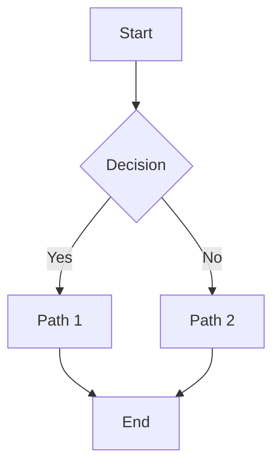
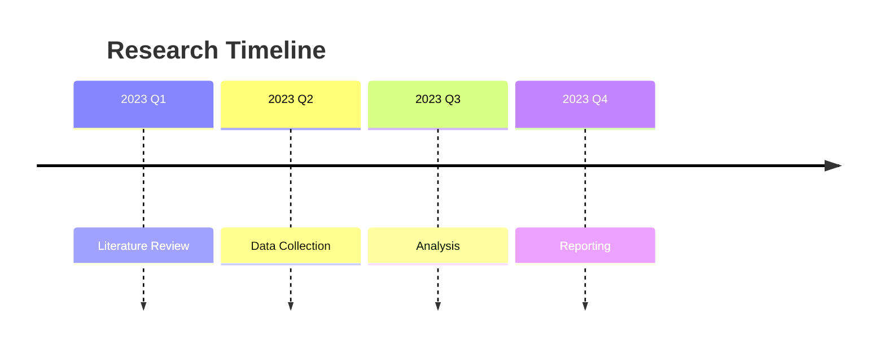

# Data Visualization Guide

This guide provides best practices for creating effective visualizations in research reports.

## Basic Principles

1. **Clarity**: Each visualization should communicate one clear insight
2. **Accuracy**: Scales should be appropriate, data not distorted
3. **Efficiency**: Minimum ink for maximum information
4. **Aesthetics**: Visually pleasing without distracting decorations

## Chart Selection Guide

| Data Type | Comparison | Distribution | Relationship | Composition | Trend |
|-----------|------------|--------------|--------------|-------------|-------|
| **Categorical** | Bar chart | Histogram | Scatter plot | Stacked bar | Line chart |
| **Numerical** | Box plot | Histogram | Scatter plot | Stacked area | Line chart |
| **Time Series** | Grouped bar | Density plot | Heatmap | Stacked area | Line chart |

## Python Examples

### Basic Line Plot
```python
import matplotlib.pyplot as plt
import numpy as np

x = np.arange(0, 10, 0.1)
y = np.sin(x)
plt.figure(figsize=(10, 6))
plt.plot(x, y, label='Sine Wave')
plt.title('Example Plot')
plt.xlabel('X-axis')
plt.ylabel('Y-axis')
plt.legend()
plt.grid(True, alpha=0.3)
plt.tight_layout()
plt.show()
```

### Bar Chart
```python
categories = ['A', 'B', 'C', 'D']
values = [23, 45, 56, 78]
plt.bar(categories, values, color=['#2E86AB', '#A23B72', '#F18F01', '#C73E1D'])
plt.title('Bar Chart Example')
plt.ylabel('Values')
plt.show()
```

## Mermaid Diagrams

### Flowchart


### Timeline


## Best Practices Checklist

- [ ] Chart type matches data and purpose
- [ ] Colors are accessible (colorblind-friendly)
- [ ] Axis labels include units
- [ ] Title clearly describes content
- [ ] Legend is positioned appropriately
- [ ] Data source is cited
- [ ] Resolution appropriate for medium (300 DPI for print)
- [ ] File format appropriate (PNG for web, PDF for print)
