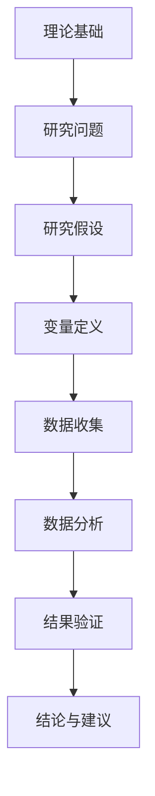
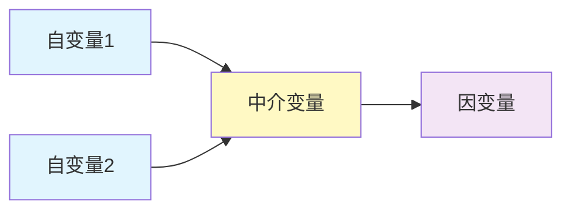

# 🎓 学术研究报告模板 | Academic Research Report Template

> **适用场景**：文献综述、学术研究、学位论文、研究项目申报

## 摘要 | Abstract

**[背景]** [研究领域背景介绍，1-2句]  
**[目的]** 本研究旨在[研究目的陈述]  
**[方法]** 采用[研究方法描述]，通过[数据来源/样本]分析[分析对象]  
**[结果]** 研究发现[主要发现摘要]  
**[结论]** 研究表明[主要结论]，对[领域/实践]具有[理论/实践意义]

**关键词**：[关键词1]；[关键词2]；[关键词3]；[关键词4]；[关键词5]

---

## 目录 | Contents

1. [引言](#1-引言)
2. [文献综述](#2-文献综述)
3. [研究方法](#3-研究方法)
4. [研究结果](#4-研究结果)
5. [讨论](#5-讨论)
6. [结论与展望](#6-结论与展望)
7. [参考文献](#7-参考文献)
8. [附录](#8-附录)

---

## 1. 引言 | Introduction

### 1.1 研究背景与意义
[阐述研究领域的现状、发展趋势，说明本研究的重要性和必要性]

#### 1.1.1 理论背景
- [相关理论发展脉络]
- [当前理论研究的不足]

#### 1.1.2 实践背景
- [实践中的应用现状]
- [实践中的问题与挑战]

### 1.2 研究问题与目标
#### 研究问题 (Research Questions):
1. RQ1: [描述性/探索性问题]
2. RQ2: [解释性/分析性问题]
3. RQ3: [预测性/建议性问题]

#### 研究目标 (Research Objectives):
1. RO1: [目标1：描述性目标]
2. RO2: [目标2：分析性目标]
3. RO3: [目标3：应用性目标]

### 1.3 研究范围与限制
**研究范围界定**：
- 理论范围：[涵盖的理论范围]
- 时间范围：[研究的时间跨度]
- 地理范围：[研究的地理范围]
- 样本范围：[研究的样本特征]

**研究限制**：
1. [限制1：如数据可获得性]
2. [限制2：如方法学局限]
3. [限制3：如资源限制]

### 1.4 论文结构安排
[简要说明各章节主要内容]

---

## 2. 文献综述 | Literature Review

### 2.1 核心概念界定
| 概念 | 定义 | 来源 | 本研究采用的定义 |
|------|------|------|------------------|
| [概念1] | [标准定义] | [来源文献] | [本研究操作化定义] |
| [概念2] | [标准定义] | [来源文献] | [本研究操作化定义] |

### 2.2 理论基础
#### 2.2.1 [理论一]
- **理论核心**：[理论主要内容]
- **代表人物**：[主要学者]
- **发展脉络**：[理论演进过程]
- **在本研究的应用**：[如何指导本研究]

#### 2.2.2 [理论二]
- **理论核心**：[理论主要内容]
- **代表人物**：[主要学者]
- **发展脉络**：[理论演进过程]
- **在本研究的应用**：[如何指导本研究]

### 2.3 研究现状综述
#### 2.3.1 国外研究现状
**主要研究方向**：
1. [方向一]：[代表性研究、主要观点、研究方法]
2. [方向二]：[代表性研究、主要观点、研究方法]

**研究趋势**：
- [趋势描述，如：从定性向定量发展]
- [热点领域变化]

#### 2.3.2 国内研究现状
**主要研究成果**：
1. [成果一]：[代表性研究、主要贡献]
2. [成果二]：[代表性研究、主要贡献]

**研究不足**：
- [不足一：如理论创新不足]
- [不足二：如实证研究缺乏]

### 2.4 研究述评与研究缺口
**现有研究总结**：
- 共识点：[学术界普遍认可的观点]
- 争议点：[存在分歧的领域]

**研究缺口 (Research Gap)**：
1. [缺口1：理论缺口]
2. [缺口2：方法缺口]
3. [缺口3：实证缺口]

**本研究的创新点**：
1. [创新点1：理论创新]
2. [创新点2：方法创新]
3. [创新点3：应用创新]

---

## 3. 研究方法 | Research Methodology

### 3.1 研究范式与设计
**研究范式**：□ 实证主义 □ 解释主义 □ 批判理论 □ 建构主义  
**研究设计**：□ 实验研究 □ 调查研究 □ 案例研究 □ 文献研究 □ 混合方法

#### 研究框架图


### 3.2 变量定义与测量
#### 变量定义表
| 变量类型 | 变量名称 | 操作化定义 | 测量指标 | 量表/工具 |
|----------|----------|------------|----------|-----------|
| **自变量** | [变量1] | [定义] | [指标1, 指标2] | [量表名称] |
| **因变量** | [变量2] | [定义] | [指标1, 指标2] | [量表名称] |
| **控制变量** | [变量3] | [定义] | [指标] | [测量方法] |

### 3.3 样本与数据
**抽样方法**：□ 随机抽样 □ 分层抽样 □ 整群抽样 □ 方便抽样 □ 目的抽样  
**样本规模**：n = [样本量]，基于[确定依据，如效应量、统计检验力]  
**数据来源**：
1. 一手数据：[收集方法、时间、地点]
2. 二手数据：[数据库名称、时间范围]

### 3.4 数据收集工具
#### 问卷设计（如适用）
**问卷结构**：
- 第一部分：基本信息（[项目数]项）
- 第二部分：[维度一]测量（[项目数]项，Cronbach's α = [值]）
- 第三部分：[维度二]测量（[项目数]项，Cronbach's α = [值]）

**预测试结果**：
- 项目分析：删除[数量]个不达标项目
- 信度分析：整体Cronbach's α = [值]
- 效度分析：[效度检验结果]

### 3.5 数据分析方法
| 分析目的 | 分析方法 | 软件工具 | 检验标准 |
|----------|----------|----------|----------|
| 描述性统计 | 均值、标准差、频率 | SPSS/R/Python | - |
| 信度检验 | Cronbach's α系数 | SPSS | α > 0.7 |
| 效度检验 | 探索性因子分析(EFA) | SPSS | KMO > 0.7 |
| 假设检验 | t检验/方差分析 | SPSS/R | p < 0.05 |
| 关系分析 | 相关分析/回归分析 | SPSS/R | R², β系数 |
| 模型检验 | 结构方程模型(SEM) | AMOS/R | χ²/df, CFI, RMSEA |

### 3.6 研究伦理考量
1. **知情同意**：[实施方式]
2. **隐私保护**：[保护措施]
3. **数据安全**：[安全措施]
4. **利益冲突**：[声明内容]

---

## 4. 研究结果 | Research Results

### 4.1 描述性统计分析
#### 样本特征分布
| 特征变量 | 类别 | 频数 | 百分比 | 累计百分比 |
|----------|------|------|--------|------------|
| [变量1] | [类别1] | [频数] | [百分比] | [累计百分比] |
|          | [类别2] | [频数] | [百分比] | [累计百分比] |

#### 主要变量描述
| 变量 | 样本量 | 均值 | 标准差 | 最小值 | 最大值 |
|------|--------|------|--------|--------|--------|
| [变量1] | n=[值] | M=[值] | SD=[值] | [最小值] | [最大值] |
| [变量2] | n=[值] | M=[值] | SD=[值] | [最小值] | [最大值] |

### 4.2 信度与效度检验
#### 信度分析结果
| 量表/维度 | 项目数 | Cronbach's α | 校正项总相关系数范围 | 结论 |
|-----------|--------|--------------|------------------------|------|
| [量表1] | [数量] | [α值] | [范围] | 信度[良好/可接受] |
| [维度1] | [数量] | [α值] | [范围] | 信度[良好/可接受] |

#### 效度分析结果
**探索性因子分析**：
- KMO值：[值]（[评价]）
- Bartlett球形检验：χ²([自由度]) = [值], p < [值]
- 累积解释方差：[百分比]

**验证性因子分析**（如适用）：
- χ²/df = [值]（<3）
- CFI = [值]（>0.9）
- TLI = [值]（>0.9）
- RMSEA = [值]（<0.08）

### 4.3 假设检验结果
#### 假设1：[假设陈述]
**检验方法**：[方法名称]
**结果**：[统计值] = [值], p = [值]
**结论**：假设[成立/不成立]

#### 假设2：[假设陈述]
**检验方法**：[方法名称]
**结果**：[统计值] = [值], p = [值]
**结论**：假设[成立/不成立]

### 4.4 模型检验结果
#### 回归分析结果
| 变量 | β系数 | 标准误 | t值 | p值 | VIF | 结论 |
|------|-------|--------|-----|-----|-----|------|
| 常数项 | [值] | [值] | [值] | [值] | - | - |
| [自变量1] | [值] | [值] | [值] | [值] | [值] | [显著/不显著] |
| [自变量2] | [值] | [值] | [值] | [值] | [值] | [显著/不显著] |
| **模型摘要** | R² = [值] | 调整R² = [值] | F([自由度]) = [值] | p = [值] | - | 模型[显著/不显著] |

#### 结构方程模型结果（如适用）


**模型拟合指数**：
- χ²/df = [值]
- CFI = [值]
- TLI = [值]
- RMSEA = [值]
- SRMR = [值]

**路径系数**：
- 路径1：[自变量] → [因变量]: β = [值], p = [值]
- 路径2：[自变量] → [中介变量]: β = [值], p = [值]
- 路径3：[中介变量] → [因变量]: β = [值], p = [值]

### 4.5 补充分析
#### 调节效应检验
**分组回归结果**：
| 组别 | 样本量 | R² | β系数 | t值 | p值 |
|------|--------|----|-------|-----|-----|
| [组1] | n=[值] | [值] | [值] | [值] | [值] |
| [组2] | n=[值] | [值] | [值] | [值] | [值] |

#### 稳健性检验
1. **更换模型设定**：[检验方法]，结果[保持一致/有差异]
2. **变换变量测量**：[检验方法]，结果[保持一致/有差异]
3. **处理内生性**：[检验方法，如工具变量]，结果[保持一致/有差异]

---

## 5. 讨论 | Discussion

### 5.1 主要发现解释
#### 发现一：[主要发现]
**与现有研究对比**：
- 一致性：[与哪些研究结论一致]
- 差异性：[与哪些研究结论不同]
- 可能的解释：[解释差异的原因]

**理论意义**：
- [对理论的贡献或修正]
- [理论解释的拓展]

#### 发现二：[主要发现]
[类似结构分析]

### 5.2 理论贡献
1. **理论拓展**：[扩展了哪个理论的应用范围]
2. **机制揭示**：[揭示了什么作用机制]
3. **边界条件**：[明确了理论的适用条件]
4. **整合视角**：[整合了不同理论视角]

### 5.3 实践启示
#### 对管理者的启示
1. [启示一：决策依据]
2. [启示二：管理实践]
3. [启示三：风险防范]

#### 对政策制定者的启示
1. [启示一：政策方向]
2. [启示二：监管重点]
3. [启示三：支持措施]

### 5.4 研究局限与未来方向
#### 研究局限
1. **方法学局限**：[如横截面数据、共同方法偏差]
2. **样本局限**：[如样本代表性、样本规模]
3. **测量局限**：[如测量工具、变量操作化]
4. **理论局限**：[如理论视角单一]

#### 未来研究方向
1. [方向一：纵向研究设计]
2. [方向二：跨文化比较]
3. [方向三：多方法融合]
4. [方向四：新兴技术应用]

---

## 6. 结论与展望 | Conclusion and Future Research

### 6.1 主要结论
1. **[结论一]**：[最重要结论]
   - **证据强度**：[基于什么证据]
   - **理论意义**：[对理论的贡献]

2. **[结论二]**：[次重要结论]
   - **证据强度**：[基于什么证据]
   - **实践意义**：[对实践的指导]

3. **[结论三]**：[其他重要结论]
   - **证据强度**：[基于什么证据]
   - **政策意义**：[对政策的启示]

### 6.2 研究创新点总结
| 创新维度 | 具体表现 | 贡献程度 |
|----------|----------|----------|
| 理论创新 | [创新内容] | 高/中/低 |
| 方法创新 | [创新内容] | 高/中/低 |
| 应用创新 | [创新内容] | 高/中/低 |

### 6.3 研究展望
#### 短期研究议程（1-2年）
1. [研究主题1]：[具体研究问题]
2. [研究主题2]：[具体研究问题]

#### 中长期研究方向（3-5年）
1. [研究方向1]：[宏观研究方向]
2. [研究方向2]：[跨学科方向]

---

## 7. 参考文献 | References

### 7.1 中文文献（GB/T 7714-2015格式）
1. 作者. 文献标题[J]. 期刊名, 出版年, 卷(期): 起止页码.
2. 作者. 专著名称[M]. 出版地: 出版社, 出版年: 引用页码.

### 7.2 英文文献（APA第7版格式）
1. Author, A. A., & Author, B. B. (Year). Title of article. *Title of Periodical, volume*(issue), pages. https://doi.org/xxxx
2. Author, C. C. (Year). *Title of book* (Edition). Publisher.

### 7.3 网络资源
1. Author. (Year, Month Day). *Title of webpage*. Site Name. Retrieved Month Day, Year, from URL

### 7.4 其他类型文献
[按实际需求添加]

---

## 8. 附录 | Appendices

### 附录A：调查问卷
[完整问卷内容]

### 附录B：访谈提纲
[访谈问题列表]

### 附录C：数据分析代码（关键部分）
```python
# 示例：描述性统计分析代码
import pandas as pd
import numpy as np

# 数据加载
data = pd.read_csv("research_data.csv")
# 描述性统计
desc_stats = data.describe()
print(desc_stats)
```

### 附录D：伦理审查批准文件
[伦理审查相关信息]

### 附录E：原始数据摘要
[数据的基本信息，不包含敏感信息]

---

## 致谢 | Acknowledgments

本研究得到[基金项目名称，项目编号]的资助，特此致谢。  
感谢[导师/同事姓名]在研究过程中给予的指导与帮助。  
感谢所有参与本研究的[调查对象/访谈对象]。

---

**作者贡献声明**：  
[作者1]：研究设计、数据收集、论文撰写  
[作者2]：数据分析、论文修改  
[作者3]：文献综述、理论框架  

**利益冲突声明**：作者声明不存在利益冲突。

**数据可用性声明**：本研究数据可在[数据仓库名称]获取，访问链接：[URL]。

**提交日期**：YYYY-MM-DD  
**修订日期**：YYYY-MM-DD  
**接受日期**：YYYY-MM-DD

---
*模板版本：学术版 v1.0 | 适用于深度研究技能*
