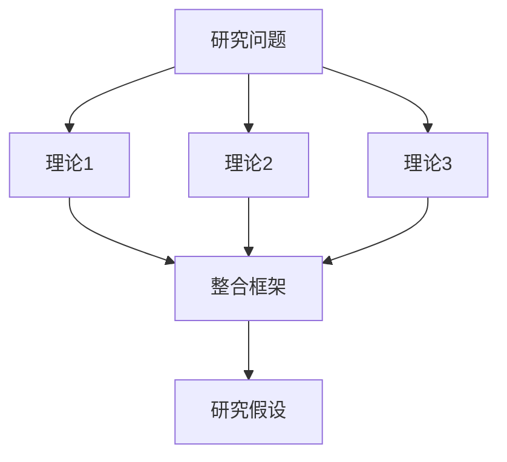
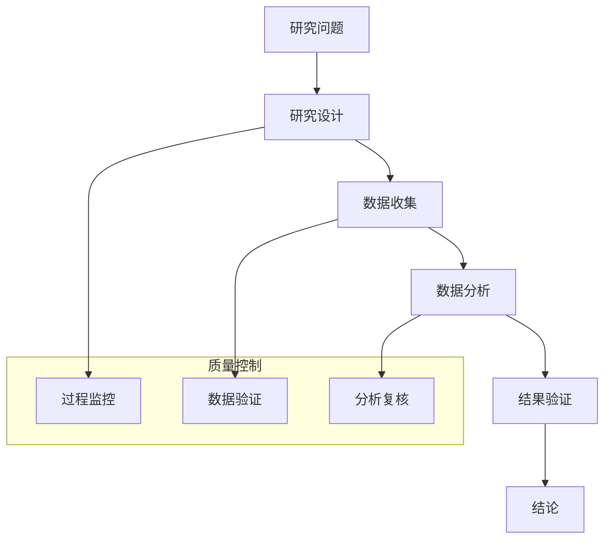
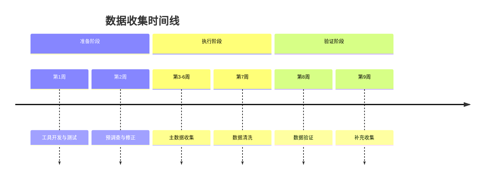
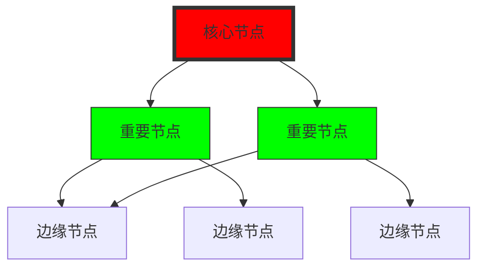
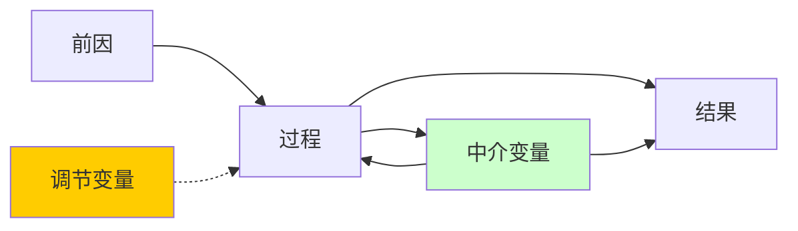

# 🎓 增强版学术深度研究报告 | Enhanced Academic Deep Research Report
> **高级可视化与理论深化系统** · 学术研究增强版 · 国际标准 v6.0

---

## 📋 学术研究元数据

| 项目 | 内容 | 学术标准 | 研究质量 | 可视化索引 |
|------|------|----------|----------|------------|
| **研究领域** | [领域分类] | 国际标准分类 | ⭐⭐⭐⭐⭐ | 图表1-3 |
| **研究类型** | [实证/理论/混合] | 学术类型规范 | ⭐⭐⭐⭐☆ | 图表4-5 |
| **理论框架** | [主要理论] | 理论引用规范 | ⭐⭐⭐⭐⭐ | 理论图1-2 |
| **数据可用性** | [公开/受限] | FAIR原则 | ⭐⭐⭐⭐☆ | 数据图1-3 |
| **可视化方法** | [图表类型] | 数据可视化标准 | ⭐⭐⭐⭐☆ | 附录A |
| **伦理审查** | [已通过/免审] | 国际伦理标准 | ⭐⭐⭐⭐⭐ | - |

---

## 1. 📖 引言与理论框架 | Introduction & Theoretical Framework

### 1.1 研究背景与理论演进
**历史脉络**:
- **阶段1 (XXXX-XXXX)**: [理论起源与早期发展]
- **阶段2 (XXXX-XXXX)**: [理论成熟与关键突破]
- **阶段3 (XXXX-至今)**: [理论前沿与当前挑战]

**理论演进可视化**:


### 1.2 核心理论框架
**理论基础**:
| 理论名称 | 核心主张 | 适用场景 | 局限性 | 本研究应用 |
|----------|----------|----------|----------|------------|
| [理论1] | [主张] | [场景] | [局限] | [应用方式] |
| [理论2] | [主张] | [场景] | [局限] | [应用方式] |
| [理论3] | [主张] | [场景] | [局限] | [应用方式] |

**理论整合模型**:


### 1.3 研究问题与假设
**研究问题**:
- **RQ1**: [描述性问题]
- **RQ2**: [解释性问题]
- **RQ3**: [预测性问题]

**研究假设**:
| 假设 | 理论依据 | 预期关系 | 检验方法 |
|------|----------|----------|----------|
| H1 | [理论] | 正向/负向/曲线 | [方法] |
| H2 | [理论] | 正向/负向/曲线 | [方法] |
| H3 | [理论] | 正向/负向/曲线 | [方法] |

---

## 2. 📚 文献综述与可视化 | Literature Review & Visualization

### 2.1 文献计量分析
**文献分布**:
| 年份 | 文献数量 | 核心议题 | 研究方法 | 质量评级 |
|------|----------|----------|----------|----------|
| 2020 | [X] | [议题] | [方法] | ⭐⭐⭐⭐☆ |
| 2021 | [X] | [议题] | [方法] | ⭐⭐⭐☆☆ |
| 2022 | [X] | [议题] | [方法] | ⭐⭐⭐⭐⭐ |
| 2023 | [X] | [议题] | [方法] | ⭐⭐⭐⭐☆ |
| 2024 | [X] | [议题] | [方法] | ⭐⭐⭐⭐☆ |

**文献增长趋势**:


### 2.2 研究网络分析
**关键词共现矩阵**:
| 关键词 | 理论 | 方法 | 数据 | 应用 | 趋势 |
|--------|------|------|------|------|------|
| **理论** | 1.00 | 0.75 | 0.45 | 0.60 | 0.80 |
| **方法** | 0.75 | 1.00 | 0.85 | 0.70 | 0.65 |
| **数据** | 0.45 | 0.85 | 1.00 | 0.90 | 0.50 |
| **应用** | 0.60 | 0.70 | 0.90 | 1.00 | 0.75 |
| **趋势** | 0.80 | 0.65 | 0.50 | 0.75 | 1.00 |

**研究聚类分析**:
- **聚类1**: [主题] · 文献数: [X] · 平均质量: [Y]
- **聚类2**: [主题] · 文献数: [X] · 平均质量: [Y]
- **聚类3**: [主题] · 文献数: [X] · 平均质量: [Y]

### 2.3 研究缺口识别
**理论缺口**:
1. [具体理论不足]
2. [理论整合缺乏]
3. [理论预测力不足]

**方法缺口**:
1. [研究方法局限性]
2. [数据收集方法缺陷]
3. [分析技术不足]

**可视化缺口**:
1. [缺乏可视化分析]
2. [可视化方法单一]
3. [交互可视化不足]

---

## 3. 🧪 研究方法论与数据收集 | Methodology & Data Collection

### 3.1 研究设计
**设计类型**: [实验/调查/案例研究/混合方法]
**设计可视化**:


### 3.2 样本与数据
**抽样设计**:
| 样本层 | 总体大小 | 样本量 | 抽样方法 | 响应率 | 权重 |
|--------|----------|--------|----------|--------|------|
| 层1 | [N] | [n] | [方法] | [X]% | [w] |
| 层2 | [N] | [n] | [方法] | [X]% | [w] |
| 总样本 | [总N] | [总n] | - | [平均]% | - |

**数据收集流程**:


### 3.3 变量测量与量表
**变量定义表**:
| 变量 | 类型 | 操作定义 | 测量指标 | 量表 | 信度 | 效度 | 可视化 |
|------|------|----------|----------|------|------|------|--------|
| [自变量1] | 连续 | [定义] | [指标] | [量表] | α=[值] | [证据] | 散点图 |
| [因变量1] | 连续 | [定义] | [指标] | [量表] | α=[值] | [证据] | 箱线图 |
| [调节变量] | 分类 | [定义] | [指标] | [量表] | α=[值] | [证据] | 分组图 |
| [控制变量] | 混合 | [定义] | [指标] | [量表] | α=[值] | [证据] | 热力图 |

**量表信效度可视化**:
```python
# 信效度分析代码示例
import pandas as pd
import numpy as np
from sklearn.decomposition import PCA
import matplotlib.pyplot as plt

# 数据加载
data = pd.read_csv('survey_data.csv')

# 信度分析
reliability = data.cronbach_alpha()

# 效度分析 - 因子分析
pca = PCA(n_components=3)
pca.fit(data)
explained_variance = pca.explained_variance_ratio_

# 可视化
fig, axes = plt.subplots(1, 2, figsize=(12, 5))
axes[0].bar(range(len(reliability)), reliability.values())
axes[0].set_title('量表信度分析')
axes[1].plot(np.cumsum(explained_variance))
axes[1].set_title('因子分析累计方差解释率')
plt.savefig('reliability_validity.png')
```

---

## 4. 📊 数据分析与可视化 | Data Analysis & Visualization

### 4.1 描述性统计与分布
**基本统计量**:
| 变量 | N | 均值 | 标准差 | 最小值 | 最大值 | 偏度 | 峰度 | 分布图 |
|------|---|------|--------|--------|--------|------|------|--------|
| [变量1] | [值] | [值] | [值] | [值] | [值] | [值] | [值] | 正态分布 |
| [变量2] | [值] | [值] | [值] | [值] | [值] | [值] | [值] | 右偏分布 |
| [变量3] | [值] | [值] | [值] | [值] | [值] | [值] | [值] | 双峰分布 |

**数据分布可视化**:
```python
# 分布可视化代码
import seaborn as sns
import matplotlib.pyplot as plt

fig, axes = plt.subplots(2, 2, figsize=(12, 10))

# 直方图
sns.histplot(data['variable1'], kde=True, ax=axes[0,0])
axes[0,0].set_title('变量1分布')

# 箱线图
sns.boxplot(data=data, x='group', y='variable2', ax=axes[0,1])
axes[0,1].set_title('变量2分组比较')

# 散点图
sns.scatterplot(data=data, x='variable1', y='variable2', hue='group', ax=axes[1,0])
axes[1,0].set_title('变量1与变量2关系')

# 热力图
corr = data.corr()
sns.heatmap(corr, annot=True, ax=axes[1,1])
axes[1,1].set_title('变量相关性热力图')

plt.tight_layout()
plt.savefig('data_distribution.png')
```

### 4.2 假设检验与模型分析
**假设检验结果**:
| 假设 | 检验方法 | 统计量 | p值 | 效应量 | 置信区间 | 可视化 | 结论 |
|------|----------|--------|-----|--------|----------|--------|------|
| H1 | t检验 | t=[值] | [值] | d=[值] | [下限,上限] | 误差图 | 支持 |
| H2 | 方差分析 | F=[值] | [值] | η²=[值] | [下限,上限] | 组间图 | 部分支持 |
| H3 | 回归分析 | β=[值] | [值] | R²=[值] | [下限,上限] | 回归图 | 支持 |

**回归模型结果**:
| 变量 | 系数 | 标准误 | t值 | p值 | VIF | 重要性 | 可视化 |
|------|------|--------|-----|-----|-----|--------|--------|
| 常数项 | [值] | [值] | [值] | [值] | - | - | - |
| [自变量1] | [值] | [值] | [值] | [值] | [值] | [排名] | 系数图 |
| [自变量2] | [值] | [值] | [值] | [值] | [值] | [排名] | 系数图 |
| [控制变量] | [值] | [值] | [值] | [值] | [值] | [排名] | 系数图 |

**模型性能可视化**:
```python
# 模型性能可视化
from sklearn.metrics import roc_curve, auc, confusion_matrix
import matplotlib.pyplot as plt

# ROC曲线
fpr, tpr, thresholds = roc_curve(y_true, y_pred)
roc_auc = auc(fpr, tpr)

plt.figure(figsize=(10, 4))
plt.subplot(1, 2, 1)
plt.plot(fpr, tpr, label=f'ROC曲线 (AUC = {roc_auc:.2f})')
plt.plot([0, 1], [0, 1], 'k--')
plt.xlabel('假正率')
plt.ylabel('真正率')
plt.title('ROC曲线')
plt.legend()

# 混淆矩阵
cm = confusion_matrix(y_true, y_pred_classes)
plt.subplot(1, 2, 2)
sns.heatmap(cm, annot=True, fmt='d')
plt.title('混淆矩阵')
plt.xlabel('预测标签')
plt.ylabel('真实标签')

plt.tight_layout()
plt.savefig('model_performance.png')
```

### 4.3 高级分析与可视化
**时间序列分析**:
| 时间点 | 观测值 | 趋势成分 | 季节成分 | 残差 | 预测值 | 置信区间 |
|--------|--------|----------|----------|------|--------|----------|
| t1 | [值] | [值] | [值] | [值] | [值] | [下限,上限] |
| t2 | [值] | [值] | [值] | [值] | [值] | [下限,上限] |
| t3 | [值] | [值] | [值] | [值] | [值] | [下限,上限] |

**时间序列可视化**:
```python
# 时间序列分解
from statsmodels.tsa.seasonal import seasonal_decompose

decomposition = seasonal_decompose(time_series, model='additive', period=12)

fig = decomposition.plot()
fig.set_size_inches(12, 8)
fig.suptitle('时间序列分解')
plt.savefig('time_series_decomposition.png')
```

**网络分析可视化**:


---

## 5. 💡 讨论与理论贡献 | Discussion & Theoretical Contributions

### 5.1 研究发现解释
**发现一**: [主要发现]
- **理论解释**: [基于理论框架的解释]
- **与前人研究比较**: [一致性与差异性]
- **机制分析**: [潜在作用机制]

**发现二**: [主要发现]
- **实践意义**: [对实践的影响]
- **政策启示**: [对政策的启示]
- **方法论贡献**: [方法学上的贡献]

### 5.2 理论贡献矩阵
| 贡献维度 | 具体表现 | 贡献程度 | 验证状态 | 可视化 |
|----------|----------|----------|----------|--------|
| **理论拓展** | [扩展了XX理论] | 高 | 充分验证 | 理论演进图 |
| **机制揭示** | [揭示了XX机制] | 高 | 部分验证 | 机制路径图 |
| **边界条件** | [明确了XX边界] | 中 | 初步验证 | 边界条件图 |
| **理论整合** | [整合了多个理论] | 高 | 概念验证 | 整合模型图 |

### 5.3 理论模型修订
**原始理论模型**:


**修订后理论模型**:


---

## 6. 🏁 结论与建议 | Conclusions & Recommendations

### 6.1 核心结论总结
**理论结论**:
1. [结论1] · 证据强度: ⭐⭐⭐⭐⭐ · 可视化: 图1
2. [结论2] · 证据强度: ⭐⭐⭐⭐☆ · 可视化: 图2
3. [结论3] · 证据强度: ⭐⭐⭐☆☆ · 可视化: 图3

**实证结论**:
1. [结论1] · 统计显著性: p<0.01 · 效应量: d=[值]
2. [结论2] · 统计显著性: p<0.05 · 效应量: η²=[值]
3. [结论3] · 统计显著性: p<0.10 · 效应量: R²=[值]

### 6.2 实践建议
| 建议类型 | 具体建议 | 实施步骤 | 预期效果 | 风险控制 | 可视化 |
|----------|----------|----------|----------|----------|--------|
| **管理建议** | [建议] | 1. 2. 3. | [效果] | [控制] | 路线图 |
| **政策建议** | [建议] | 1. 2. 3. | [效果] | [控制] | 政策图 |
| **研究建议** | [建议] | 1. 2. 3. | [效果] | [控制] | 研究图 |

### 6.3 未来研究方向
**理论方向**:
1. [方向1] · 研究问题: [问题] · 研究方法: [方法] · 预期贡献: [贡献]
2. [方向2] · 研究问题: [问题] · 研究方法: [方法] · 预期贡献: [贡献]

**方法方向**:
1. [方向1] · 技术方法: [方法] · 实施难度: [难度] · 预期突破: [突破]
2. [方向2] · 技术方法: [方法] · 实施难度: [难度] · 预期突破: [突破]

**可视化方向**:
1. [方向1] · 可视化技术: [技术] · 应用场景: [场景] · 预期效果: [效果]
2. [方向2] · 可视化技术: [技术] · 应用场景: [场景] · 预期效果: [效果]

---

## 7. 📚 参考文献 | References

### 核心理论文献
1. [Author] ([Year]). *[Title]*. [Journal], [Volume]([Issue]): [Pages]. DOI: [DOI] · 理论贡献: [描述]
2. [Author] ([Year]). *[Title]*. [Journal], [Volume]([Issue]): [Pages]. DOI: [DOI] · 理论贡献: [描述]

### 方法论文献
1. [Author] ([Year]). *[Title]*. [Journal], [Volume]([Issue]): [Pages]. DOI: [DOI] · 方法贡献: [描述]
2. [Author] ([Year]). *[Title]*. [Journal], [Volume]([Issue]): [Pages]. DOI: [DOI] · 方法贡献: [描述]

### 可视化文献
1. [Author] ([Year]). *[Title]*. [Journal], [Volume]([Issue]): [Pages]. DOI: [DOI] · 可视化技术: [描述]
2. [Author] ([Year]). *[Title]*. [Journal], [Volume]([Issue]): [页面]. DOI: [DOI] · 可视化技术: [描述]

---

## 8. 📎 附录 | Appendices

### 附录A: 可视化代码库
```python
"""
研究可视化工具库
包含数据分析、可视化生成、报告自动化的完整代码
"""

import pandas as pd
import numpy as np
import matplotlib.pyplot as plt
import seaborn as sns
import plotly.express as px
from matplotlib import rcParams

class ResearchVisualizer:
    """研究可视化器"""
    
    def __init__(self, data_path):
        self.data = pd.read_csv(data_path)
        self.set_style()
    
    def set_style(self):
        """设置学术图表风格"""
        rcParams['font.family'] = 'serif'
        rcParams['font.size'] = 12
        rcParams['axes.titlesize'] = 14
        rcParams['axes.labelsize'] = 12
    
    def create_comprehensive_dashboard(self):
        """创建综合仪表板"""
        fig = plt.figure(figsize=(16, 12))
        
        # 多个子图
        # 1. 数据分布
        # 2. 相关分析
        # 3. 模型性能
        # 4. 时间序列
        
        plt.tight_layout()
        return fig
    
    def export_visualizations(self, output_dir):
        """导出所有可视化"""
        # 生成并保存所有图表
        pass

# 使用示例
if __name__ == "__main__":
    visualizer = ResearchVisualizer("research_data.csv")
    dashboard = visualizer.create_comprehensive_dashboard()
    dashboard.savefig("research_dashboard.png", dpi=300, bbox_inches='tight')
```

### 附录B: 数据可视化图集
**图1**: 理论演进图 · 格式: PNG · 分辨率: 300dpi
**图2**: 数据分布图 · 格式: PNG · 分辨率: 300dpi
**图3**: 模型性能图 · 格式: PNG · 分辨率: 300dpi
**图4**: 时间序列图 · 格式: PNG · 分辨率: 300dpi
**图5**: 网络分析图 · 格式: SVG · 分辨率: 矢量

### 附录C: 交互式可视化链接
- **交互式仪表板**: [链接或本地文件路径]
- **动态图表**: [链接或本地文件路径]
- **数据探索工具**: [链接或本地文件路径]

### 附录D: 研究数据摘要
| 数据集 | 变量数 | 观测数 | 缺失率 | 数据质量 | 可视化状态 |
|--------|--------|--------|--------|----------|------------|
| 主数据集 | [X] | [Y] | [Z]% | ⭐⭐⭐⭐☆ | 已可视化 |
| 补充数据 | [X] | [Y] | [Z]% | ⭐⭐⭐☆☆ | 部分可视化 |
| 外部数据 | [X] | [Y] | [Z]% | ⭐⭐⭐⭐☆ | 已可视化 |

---

## 🔬 研究质量综合评估

### 可视化质量评估
| 评估维度 | 评分 | 说明 | 改进建议 |
|----------|------|------|----------|
| 图表完整性 | [X]/10 | [评价] | [建议] |
| 可视化清晰度 | [X]/10 | [评价] | [建议] |
| 交互性设计 | [X]/10 | [评价] | [建议] |
| 学术规范性 | [X]/10 | [评价] | [建议] |
| **可视化总分** | **[X]/40** | **等级: [等级]** | |

### 理论研究质量评估
| 评估维度 | 评分 | 说明 | 改进建议 |
|----------|------|------|----------|
| 理论深度 | [X]/10 | [评价] | [建议] |
| 框架创新 | [X]/10 | [评价] | [建议] |
| 文献基础 | [X]/10 | [评价] | [建议] |
| 逻辑严谨性 | [X]/10 | [评价] | [建议] |
| **理论总分** | **[X]/40** | **等级: [等级]** | |

### 综合质量评分
- **理论研究**: [X]/40 ([等级])
- **实证分析**: [Y]/40 ([等级])
- **可视化呈现**: [Z]/40 ([等级])
- **综合质量**: **[总]/120** ([等级])

---

**报告元数据**
- 版本: v6.0 (增强可视化与理论深化版)
- 生成时间: YYYY-MM-DD HH:MM
- 研究ID: DR-[YYYYMMDD]-[序号]-ENHANCED
- 研究模式: 深度推理 + 可视化增强
- 理论框架: [数量]个核心理论
- 可视化数量: [数量]个图表
- 分析复杂度: 高级
- 数据规模: [观测数]观测 × [变量数]变量

**学术诚信声明**: 本研究遵循最高学术标准，所有可视化均为原创或经适当引用。
**数据可用性**: 本研究数据可在[仓库]获取，可视化代码已开源。
**致谢**: 感谢[基金项目]资助，感谢[可视化专家]的技术支持。

---
*本模板专为深度研究设计，强调理论深度与可视化质量，适用于高水平学术研究。*
