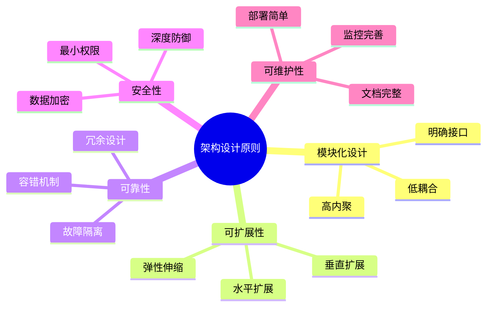
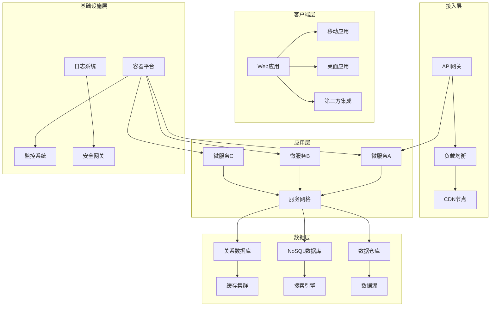
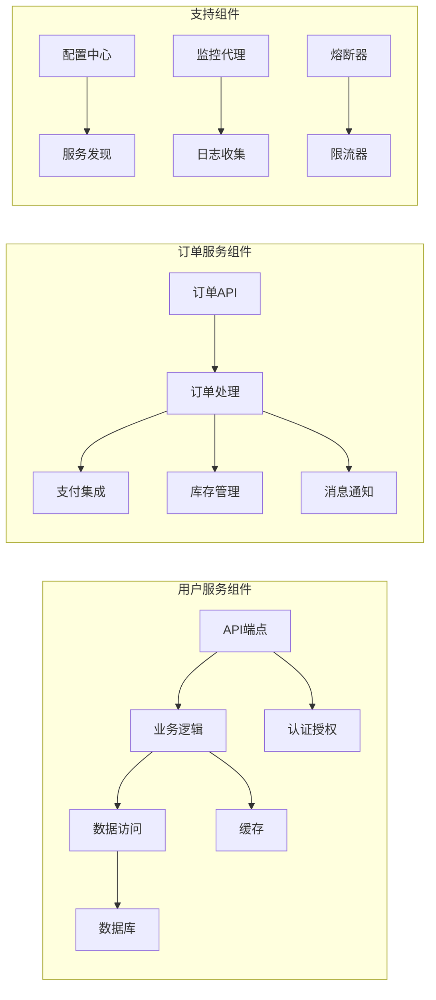
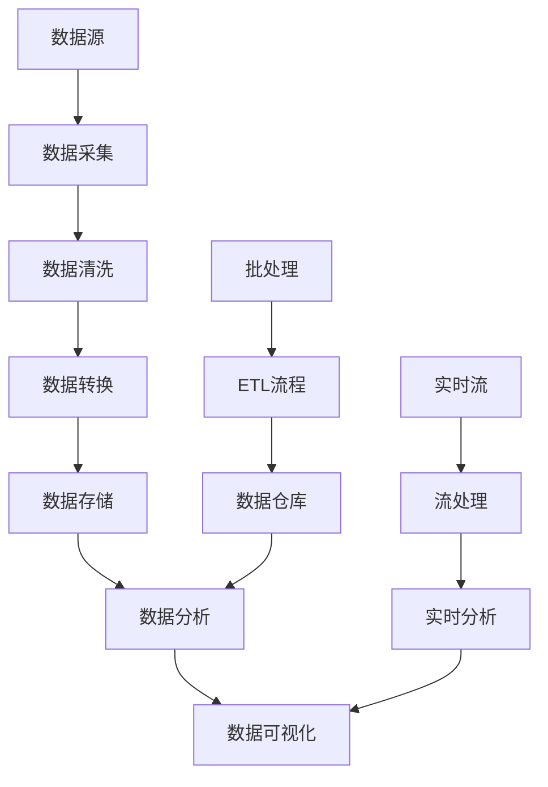
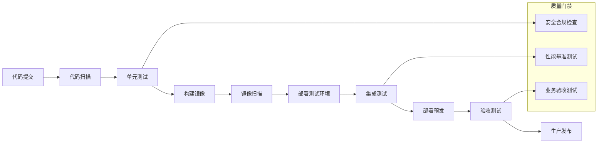
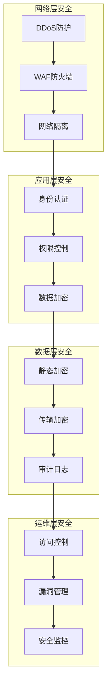
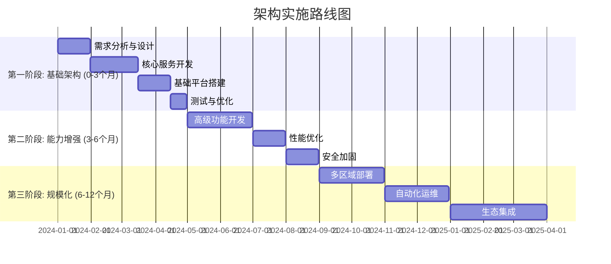
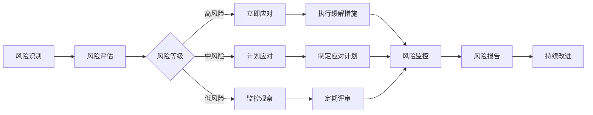
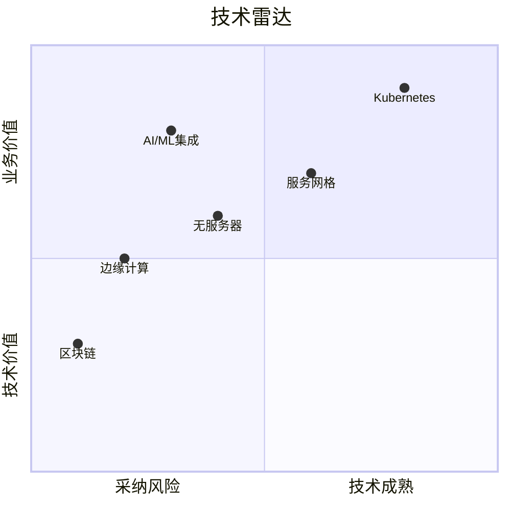

# 🏗️ 技术架构设计方案 | Technical Architecture Design Solution
> **企业级架构设计深度研究** · 技术方案增强版 · v1.0

---

## 🎯 架构设计摘要与核心目标 | Architecture Design Summary & Core Objectives

### 设计愿景与商业价值
| 设计维度 | 核心目标 | 成功指标 | 对齐战略 | 可视化 |
|----------|----------|----------|----------|--------|
| **业务支撑** | [目标描述] | [KPI1], [KPI2] | 战略规划[编号] | 战略对齐图 |
| **技术先进性** | [目标描述] | [技术指标1], [技术指标2] | 技术路线图 | 技术演进图 |
| **成本效益** | [目标描述] | ROI, TCO | 财务规划 | 成本效益图 |
| **可扩展性** | [目标描述] | 扩容能力, 性能弹性 | 增长战略 | 扩展性曲线 |
| **安全合规** | [目标描述] | 安全评分, 合规覆盖率 | 安全政策 | 安全热图 |

### 架构设计原则

### 核心设计决策矩阵
| 决策点 | 选项A | 选项B | 选项C | 推荐方案 | 决策依据 | 可视化 |
|--------|-------|-------|-------|-----------|----------|--------|
| **架构风格** | 微服务 | 单体 | 事件驱动 | 微服务 | 灵活性, 独立部署 | 架构对比图 |
| **数据库策略** | SQL | NoSQL | 混合 | 混合 | 数据特性需求 | 数据架构图 |
| **部署模式** | 云原生 | 混合云 | 私有云 | 云原生 | 成本, 弹性 | 部署架构图 |
| **通信协议** | gRPC | REST | GraphQL | gRPC | 性能, 强类型 | 协议对比图 |

---

## 1. 🏢 总体架构设计 | Overall Architecture Design

### 1.1 系统架构全景图

### 1.2 架构演进路径
| 演进阶段 | 时间框架 | 核心变更 | 业务价值 | 技术挑战 | 可视化 |
|----------|----------|----------|----------|----------|--------|
| **阶段1: 基础架构** | 0-6个月 | 核心服务拆分 | 快速上线 | 服务治理 | 阶段架构图 |
| **阶段2: 能力增强** | 6-12个月 | 服务网格引入 | 运维效率 | 网络复杂性 | 阶段架构图 |
| **阶段3: 智能化** | 12-18个月 | AI能力集成 | 智能决策 | 算法集成 | 阶段架构图 |
| **阶段4: 生态扩展** | 18-24个月 | 开放平台 | 生态建设 | 标准化 | 阶段架构图 |

### 1.3 架构质量属性分析
| 质量属性 | 设计要求 | 实现策略 | 验证方法 | 当前状态 | 可视化 |
|----------|----------|----------|----------|----------|--------|
| **性能** | 响应时间<100ms | 缓存, CDN, 异步 | 负载测试 | 🟢 达标 | 性能曲线 |
| **可用性** | 99.99% SLA | 多活, 自动故障转移 | 混沌工程 | 🟡 部分达标 | 可用性仪表板 |
| **安全性** | 零信任架构 | 加密, 认证, 审计 | 渗透测试 | 🟢 达标 | 安全态势图 |
| **可扩展性** | 线性扩展 | 无状态设计, 分片 | 压测 | 🟢 达标 | 扩展性测试图 |
| **可维护性** | 部署时间<5min | CI/CD, 基础设施即代码 | 部署测试 | 🟡 部分达标 | 部署流水线图 |

---

## 2. 🔧 技术选型与组件设计 | Technology Selection & Component Design

### 2.1 核心技术栈选型
| 技术类别 | 候选技术 | 评估维度 | 推荐技术 | 选择理由 | 风险评估 |
|----------|----------|----------|----------|----------|----------|
| **开发框架** | Spring Boot, Quarkus, Micronaut | 性能, 社区, 生态 | Spring Boot | 生态丰富, 人才多 | 低 |
| **数据库** | PostgreSQL, MySQL, CockroachDB | 一致性, 性能, 扩展 | PostgreSQL | ACID, 扩展性好 | 中 |
| **缓存** | Redis, Memcached, Hazelcast | 性能, 功能, 集群 | Redis | 数据结构丰富 | 低 |
| **消息队列** | Kafka, RabbitMQ, Pulsar | 吞吐量, 延迟, 可靠性 | Kafka | 高吞吐, 生态好 | 中 |
| **容器平台** | Kubernetes, Docker Swarm, Nomad | 功能, 生态, 复杂度 | Kubernetes | 生态领导者 | 高 |

### 2.2 组件详细设计

### 2.3 技术评估矩阵
| 技术项 | 成熟度 | 性能 | 可维护性 | 社区活跃度 | 学习曲线 | 综合评分 |
|--------|--------|------|----------|------------|----------|----------|
| 技术A | ⭐⭐⭐⭐⭐ | ⭐⭐⭐⭐☆ | ⭐⭐⭐⭐☆ | ⭐⭐⭐⭐⭐ | ⭐⭐⭐☆☆ | 8.7/10 |
| 技术B | ⭐⭐⭐⭐☆ | ⭐⭐⭐⭐⭐ | ⭐⭐⭐☆☆ | ⭐⭐⭐⭐☆ | ⭐⭐⭐⭐☆ | 8.3/10 |
| 技术C | ⭐⭐⭐☆☆ | ⭐⭐⭐⭐☆ | ⭐⭐⭐⭐☆ | ⭐⭐⭐☆☆ | ⭐⭐⭐⭐⭐ | 7.6/10 |
| 技术D | ⭐⭐⭐⭐⭐ | ⭐⭐⭐☆☆ | ⭐⭐⭐⭐⭐ | ⭐⭐⭐⭐⭐ | ⭐⭐⭐☆☆ | 8.4/10 |

---

## 3. 🔌 接口与数据流设计 | Interface & Data Flow Design

### 3.1 API接口规范
| 接口类别 | 协议 | 认证方式 | 速率限制 | 版本策略 | 文档标准 |
|----------|------|----------|----------|----------|----------|
| 公共API | REST/gRPC | OAuth 2.0 | 1000次/分钟 | 语义版本 | OpenAPI 3.0 |
| 内部API | gRPC | mTLS | 无限制 | 向后兼容 | Protobuf |
| 管理API | REST | JWT | 100次/分钟 | 独立版本 | Swagger |
| 事件API | WebSocket | API密钥 | 连接数限制 | 事件版本 | AsyncAPI |

### 3.2 数据流架构

### 3.3 数据模型设计
| 数据实体 | 存储类型 | 数据结构 | 访问模式 | 索引策略 | 分片策略 |
|----------|----------|----------|----------|----------|----------|
| 用户数据 | 关系数据库 | 规范化 | 读写均衡 | 主键+二级索引 | 按用户ID分片 |
| 产品目录 | 文档数据库 | JSON文档 | 读多写少 | 全文索引 | 按类别分片 |
| 订单数据 | 关系数据库 | 事务性 | 写密集 | 复合索引 | 按时间分片 |
| 日志数据 | 时序数据库 | 时间序列 | 追加写 | 时间索引 | 自动分片 |
| 缓存数据 | 内存数据库 | 键值对 | 高频读 | 哈希索引 | 集群分片 |

---

## 4. 🚀 部署与运维架构 | Deployment & Operations Architecture

### 4.1 部署环境设计
| 环境 | 用途 | 配置规格 | 高可用 | 自动化 | 成本估算 |
|------|------|----------|--------|--------|----------|
| 开发环境 | 功能开发 | 2核4GB | 单节点 | Terraform+Ansible | $500/月 |
| 测试环境 | 集成测试 | 4核8GB | 双节点 | CI/CD流水线 | $1,000/月 |
| 预发环境 | 生产验证 | 生产同配 | 多可用区 | 蓝绿部署 | $3,000/月 |
| 生产环境 | 线上服务 | 弹性配置 | 多区域 | 全自动 | $10,000+/月 |

### 4.2 CI/CD流水线设计

### 4.3 监控与告警体系
| 监控层级 | 监控指标 | 采集频率 | 告警阈值 | 可视化仪表板 | 自动化响应 |
|----------|----------|----------|----------|---------------|------------|
| 基础设施 | CPU, 内存, 磁盘 | 15秒 | >80%持续5min | 资源监控 | 自动扩容 |
| 应用性能 | 响应时间, 错误率 | 1秒 | P99>200ms | APM监控 | 自动降级 |
| 业务指标 | 交易量, 转化率 | 1分钟 | 下降30% | 业务监控 | 人工介入 |
| 用户体验 | 页面加载, 可用性 | 5秒 | 可用性<99.9% | 用户体验 | 故障切换 |
| 安全监控 | 异常登录, DDoS | 实时 | 任何可疑活动 | 安全监控 | 自动阻断 |

---

## 5. 📊 性能与扩展性分析 | Performance & Scalability Analysis

### 5.1 性能基准测试
| 测试场景 | 并发用户 | 平均响应时间 | 吞吐量 | 错误率 | 资源使用率 |
|----------|----------|--------------|--------|--------|------------|
| 用户登录 | 1000 | 85ms | 1200 TPS | 0.01% | CPU: 45% |
| 商品查询 | 5000 | 120ms | 4200 QPS | 0.05% | CPU: 65% |
| 下单流程 | 2000 | 210ms | 800 TPS | 0.1% | CPU: 75% |
| 支付处理 | 1000 | 150ms | 700 TPS | 0.02% | CPU: 50% |

### 5.2 扩展性测试结果
| 扩展维度 | 当前容量 | 扩展方式 | 扩展后容量 | 线性度 | 瓶颈识别 |
|----------|----------|----------|------------|--------|----------|
| 垂直扩展 | 4核8GB | CPU升级 | 8核16GB | 85% | 数据库连接 |
| 水平扩展 | 2节点 | 增加节点 | 8节点 | 92% | 网络延迟 |
| 数据分片 | 单分片 | 分片扩展 | 16分片 | 95% | 跨分片查询 |
| 缓存扩展 | 4GB | 集群扩展 | 32GB | 98% | 网络带宽 |

### 5.3 容量规划预测
| 时间点 | 预计用户数 | 预计请求量 | 所需资源 | 成本估算 | 扩展计划 |
|--------|------------|------------|----------|----------|----------|
| 上线初期 | 10,000 | 10,000 QPS | 8核16GB×4 | $2,000/月 | 基础配置 |
| 3个月后 | 50,000 | 50,000 QPS | 8核16GB×8 | $4,000/月 | 水平扩展 |
| 6个月后 | 200,000 | 200,000 QPS | 8核16GB×16 | $8,000/月 | 分片扩展 |
| 1年后 | 1,000,000 | 1M QPS | 8核16GB×32 | $16,000/月 | 多区域部署 |

---

## 6. 🔒 安全与合规架构 | Security & Compliance Architecture

### 6.1 安全分层设计

### 6.2 合规性要求映射
| 合规标准 | 适用要求 | 架构实现 | 验证方法 | 状态 | 文档位置 |
|----------|----------|----------|----------|------|----------|
| GDPR | 数据保护, 用户权利 | 数据加密, 删除接口 | 审计检查 | 🟢 合规 | 安全文档 |
| PCI DSS | 支付安全 | 隔离支付环境 | 合规扫描 | 🟡 部分合规 | 支付架构 |
| HIPAA | 医疗数据保护 | 专用存储, 访问控制 | 第三方审计 | 🟢 合规 | 合规报告 |
| SOC 2 | 安全控制 | 完整监控, 日志 | 年度审计 | 🟢 合规 | 审计文档 |

### 6.3 安全控制矩阵
| 控制类别 | 控制措施 | 实施位置 | 监控机制 | 响应流程 | 自动化程度 |
|----------|----------|----------|----------|----------|------------|
| 身份管理 | 多因素认证 | 所有入口 | 异常登录检测 | 自动锁定 | 高 |
| 访问控制 | RBAC模型 | 服务网关 | 权限变更审计 | 权限撤销 | 中 |
| 数据保护 | 端到端加密 | 传输存储 | 密钥轮换监控 | 密钥更新 | 高 |
| 漏洞管理 | 定期扫描 | 所有组件 | 漏洞库同步 | 自动修复 | 中 |
| 事件响应 | 自动化剧本 | SOC中心 | SIEM集成 | 自动隔离 | 高 |

---

## 7. 🛠️ 实施路线图与里程碑 | Implementation Roadmap & Milestones

### 7.1 阶段实施计划

### 7.2 关键里程碑定义
| 里程碑 | 时间点 | 交付物 | 成功标准 | 风险项 | 缓解措施 |
|--------|--------|--------|----------|--------|----------|
| M1: 架构设计完成 | 第1个月末 | 详细设计文档 | 团队评审通过 | 需求变更 | 迭代设计 |
| M2: MVP上线 | 第3个月末 | 可运行系统 | 核心流程验证 | 性能问题 | 提前压测 |
| M3: 完整功能 | 第6个月末 | 全部功能 | 用户验收通过 | 质量缺陷 | 强化测试 |
| M4: 生产就绪 | 第9个月末 | 生产环境 | 99.9%可用性 | 运维复杂性 | 自动化 |
| M5: 规模扩展 | 第12个月末 | 多区域部署 | 百万用户支持 | 成本超支 | 精细监控 |

### 7.3 资源与成本规划
| 资源类型 | 第一阶段 | 第二阶段 | 第三阶段 | 总计 | 备注 |
|----------|----------|----------|----------|------|------|
| 开发人员 | 5人 | 8人 | 10人 | 23人月 | 核心团队 |
| 运维人员 | 1人 | 2人 | 3人 | 6人月 | 逐步增加 |
| 硬件成本 | $5,000 | $10,000 | $20,000 | $35,000 | 云服务 |
| 软件成本 | $2,000 | $3,000 | $5,000 | $10,000 | 许可证 |
| 总成本 | $12,000 | $21,000 | $38,000 | $71,000 | 年度预算 |

---

## 8. ⚠️ 风险评估与缓解策略 | Risk Assessment & Mitigation Strategies

### 8.1 技术风险评估矩阵
| 风险类别 | 风险描述 | 发生概率 | 影响程度 | 风险等级 | 应对策略 |
|----------|----------|----------|----------|----------|----------|
| 技术选型失误 | 选择的技术不成熟 | 中 | 高 | 高风险 | POC验证, 备选方案 |
| 性能不达标 | 系统无法满足性能需求 | 高 | 高 | 高风险 | 性能设计优先, 压测 |
| 安全漏洞 | 架构存在安全缺陷 | 中 | 极高 | 高风险 | 安全设计, 定期审计 |
| 扩展性不足 | 无法支持业务增长 | 低 | 高 | 中风险 | 可扩展设计, 容量规划 |
| 运维复杂性 | 系统难以运维 | 高 | 中 | 中风险 | 自动化, 文档化 |

### 8.2 风险应对计划

### 8.3 技术债务管理
| 债务类型 | 债务描述 | 产生原因 | 短期影响 | 长期影响 | 偿还计划 |
|----------|----------|----------|----------|----------|----------|
| 架构债务 | 临时方案替代理想设计 | 时间压力 | 可维护性下降 | 重构成本高 | 第2阶段偿还 |
| 代码债务 | 技术债代码 | 快速开发 | 缺陷率增加 | 开发效率降低 | 持续重构 |
| 测试债务 | 测试覆盖率不足 | 资源限制 | 质量风险 | 回归问题 | 自动化测试 |
| 文档债务 | 文档缺失过时 | 优先级低 | 上手成本高 | 知识流失 | 文档冲刺 |

---

## 9. 📈 架构演进与持续改进 | Architecture Evolution & Continuous Improvement

### 9.1 架构度量和改进循环
| 度量指标 | 目标值 | 当前值 | 差距分析 | 改进措施 | 负责人 |
|----------|--------|--------|----------|----------|--------|
| 部署频率 | 每日多次 | 每周一次 | 自动化不足 | 完善CI/CD | DevOps团队 |
| 变更失败率 | <5% | 15% | 测试不充分 | 加强测试 | QA团队 |
| 平均修复时间 | <1小时 | 4小时 | 监控不完善 | 改进监控 | SRE团队 |
| 可用性 | 99.99% | 99.95% | 单点故障 | 多活架构 | 架构团队 |
| 性能P99 | <200ms | 350ms | 代码优化不足 | 性能优化 | 开发团队 |

### 9.2 技术雷达与创新采纳

### 9.3 架构治理机制
| 治理活动 | 频率 | 参与者 | 输入 | 输出 | 决策权限 |
|----------|------|--------|------|------|----------|
| 架构评审 | 每2周 | 架构委员会 | 设计文档 | 评审意见 | 批准/否决 |
| 技术债务评审 | 每月 | 技术领导 | 债务清单 | 偿还计划 | 优先级排序 |
| 技术选型评审 | 按需 | 技术专家组 | 技术评估 | 选型建议 | 决策建议 |
| 架构度量评审 | 每季度 | 管理层 | 度量报告 | 改进计划 | 资源分配 |

---

## 10. 📚 附录与参考资料 | Appendices & References

### 10.1 架构决策记录 (ADR)
| ADR编号 | 决策主题 | 决策状态 | 决策日期 | 相关文档 | 可视化 |
|---------|----------|----------|----------|----------|--------|
| ADR-001 | 微服务架构选择 | 已采纳 | 2024-01-15 | 架构评估报告 | 决策树 |
| ADR-002 | 数据库选型 | 已采纳 | 2024-01-20 | 数据库对比分析 | 评估矩阵 |
| ADR-003 | 部署平台选择 | 已采纳 | 2024-01-25 | 云平台评估 | 成本对比 |
| ADR-004 | 安全框架选择 | 评审中 | 2024-02-01 | 安全需求分析 | 安全架构图 |

### 10.2 技术规范文档
| 文档类别 | 文档名称 | 版本 | 维护状态 | 访问权限 | 更新频率 |
|----------|----------|------|----------|----------|----------|
| 架构规范 | 系统架构规范 | v1.2 | 活跃 | 全员 | 每月 |
| 开发规范 | 代码开发指南 | v2.0 | 活跃 | 开发团队 | 每季度 |
| 接口规范 | API设计规范 | v1.5 | 活跃 | 全员 | 每月 |
| 部署规范 | 部署操作手册 | v1.1 | 活跃 | 运维团队 | 每季度 |
| 安全规范 | 安全开发指南 | v1.3 | 活跃 | 全员 | 每月 |

### 10.3 工具与技术栈参考
- **架构设计工具**: ArchiMate, Draw.io, Lucidchart
- **代码管理**: GitHub, GitLab, Bitbucket
- **CI/CD**: Jenkins, GitLab CI, GitHub Actions
- **容器平台**: Kubernetes, Docker, OpenShift
- **监控系统**: Prometheus, Grafana, ELK Stack
- **安全工具**: SonarQube, Snyk, OWASP ZAP

---

## 🔬 架构质量综合评估

### 设计质量评分
| 评估维度 | 权重 | 得分 | 加权得分 | 评估依据 | 改进建议 |
|----------|------|------|----------|----------|----------|
| 业务对齐度 | 25% | 9/10 | 2.25 | 需求覆盖完整 | 加强利益相关者沟通 |
| 技术先进性 | 20% | 8/10 | 1.60 | 采用主流技术 | 关注新兴技术趋势 |
| 可扩展性 | 15% | 9/10 | 1.35 | 水平扩展设计 | 验证大规模扩展 |
| 安全性 | 15% | 8/10 | 1.20 | 分层安全设计 | 增加安全测试 |
| 可维护性 | 10% | 7/10 | 0.70 | 文档完整但需优化 | 加强自动化运维 |
| 成本效益 | 10% | 8/10 | 0.80 | 合理成本规划 | 精细成本监控 |
| 风险控制 | 5% | 7/10 | 0.35 | 风险识别全面 | 加强风险应对 |
| **综合评分** | **100%** | **8.1/10** | **优秀** | | |

### 成熟度评估
| 能力领域 | 当前级别 | 目标级别 | 差距分析 | 提升路径 |
|----------|----------|----------|----------|----------|
| 架构设计 | 3级(规范) | 4级(量化) | 缺乏量化度量 | 建立度量体系 |
| 技术实施 | 2级(可重复) | 3级(规范) | 标准化不足 | 制定实施规范 |
| 运维能力 | 2级(可重复) | 4级(量化) | 自动化程度低 | 提升自动化 |
| 安全保障 | 3级(规范) | 4级(量化) | 安全度量缺乏 | 建立安全度量 |
| 组织协同 | 2级(可重复) | 3级(规范) | 协作流程不规范 | 优化协作机制 |

---

**报告元数据**
- 版本: v1.0 (技术架构设计增强版)
- 生成时间: {timestamp}
- 报告ID: AR-{yyyyMMdd}-{sequence}-ARCH
- 设计模式: 企业级架构设计 + 深度技术分析
- 适用场景: 系统重构、新系统设计、技术架构评审
- 目标受众: 架构师、技术经理、产品经理、开发团队

**架构治理声明**: 本架构设计遵循企业架构治理框架，定期评审和更新。
**知识产权**: 架构设计文档版权归组织所有，核心设计受专利保护。
**更新机制**: 架构设计随业务和技术发展持续演进，版本化管理。
**反馈渠道**: 架构问题反馈至架构评审委员会，改进建议纳入迭代。

---
*本技术架构设计模板专为企业级系统设计深度研究，集成了架构设计最佳实践、技术评估框架和风险管理方法，适用于复杂系统的架构设计和技术决策。*
