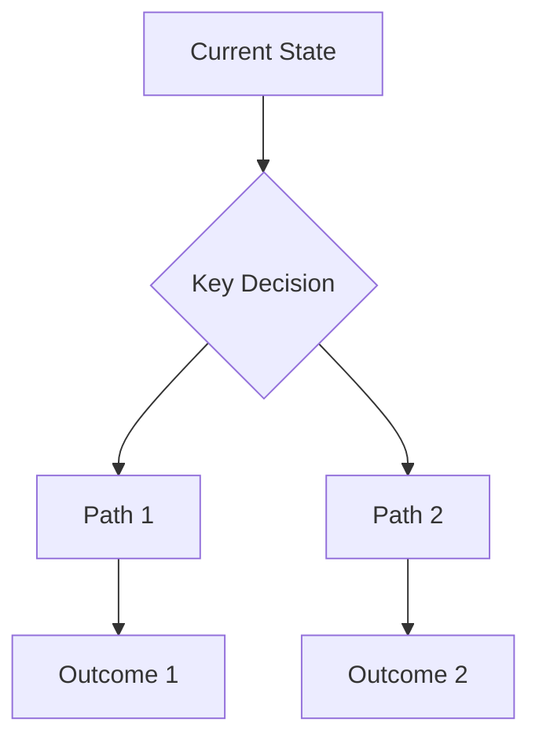

# Research Report Template

## Executive Summary
[Provide 3-5 sentence overview of key findings, conclusions, and recommendations.]

## 1. Introduction & Research Objectives
### 1.1 Background
[Context and importance of the research topic.]

### 1.2 Research Questions
1. [Primary research question 1]
2. [Primary research question 2]
3. [Primary research question 3]

### 1.3 Scope & Limitations
- **Scope**: [What is included in the research]
- **Limitations**: [What is excluded or constrained]
- **Timeframe**: [Research period covered]

## 2. Methodology
### 2.1 Research Approach
[Description of research methodology and approach.]

### 2.2 Data Sources
| Source Type | Examples | Credibility Assessment |
|-------------|----------|------------------------|
| Academic Journals | [Journal names] | High - Peer reviewed |
| Industry Reports | [Report names] | Medium - Industry standard |
| News Media | [Outlet names] | Variable - Fact-checked |
| Official Statistics | [Agency names] | High - Government sources |

### 2.3 Search Strategy
- **Keywords Used**: [List of search terms]
- **Time Range**: [Start date] to [End date]
- **Source Types**: [Types of sources consulted]

## 3. Findings
### 3.1 [Key Theme 1]
[Detailed findings on first major theme.]

#### Supporting Data
- **Statistic 1**: [Value with source]
- **Statistic 2**: [Value with source]
- **Trend**: [Description of trend]

#### Comparative Analysis
| Aspect | Option A | Option B | Option C | Assessment |
|--------|----------|----------|----------|------------|
| Feature 1 | [Details] | [Details] | [Details] | [Assessment] |
| Feature 2 | [Details] | [Details] | [Details] | [Assessment] |
| Cost | [Details] | [Details] | [Details] | [Assessment] |

### 3.2 [Key Theme 2]
[Detailed findings on second major theme.]

## 4. Analysis
### 4.1 Trends & Patterns
[Analysis of identified trends and patterns.]

### 4.2 Strengths, Weaknesses, Opportunities, Threats (SWOT)
| | Internal | External |
|-|----------|----------|
| **Positive** | **Strengths** - [Strength 1] - [Strength 2] | **Opportunities** - [Opportunity 1] - [Opportunity 2] |
| **Negative** | **Weaknesses** - [Weakness 1] - [Weakness 2] | **Threats** - [Threat 1] - [Threat 2] |

### 4.3 Risk Assessment
| Risk | Probability | Impact | Mitigation Strategy |
|------|-------------|--------|---------------------|
| [Risk 1] | High/Medium/Low | High/Medium/Low | [Mitigation approach] |
| [Risk 2] | High/Medium/Low | High/Medium/Low | [Mitigation approach] |

## 5. Conclusions
### 5.1 Key Insights
1. [Insight 1]
2. [Insight 2]
3. [Insight 3]

### 5.2 Recommendations
#### Short-term (0-6 months)
- [Recommendation 1]
- [Recommendation 2]

#### Medium-term (6-18 months)
- [Recommendation 3]
- [Recommendation 4]

#### Long-term (18+ months)
- [Recommendation 5]
- [Recommendation 6]

## 6. Appendices
### 6.1 Data Tables
[Additional data tables if needed.]

### 6.2 Methodology Details
[Detailed methodological explanations.]

### 6.3 Glossary
- **Term 1**: [Definition]
- **Term 2**: [Definition]

## 7. References
### 7.1 Academic Sources
1. [Author]. (Year). [Title]. [Journal]. [DOI/Link]
2. [Author]. (Year). [Title]. [Journal]. [DOI/Link]

### 7.2 Industry Reports
1. [Organization]. (Year). [Report Title]. [Link]
2. [Organization]. (Year). [Report Title]. [Link]

### 7.3 News & Media
1. [Outlet]. (Date). [Article Title]. [Link]
2. [Outlet]. (Date). [Article Title]. [Link]

---

*Report generated using Deep Research Skill. Last updated: [Date]*
