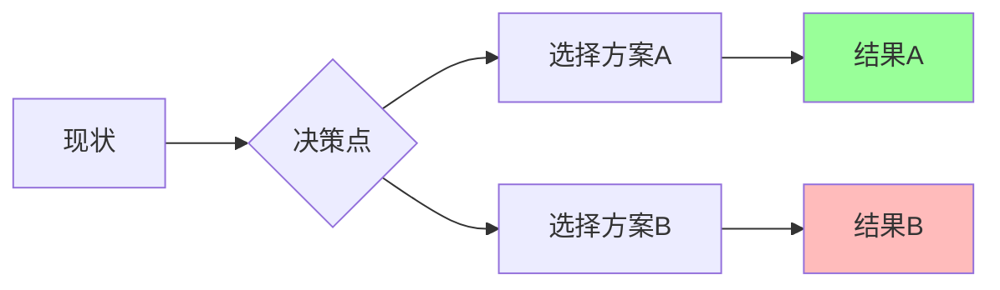

# 🚀 快速研究报告模板 | Quick Research Report Template

> **适用场景**：时间紧迫的决策支持、初步调研、执行简报、会议材料

## 📋 单页报告结构（5分钟阅读）

### 1. 🎯 核心问题
*[用一句话说明研究解决的核心问题]*

**示例**：评估A方案与B方案的技术可行性与成本效益，为Q3技术选型提供依据。

### 2. 📊 关键数据速览
| 指标 | 数值 | 趋势 | 数据来源 |
|------|------|------|----------|
| [关键指标1] | [数值] | ↗️ 上升/↘️ 下降/➡️ 平稳 | [来源] |
| [关键指标2] | [数值] | ↗️/↘️/➡️ | [来源] |
| [关键指标3] | [数值] | ↗️/↘️/➡️ | [来源] |

### 3. 🔍 最重要发现（3个）
#### ✅ 发现一：[最重要的积极发现]
- **证据**：[关键数据或事实]
- **意义**：[对业务/项目的影响]

#### ⚠️ 发现二：[最重要的风险或挑战]
- **证据**：[关键数据或事实]
- **影响**：[潜在后果]

#### 🔄 发现三：[最关键的趋势或变化]
- **证据**：[关键数据或事实]
- **预测**：[未来发展方向]

### 4. ⚖️ 方案对比（2-3个选项）
| 评估维度 | 方案A | 方案B | 推荐意见 |
|----------|-------|-------|----------|
| **成本** | $X | $Y | [方案]更经济 |
| **效果** | [描述] | [描述] | [方案]更有效 |
| **风险** | [风险描述] | [风险描述] | [方案]更安全 |
| **实施难度** | 高/中/低 | 高/中/低 | [方案]更易实施 |
| **综合评分** | ★★★☆☆ | ★★★★☆ | **推荐方案B** |

### 5. 💡 立即行动建议（3个）
1. **[优先级1]**：[具体行动]
   - **负责人**：[姓名/部门]
   - **时间**：[完成时限]
   - **预期成果**：[可衡量结果]

2. **[优先级2]**：[具体行动]
   - **负责人**：[姓名/部门]
   - **时间**：[完成时限]
   - **预期成果**：[可衡量结果]

3. **[优先级3]**：[具体行动]
   - **负责人**：[姓名/部门]
   - **时间**：[完成时限]
   - **预期成果**：[可衡量结果]

### 6. 📈 可视化摘要

### 7. ⚠️ 关键风险提示
| 风险 | 概率 | 影响 | 应急措施 |
|------|------|------|----------|
| [风险1] | 高/中/低 | 高/中/低 | [应急方案] |
| [风险2] | 高/中/低 | 高/中/低 | [应急方案] |

### 8. 🔗 核心资料来源
1. **[最重要来源]**：[来源名称] - [关键发现]
2. **[次重要来源]**：[来源名称] - [关键发现]
3. **[补充来源]**：[来源名称] - [补充信息]

## 🎨 使用指南

### 何时使用本模板
- 时间紧迫（<2小时研究时间）
- 面向执行层决策者
- 初步调研阶段
- 会议汇报材料

### 填写时间分配（建议）
- 问题定义：5分钟
- 数据收集：30分钟
- 分析整理：15分钟
- 建议制定：10分钟

### 质量检查清单
- [ ] 核心问题清晰明确
- [ ] 关键数据有来源验证
- [ ] 建议具体可执行
- [ ] 风险已识别并评估
- [ ] 报告长度控制在1页内

---

**报告生成**：YYYY-MM-DD  
**研究时长**：[时长]  
**数据置信度**：高/中/低  
**模板版本**：简化版 v1.0

> *注：如需更深入分析，请使用完整版深度研究报告模板。*
