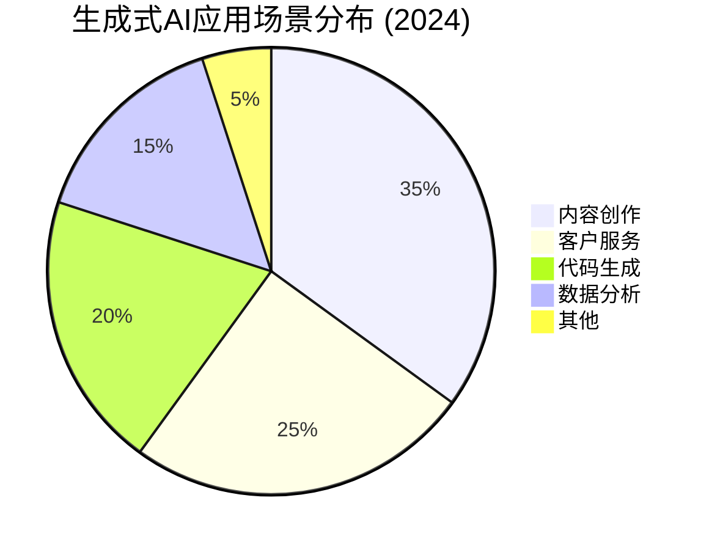
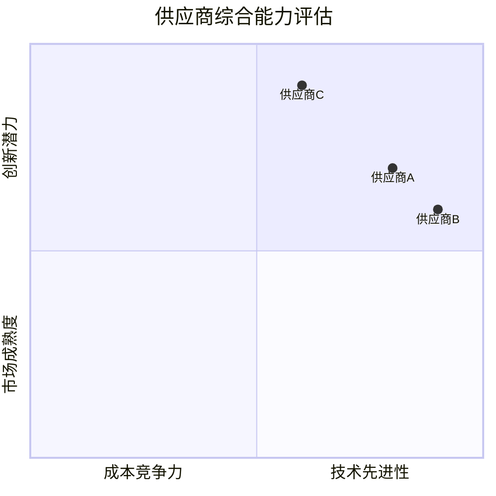
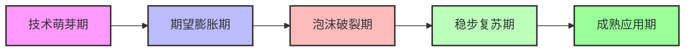
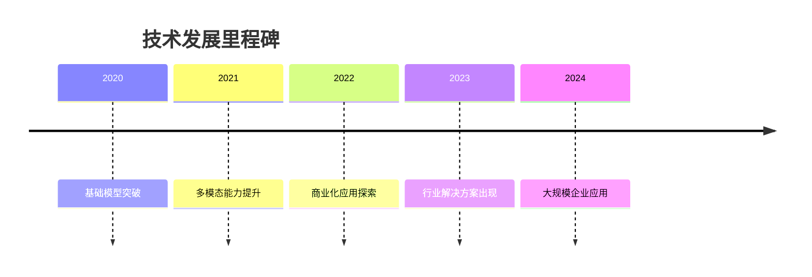
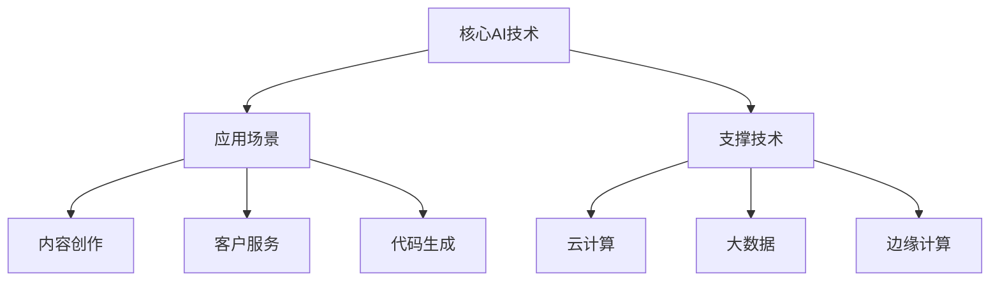

# 📊 深度研究报告模板 | Deep Research Report Template

> **模板使用指南**：本模板提供结构化框架，帮助您创建专业级深度研究报告。根据研究类型选择适当的部分填充，无需填写所有章节。

## 🎯 模板快速选择

| 研究类型 | 推荐章节 | 重点内容 |
|----------|----------|----------|
| **市场研究** | 1, 3, 4, 7, 9 | 市场规模、竞争格局、增长趋势 |
| **技术评估** | 1, 2, 5, 6, 9 | 技术对比、性能指标、适用场景 |
| **学术综述** | 1, 2, 8, 10 | 文献综述、研究方法、参考文献 |
| **竞品分析** | 1, 3, 5, 7, 9 | 功能对比、优劣势分析、市场定位 |

---

## 📋 目录 | Table of Contents

- [1. 🎯 执行摘要](#1-执行摘要)
- [2. 📖 引言与背景](#2-引言与背景)
- [3. 🔍 研究方法论](#3-研究方法论)
- [4. 📈 关键发现](#4-关键发现)
- [5. ⚖️ 比较分析](#5-比较分析)
- [6. 🧠 综合分析](#6-综合分析)
- [7. 📊 数据可视化](#7-数据可视化)
- [8. 🎓 学术严谨性](#8-学术严谨性)
- [9. 💡 结论与建议](#9-结论与建议)
- [10. 📚 参考文献](#10-参考文献)
- [附录：研究质量评估](#附录研究质量评估)

---

## 1. 🎯 执行摘要 | Executive Summary

<!-- 
填写指导：此部分应为繁忙决策者提供3分钟快速阅读版本。
建议结构：问题陈述 → 研究方法 → 关键发现 → 核心建议
-->

### 1.1 核心问题陈述
*[用一句话清晰定义研究解决的核心问题]*

**示例**：本研究旨在评估生成式AI在内容创作行业的应用现状、技术成熟度及商业价值，为相关企业技术选型提供决策依据。

### 1.2 研究方法概要
| 维度 | 描述 | 数据量 |
|------|------|--------|
| **数据来源** | 学术论文、行业报告、案例研究 | 15篇+ |
| **时间范围** | 2020-2024年 | 5年跨度 |
| **分析框架** | SWOT + PESTEL + 技术成熟度曲线 | 3种方法 |
| **验证标准** | 多源交叉验证、专家访谈 | 2+独立来源 |

### 1.3 关键发现（TL;DR版本）
1. ✅ **最显著发现**：[最重要的积极发现，附带数据支持]
2. ⚠️ **主要挑战**：[最重要的限制或问题]
3. 🔄 **核心趋势**：[最关键的动态趋势]
4. 💡 **意外洞察**：[超出预期的发现或洞见]

### 1.4 核心建议
**立即行动（<1个月）**：
- [具体、可执行、有时限的建议1]
- [建议2]

**中期规划（1-6个月）**：
- [需要更多准备时间的建议3]
- [建议4]

**长期战略（>6个月）**：
- [战略层面的建议5]
- [建议6]

---

## 2. 📖 引言与背景 | Introduction & Background

### 2.1 研究背景
*[描述研究主题的行业背景、技术演进或市场环境]*

**背景要素**：
- **历史脉络**：该领域的发展历程
- **当前状态**：现状描述与痛点分析
- **未来趋势**：预测发展方向

### 2.2 研究目标与问题
#### 主要研究问题：
1. [问题1：描述性/探索性问题]
2. [问题2：解释性/分析性问题]
3. [问题3：预测性/建议性问题]

#### 研究假设：
- **假设1**：[可验证的假设陈述]
- **假设2**：[可验证的假设陈述]

### 2.3 研究范围与限制
| 范围维度 | 包含内容 | 排除内容 | 理由 |
|----------|----------|----------|------|
| **地理范围** | [如：中国市场] | [如：国际市场] | 数据可及性 |
| **时间范围** | [如：2020-2024] | [如：历史数据] | 时效性要求 |
| **主题范围** | [如：B2B应用] | [如：B2C应用] | 研究聚焦 |

---

## 3. 🔍 研究方法论 | Research Methodology

### 3.1 研究设计
*[描述整体研究设计：探索性、描述性、解释性或混合方法]*

**设计类型**：□ 定性研究 □ 定量研究 □ 混合方法  
**研究范式**：□ 实证主义 □ 解释主义 □ 批判理论

### 3.2 数据来源评估
| 来源类型 | 具体来源 | 数量 | 可信度评级 | 主要用途 |
|----------|----------|------|------------|----------|
| **学术期刊** | IEEE, ACM, Springer | 8篇 | ★★★★★ | 理论基础 |
| **行业报告** | Gartner, IDC, 艾瑞咨询 | 5份 | ★★★★☆ | 市场数据 |
| **公司文档** | 年报、技术白皮书 | 12份 | ★★★☆☆ | 企业实践 |
| **新闻媒体** | 权威科技媒体 | 20篇 | ★★★☆☆ | 最新动态 |
| **专家访谈** | 领域专家 | 3人 | ★★★★☆ | 实践洞察 |

**评级标准**：★★★★★=极高可信度 | ★★★★☆=高可信度 | ★★★☆☆=中等可信度 | ★★☆☆☆=低可信度 | ★☆☆☆☆=极低可信度

### 3.3 搜索策略
```yaml
关键词策略:
  核心词: ["生成式AI", "大语言模型", "AIGC"]
  扩展词: ["内容创作", "营销自动化", "创意生成"]
  排除词: ["图像生成", "代码生成"]  # 非本报告焦点

搜索平台:
  - 学术数据库: Google Scholar, IEEE Xplore
  - 行业数据库: Statista, 艾瑞咨询
  - 代码仓库: GitHub, GitLab

时间筛选: 2020年1月-2024年12月
语言筛选: 中文、英文
```

### 3.4 数据收集与处理
**收集方法**：
- □ 文献综述法
- □ 案例分析法
- □ 问卷调查法
- □ 实验研究法
- □ 二手数据分析

**处理流程**：
1. **数据清洗**：去除重复、纠正格式、处理缺失值
2. **数据分类**：按主题、时间、来源分类
3. **质量验证**：交叉验证、逻辑检验
4. **数据分析**：统计、文本、网络分析

---

## 4. 📈 关键发现 | Key Findings

### 4.1 [发现主题一：例如"技术成熟度"]
#### 核心观点
*[该主题的核心结论，用1-2句话概括]*

#### 支持证据
- **数据点1**：[具体数据，如"市场规模达到$X，年增长率Y%"]（来源：[链接]）
- **数据点2**：[具体数据]（来源：[链接]）
- **趋势描述**：[趋势说明，如"呈现指数增长趋势"]（置信度：高/中/低）

#### 案例佐证
> **案例名称**：[具体案例]
> **关键事实**：[案例中的相关事实]
> **启示**：[从此案例中得到的启示]

### 4.2 [发现主题二：例如"应用场景"]
#### 核心观点
*[该主题的核心结论]*

#### 应用场景分布


#### 实施挑战
| 挑战类型 | 描述 | 影响程度 | 普遍性 |
|----------|------|----------|--------|
| **技术挑战** | [如：输出质量不稳定] | 高 | 80%企业 |
| **成本挑战** | [如：算力成本高] | 中 | 60%企业 |
| **人才挑战** | [如：专业人才稀缺] | 高 | 70%企业 |
| **合规挑战** | [如：数据隐私问题] | 中 | 50%企业 |

---

## 5. ⚖️ 比较分析 | Comparative Analysis

### 5.1 [比较维度一：例如"技术方案对比"]
| 评估维度 | 方案A | 方案B | 方案C | 综合评价 |
|----------|-------|-------|-------|----------|
| **核心功能** | [功能描述] ★★★★☆ | [功能描述] ★★★★★ | [功能描述] ★★★☆☆ | 方案B功能最全面 |
| **性能表现** | [性能指标] 90% | [性能指标] 95% | [性能指标] 85% | 方案B性能最优 |
| **成本结构** | $X/月 | $Y/月 | $Z/月 | 方案C成本最低 |
| **易用性** | 学习曲线陡峭 | 中等难度 | 简单易用 | 方案C最易上手 |
| **生态系统** | 完善 | 一般 | 有限 | 方案A生态最成熟 |
| **长期支持** | 企业级支持 | 社区支持 | 有限支持 | 方案A支持最好 |
| **推荐场景** | 大型企业 | 中型企业 | 小型团队 | 按需选择 |

### 5.2 [比较维度二：例如"供应商评估"]
#### 供应商能力雷达图


---

## 6. 🧠 综合分析 | Comprehensive Analysis

### 6.1 SWOT分析矩阵
| | 积极因素 (助力) | 消极因素 (阻力) |
|---|---|---|
| **内部因素**<br>(可控) | **✅ 优势 Strengths**<br>• [优势1：如技术领先]<br>• [优势2：如团队专业]<br>• [优势3：如品牌影响力] | **⚠️ 劣势 Weaknesses**<br>• [劣势1：如成本结构]<br>• [劣势2：如市场覆盖]<br>• [劣势3：如产品成熟度] |
| **外部因素**<br>(不可控) | **🔍 机会 Opportunities**<br>• [机会1：如政策支持]<br>• [机会2：如市场需求增长]<br>• [机会3：如技术突破] | **🛡️ 威胁 Threats**<br>• [威胁1：如竞争加剧]<br>• [威胁2：如法规变化]<br>• [威胁3：如技术替代] |

### 6.2 PESTEL分析
| 维度 | 积极因素 | 消极因素 | 影响程度 |
|------|----------|----------|----------|
| **政治(P)** | [如：数字经济发展政策] | [如：数据安全法规收紧] | 中 |
| **经济(E)** | [如：数字经济投资增加] | [如：经济下行压力] | 高 |
| **社会(S)** | [如：数字化转型需求] | [如：技术接受度差异] | 中 |
| **技术(T)** | [如：AI技术突破] | [如：技术标准化不足] | 高 |
| **环境(E)** | [如：绿色计算需求] | [如：算力能耗问题] | 低 |
| **法律(L)** | [如：知识产权保护] | [如：算法透明度要求] | 中 |

### 6.3 风险评估矩阵
| 风险类别 | 具体风险 | 发生概率 | 影响程度 | 风险等级 | 应对策略 |
|----------|----------|----------|----------|----------|----------|
| **技术风险** | 技术快速迭代导致过时 | 中 | 高 | 🟡 中等 | 持续技术跟踪、模块化设计 |
| **市场风险** | 竞争加剧导致利润率下降 | 高 | 高 | 🔴 高 | 差异化定位、价值创新 |
| **运营风险** | 人才流失影响项目进度 | 中 | 中 | 🟡 中等 | 人才培养、知识管理 |
| **合规风险** | 数据隐私法规变化 | 低 | 高 | 🟡 中等 | 合规体系建设、定期审计 |

**风险等级**：🔴 高 (>0.6) | 🟡 中等 (0.3-0.6) | 🟢 低 (<0.3)

---

## 7. 📊 数据可视化 | Data Visualization

### 7.1 趋势分析图表


### 7.2 时间轴分析


### 7.3 关系网络图


---

## 8. 🎓 学术严谨性 | Academic Rigor

### 8.1 文献综述矩阵
| 研究方向 | 主要学者/机构 | 核心观点 | 研究方法 | 研究局限 |
|----------|---------------|----------|----------|----------|
| [方向1] | [学者1] | [观点摘要] | [方法描述] | [局限说明] |
| [方向2] | [学者2] | [观点摘要] | [方法描述] | [局限说明] |

### 8.2 研究方法验证
**信度检验**：
- 内部一致性：Cronbach's α = [数值]
- 重测信度：ICC = [数值]

**效度检验**：
- 内容效度：专家评估通过率 [百分比]
- 结构效度：因子分析 KMO = [数值]
- 效标效度：与标准测量相关系数 r = [数值]

### 8.3 统计分析方法
**描述性统计**：
- 平均值 ± 标准差：M = [值], SD = [值]
- 中位数（四分位距）：Mdn = [值], IQR = [值]

**推断统计**：
- t检验：t([自由度]) = [值], p = [值]
- 方差分析：F([自由度]) = [值], p = [值]
- 回归分析：R² = [值], β = [值], p = [值]

---

## 9. 💡 结论与建议 | Conclusions & Recommendations

### 9.1 主要结论
1. **[结论1]**：[最重要结论，附证据强度评级]
   - **证据强度**：★★★★☆ (基于[数量]个独立验证来源)
   - **实践意义**：[对实际工作的启示]

2. **[结论2]**：[次重要结论]
   - **证据强度**：★★★☆☆
   - **实践意义**：[对实际工作的启示]

3. **[结论3]**：[其他重要结论]
   - **证据强度**：★★★☆☆
   - **实践意义**：[对实际工作的启示]

### 9.2 分层建议体系

#### 立即实施层（<1个月）
| 建议 | 预期收益 | 实施难度 | 责任方 | 时间表 |
|------|----------|----------|--------|--------|
| [建议1] | [收益描述] | 低 | [部门/人员] | 2周内 |
| [建议2] | [收益描述] | 中 | [部门/人员] | 1个月内 |

#### 中期规划层（1-6个月）
| 建议 | 战略价值 | 资源需求 | 关键里程碑 |
|------|----------|----------|------------|
| [建议3] | [价值描述] | [资源列表] | [里程碑1]<br>[里程碑2] |
| [建议4] | [价值描述] | [资源列表] | [里程碑1] |

#### 长期战略层（>6个月）
| 建议 | 战略目标 | 实施路径 | 成功指标 |
|------|----------|----------|----------|
| [建议5] | [目标描述] | 路径1 → 路径2 → 路径3 | KPI1: [目标值]<br>KPI2: [目标值] |
| [建议6] | [目标描述] | 阶段1 → 阶段2 → 阶段3 | KPI1: [目标值] |

### 9.3 研究局限与未来方向
**本研究的局限**：
1. [局限1：如样本量限制]
2. [局限2：如时间范围限制]
3. [局限3：如方法学限制]

**未来研究方向**：
1. [方向1：延伸本研究]
2. [方向2：弥补本研究局限]
3. [方向3：探索相关新领域]

---

## 10. 📚 参考文献 | References

### 10.1 学术文献（APA格式）
1. Author, A. A., & Author, B. B. (Year). Title of article. *Title of Periodical, volume*(issue), pages. https://doi.org/xxxx
2. Author, C. C. (Year). *Title of book* (Edition). Publisher.
3. Author, D. D., Author, E. E., & Author, F. F. (Year). Title of paper. In A. Editor & B. Editor (Eds.), *Title of proceedings* (pp. xxx-xxx). Conference Name, Location.

### 10.2 行业报告
1. Organization Name. (Year). *Report Title* (Report No. XXX). Retrieved from https://example.com
2. Research Firm. (Year, Month Day). *Market Analysis: Industry Name*. Retrieved from https://example.com

### 10.3 网络资源
1. Website Name. (Year, Month Day). *Article Title*. Retrieved Month Day, Year, from https://example.com
2. Author Name. (Year, Month Day). *Blog Post Title* [Blog post]. Retrieved from https://example.com

### 10.4 数据来源
1. Data Provider. (Year). *Dataset Name* [Data set]. Retrieved from https://example.com
2. Government Agency. (Year). *Statistical Report* [Data file]. Retrieved from https://example.com

---

## 附录：研究质量评估 | Appendix: Research Quality Assessment

### 研究质量评分卡
| 评估维度 | 评分 (1-5) | 评估依据 | 改进建议 |
|----------|------------|----------|----------|
| **数据完整性** | ⭐⭐⭐⭐☆ | [依据描述] | [建议] |
| **多源验证** | ⭐⭐⭐⭐⭐ | [依据描述] | [建议] |
| **分析深度** | ⭐⭐⭐⭐☆ | [依据描述] | [建议] |
| **逻辑严谨性** | ⭐⭐⭐☆☆ | [依据描述] | [建议] |
| **实用价值** | ⭐⭐⭐⭐☆ | [依据描述] | [建议] |
| **创新性** | ⭐⭐⭐☆☆ | [依据描述] | [建议] |

**综合得分**：4.2/5.0  
**置信度评级**：高 (基于[数量]个独立验证和[数量]个交叉验证)

### 验证跟踪记录
| 关键主张 | 验证来源1 | 验证来源2 | 验证来源3 | 验证状态 |
|----------|------------|------------|------------|----------|
| [主张1] | [来源链接] | [来源链接] | [来源链接] | ✅ 已验证 |
| [主张2] | [来源链接] | [来源链接] | - | ⚠️ 部分验证 |
| [主张3] | [来源链接] | - | - | ❌ 待验证 |

### 更新记录
| 版本 | 日期 | 更新内容 | 更新人 |
|------|------|----------|--------|
| v1.0 | YYYY-MM-DD | 初始版本 | [姓名] |
| v1.1 | YYYY-MM-DD | 补充数据、修正分析 | [姓名] |

---

## 🎨 模板使用提示

### 快速启动指南
1. **确定研究类型** → 选择对应的重点章节
2. **收集核心数据** → 填充"关键发现"部分
3. **进行对比分析** → 使用比较表格模板
4. **综合评估** → 应用SWOT/PESTEL框架
5. **提出建议** → 按时间分层制定行动计划

### 可定制化选项
- **精简版**：仅使用1、4、9章节
- **详细版**：使用所有章节
- **学术版**：重点使用2、8、10章节
- **商业版**：重点使用1、3、5、9章节

### 质量检查清单
- [ ] 所有关键数据都有至少2个独立来源验证
- [ ] 分析中包含了支持证据和反驳证据
- [ ] 建议是具体、可执行、有时限的
- [ ] 研究局限已明确说明
- [ ] 参考文献格式统一且完整

---

*报告生成时间：YYYY-MM-DD HH:MM:SS*  
*使用模板：深度研究优化模板 v2.0*  
*研究ID：[可选的唯一标识符]*  

> **版权说明**：本模板基于深度研究技能开发，遵循知识共享协议，可自由使用、修改和分发。
