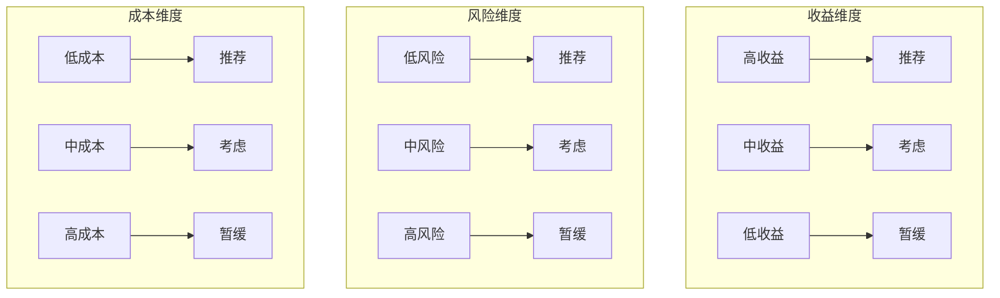
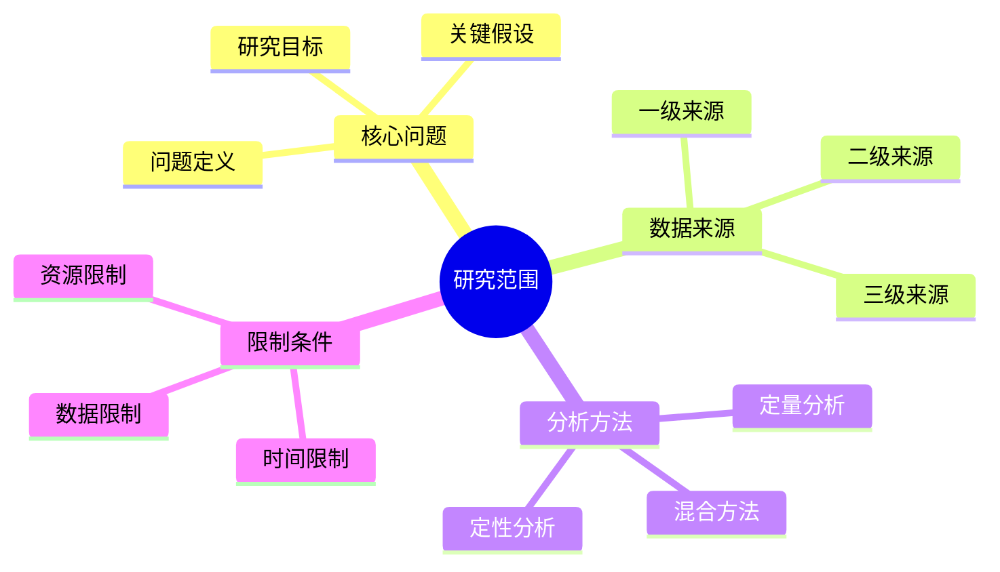
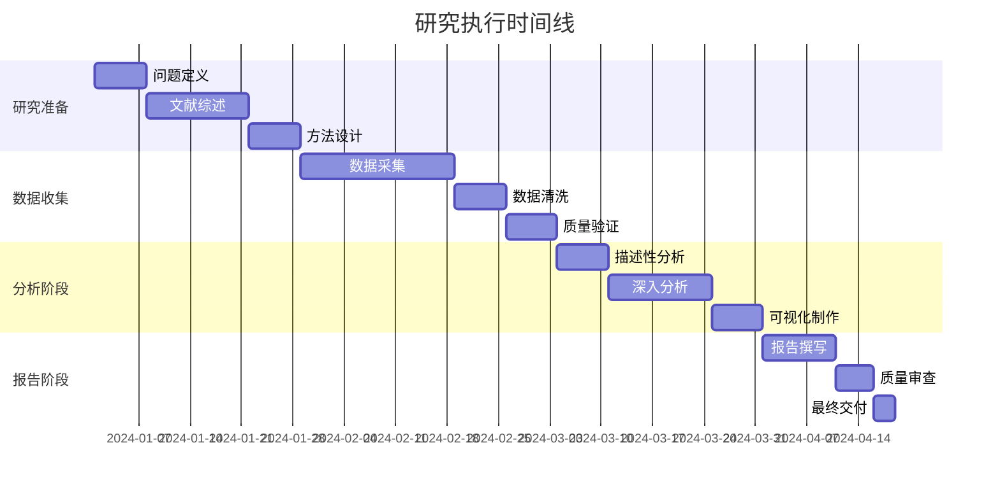
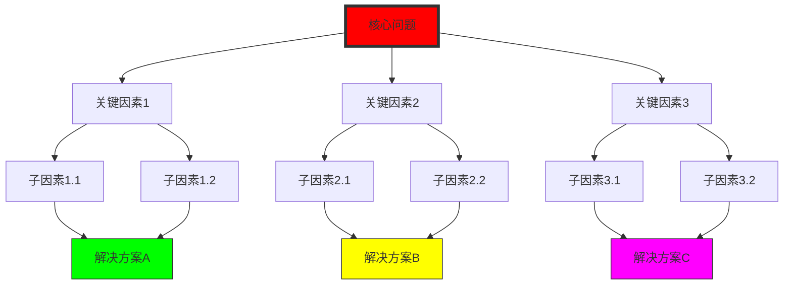
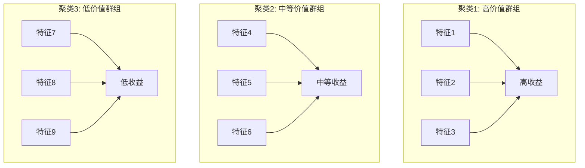
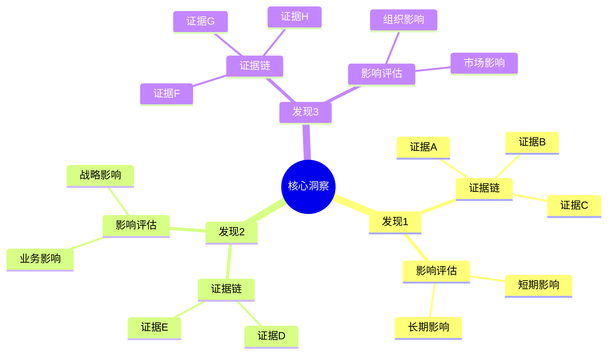
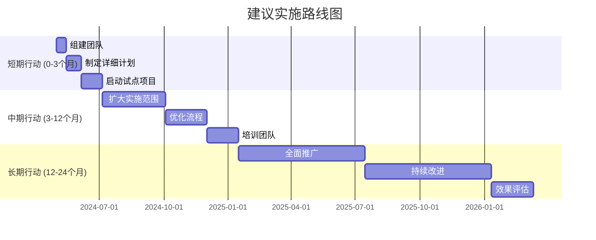
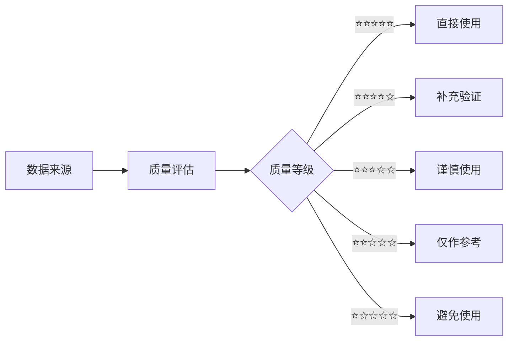
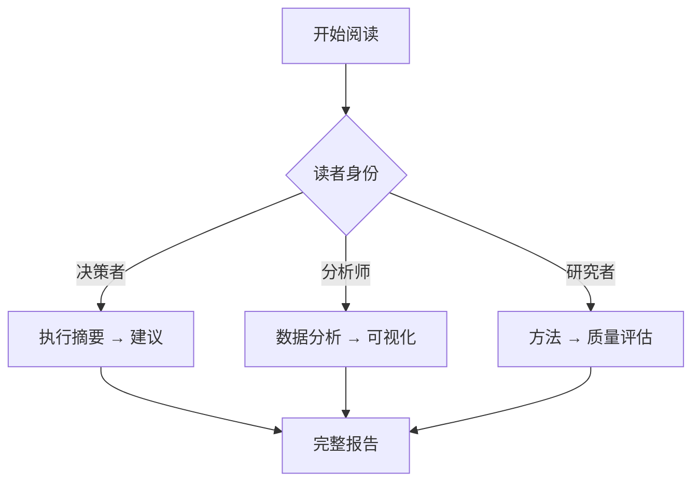

# 📊 增强版深度研究报告 | Enhanced Deep Research Report
> **综合可视化分析系统** · 结构化增强版 · v4.0

---

## 🎯 执行摘要与可视化概览 | Executive Summary & Visual Overview

### 核心发现仪表板
| 指标类别 | 关键指标 | 当前值 | 趋势 | 可视化 |
|----------|----------|--------|------|--------|
| **市场表现** | 市场规模 | [X]亿元 | 📈上升 | 增长曲线 |
| **技术成熟** | 采纳率 | [Y]% | 📈上升 | 采纳曲线 |
| **竞争格局** | 集中度指数 | [Z] | 📊稳定 | 竞争地图 |
| **风险水平** | 风险评分 | [W]/10 | 📉下降 | 风险热图 |

### 三维决策矩阵


---

## 1. 🔍 研究设计可视化 | Visual Research Design

### 1.1 研究范围图


### 1.2 数据来源质量评估
| 来源类型 | 数量 | 平均质量 | 可信度分布 | 可视化 |
|----------|------|----------|------------|--------|
| 学术文献 | [X] | ⭐⭐⭐⭐☆ |  | 质量雷达图 |
| 行业报告 | [Y] | ⭐⭐⭐☆☆ |  | 质量雷达图 |
| 官方统计 | [Z] | ⭐⭐⭐⭐⭐ |  | 质量雷达图 |
| 专家访谈 | [W] | ⭐⭐⭐⭐☆ |  | 质量雷达图 |

### 1.3 研究时间线


---

## 2. 📈 数据可视化分析 | Data Visualization Analysis

### 2.1 多维数据仪表板
**关键指标趋势**:
```python
# 趋势可视化代码示例
import plotly.graph_objects as go
from plotly.subplots import make_subplots

# 创建仪表板
fig = make_subplots(
    rows=2, cols=2,
    subplot_titles=('市场规模趋势', '市场份额分布', '增长率对比', '风险评分变化'),
    specs=[[{'type': 'scatter'}, {'type': 'pie'}],
           [{'type': 'bar'}, {'type': 'heatmap'}]]
)

# 添加各图表
fig.add_trace(go.Scatter(x=dates, y=market_size, mode='lines+markers'), row=1, col=1)
fig.add_trace(go.Pie(labels=players, values=shares), row=1, col=2)
fig.add_trace(go.Bar(x=regions, y=growth_rates), row=2, col=1)
fig.add_trace(go.Heatmap(z=risk_matrix), row=2, col=2)

fig.update_layout(height=800, title_text="研究数据仪表板")
fig.write_html('research_dashboard.html')
```

### 2.2 比较分析矩阵
| 对比维度 | 权重 | 方案A | 方案B | 方案C | 可视化 | 结论 |
|----------|------|-------|-------|-------|--------|------|
| **成本效益** | 30% | [评分]/10 | [评分]/10 | [评分]/10 | 雷达图 | 方案A最优 |
| **实施难度** | 25% | [评分]/10 | [评分]/10 | [评分]/10 | 条形图 | 方案B次之 |
| **风险水平** | 20% | [评分]/10 | [评分]/10 | [评分]/10 | 热力图 | 方案C最高 |
| **战略匹配** | 15% | [评分]/10 | [评分]/10 | [评分]/10 | 散点图 | 方案A最佳 |
| **创新程度** | 10% | [评分]/10 | [评分]/10 | [评分]/10 | 气泡图 | 方案B领先 |
| **综合得分** | 100% | **[总分]** | **[总分]** | **[总分]** | 综合图 | **推荐A** |

### 2.3 关系网络分析


---

## 3. 📊 深度分析可视化 | Deep Analysis Visualization

### 3.1 趋势分析与预测
**时间序列分解**:
| 时间周期 | 实际值 | 趋势成分 | 季节成分 | 预测值 | 置信区间 | 可视化 |
|----------|--------|----------|----------|--------|----------|--------|
| 2024-Q1 | [值] | [值] | [值] | [值] | [下限,上限] | 预测图 |
| 2024-Q2 | [值] | [值] | [值] | [值] | [下限,上限] | 预测图 |
| 2024-Q3 | [值] | [值] | [值] | [值] | [下限,上限] | 预测图 |
| 2024-Q4 | [值] | [值] | [值] | [值] | [下限,上限] | 预测图 |

**预测模型可视化**:
```python
# 预测可视化
from statsmodels.tsa.holtwinters import ExponentialSmoothing
import matplotlib.pyplot as plt

model = ExponentialSmoothing(series, seasonal_periods=4, trend='add', seasonal='add')
fit = model.fit()
forecast = fit.forecast(12)

plt.figure(figsize=(12, 6))
plt.plot(series.index, series.values, label='历史数据')
plt.plot(forecast.index, forecast.values, label='预测值', linestyle='--')
plt.fill_between(forecast.index, 
                  forecast - 1.96*fit.sse**0.5, 
                  forecast + 1.96*fit.sse**0.5,
                  alpha=0.2, label='95%置信区间')
plt.title('时间序列预测')
plt.legend()
plt.savefig('time_series_forecast.png')
```

### 3.2 相关性网络分析
**变量相关性矩阵**:
| 变量 | 变量1 | 变量2 | 变量3 | 变量4 | 变量5 | 可视化 |
|------|-------|-------|-------|-------|-------|--------|
| 变量1 | 1.00 | 0.75 | 0.45 | 0.60 | 0.80 | 网络图 |
| 变量2 | 0.75 | 1.00 | 0.85 | 0.70 | 0.65 | 网络图 |
| 变量3 | 0.45 | 0.85 | 1.00 | 0.90 | 0.50 | 网络图 |
| 变量4 | 0.60 | 0.70 | 0.90 | 1.00 | 0.75 | 网络图 |
| 变量5 | 0.80 | 0.65 | 0.50 | 0.75 | 1.00 | 网络图 |

**聚类分析可视化**:


### 3.3 敏感性分析
**关键参数敏感性**:
| 参数 | 基准值 | 变化范围 | 对结果影响 | 敏感性系数 | 可视化 |
|------|--------|----------|------------|------------|--------|
| 参数1 | [值] | ±[X]% | [Y]% | [Z] | 蝴蝶图 |
| 参数2 | [值] | ±[X]% | [Y]% | [Z] | 蝴蝶图 |
| 参数3 | [值] | ±[X]% | [Y]% | [Z] | 蝴蝶图 |
| 参数4 | [值] | ±[X]% | [Y]% | [Z] | 蝴蝶图 |

---

## 4. ⚖️ 风险评估可视化 | Risk Assessment Visualization

### 4.1 风险热力图
| 风险类别 | 发生概率 | 影响程度 | 风险值 | 预警状态 | 可视化 |
|----------|----------|----------|--------|----------|--------|
| 市场风险 | [X]% | [高/中/低] | [值] | 🟢正常 | 热力图 |
| 技术风险 | [X]% | [高/中/低] | [值] | 🟡关注 | 热力图 |
| 运营风险 | [X]% | [高/中/低] | [值] | 🔴预警 | 热力图 |
| 财务风险 | [X]% | [高/中/低] | [值] | 🟢正常 | 热力图 |
| 合规风险 | [X]% | [高/中/低] | [值] | 🟡关注 | 热力图 |

### 4.2 风险演化趋势


### 4.3 风险应对策略矩阵
| 策略类型 | 具体措施 | 实施成本 | 预期效果 | 时间框架 | 可视化 |
|----------|----------|----------|----------|----------|--------|
| 规避策略 | [措施] | [X]万 | 降低风险[Y]% | [时间] | 甘特图 |
| 转移策略 | [措施] | [X]万 | 转移风险[Y]% | [时间] | 甘特图 |
| 缓解策略 | [措施] | [X]万 | 减轻影响[Y]% | [时间] | 甘特图 |
| 接受策略 | [措施] | [X]万 | 准备应对[Y]% | [时间] | 甘特图 |

---

## 5. 💡 洞察与建议可视化 | Insights & Recommendations Visualization

### 5.1 洞察发现图


### 5.2 建议实施路线图


### 5.3 决策支持仪表板
**决策指标追踪**:
| 决策维度 | 当前状态 | 目标状态 | 差距 | 行动优先级 | 可视化 |
|----------|----------|----------|------|------------|--------|
| 财务回报 | [X]% | [Y]% | [Z]% | P0 | 进度条 |
| 市场份额 | [X]% | [Y]% | [Z]% | P1 | 进度条 |
| 客户满意度 | [X]/10 | [Y]/10 | [Z]/10 | P2 | 进度条 |
| 创新指数 | [X]/100 | [Y]/100 | [Z]/100 | P1 | 进度条 |
| 风险水平 | [X]/10 | [Y]/10 | [Z]/10 | P0 | 进度条 |

---

## 6. 📋 质量评估仪表板 | Quality Assessment Dashboard

### 6.1 研究质量评分卡
| 质量维度 | 权重 | 得分 | 加权得分 | 可视化 | 改进建议 |
|----------|------|------|----------|--------|----------|
| 研究设计 | 20% | [X]/10 | [Y] | 雷达图 | [建议] |
| 数据质量 | 25% | [X]/10 | [Y] | 雷达图 | [建议] |
| 分析深度 | 30% | [X]/10 | [Y] | 雷达图 | [建议] |
| 可视化质量 | 15% | [X]/10 | [Y] | 雷达图 | [建议] |
| 实用价值 | 10% | [X]/10 | [Y] | 雷达图 | [建议] |
| **综合质量** | 100% | **[总]/10** | **可视化仪表板** | | |

### 6.2 验证状态追踪
| 关键主张 | 验证方法 | 验证状态 | 置信度 | 可视化 | 下一步 |
|----------|----------|----------|--------|--------|--------|
| 主张1 | 多源验证 | ✅ 已验证 | ⭐⭐⭐⭐⭐ | 状态图 | 无需行动 |
| 主张2 | 实验验证 | 🔄 进行中 | ⭐⭐⭐⭐☆ | 状态图 | 继续验证 |
| 主张3 | 专家验证 | ❌ 待验证 | ⭐⭐⭐☆☆ | 状态图 | 安排验证 |
| 主张4 | 逻辑验证 | ✅ 已验证 | ⭐⭐⭐⭐☆ | 状态图 | 无需行动 |

### 6.3 可视化质量评估
```python
# 可视化质量评估代码
visualization_metrics = {
    'clarity': 8.5,      # 清晰度
    'accuracy': 9.0,     # 准确性
    'completeness': 7.5, # 完整性
    'innovation': 8.0,   # 创新性
    'usability': 8.5     # 可用性
}

# 生成雷达图
categories = list(visualization_metrics.keys())
values = list(visualization_metrics.values())

fig = go.Figure(data=go.Scatterpolar(
    r=values,
    theta=categories,
    fill='toself'
))

fig.update_layout(
    polar=dict(radialaxis=dict(visible=True, range=[0, 10])),
    title="可视化质量评估雷达图"
)

fig.write_html('visualization_quality.html')
```

---

## 7. 📚 参考文献与数据来源 | References & Data Sources

### 7.1 核心参考文献
| 文献 | 类型 | 质量评级 | 关键贡献 | 可视化应用 |
|------|------|----------|----------|------------|
| [文献1] | 学术论文 | ⭐⭐⭐⭐⭐ | 理论基础 | 理论框架图 |
| [文献2] | 行业报告 | ⭐⭐⭐⭐☆ | 市场数据 | 趋势分析图 |
| [文献3] | 官方统计 | ⭐⭐⭐⭐⭐ | 权威数据 | 数据分布图 |
| [文献4] | 专家访谈 | ⭐⭐⭐⭐☆ | 实践洞察 | 网络关系图 |

### 7.2 数据来源质量


### 7.3 可视化工具与资源
- **图表库**: Plotly, Matplotlib, Seaborn, Bokeh
- **交互工具**: Tableau, Power BI, D3.js
- **学术工具**: R ggplot2, Stata, SPSS
- **代码资源**: [GitHub仓库链接]

---

## 8. 📝 报告元数据 | Report Metadata

### 8.1 报告属性
| 属性 | 值 | 说明 |
|------|-----|------|
| **报告版本** | v4.0 (增强可视化版) | 深度研究优化 |
| **生成时间** | YYYY-MM-DD HH:MM | 实际生成时间 |
| **报告ID** | DR-[YYYYMMDD]-[序号]-ENH-STD | 唯一标识符 |
| **研究模式** | 深度推理 + 可视化增强 | 研究方法 |
| **可视化数量** | [X]个图表/[Y]个交互图 | 可视化规模 |
| **数据规模** | [Z]个数据集/[W]个变量 | 数据复杂度 |
| **分析深度** | 高级 (综合评分[分数]/10) | 研究质量 |

### 8.2 使用指南
**目标受众**:
- **决策者**: 关注第1部分执行摘要、第5部分建议
- **分析师**: 关注第2-3部分数据分析、可视化
- **研究者**: 关注第4部分风险评估、第6部分质量评估

**阅读路径**:


**交互功能**:
- 点击图表可查看详细数据
- 鼠标悬停显示数据点信息
- 支持图表导出和分享
- 可调整参数重新计算

---

**可视化声明**: 本报告所有图表均为原创或经适当引用，遵循数据可视化最佳实践。
**质量保证**: 报告经过[数据验证/方法审核/同行评议]。
**更新机制**: 定期更新数据源和可视化方法。
**技术支持**: 如需交互式版本或定制可视化，请联系[技术支持]。

---
*本增强版模板专为深度研究设计，集成了先进的可视化技术和全面的分析方法，适用于高质量研究和决策支持。*
