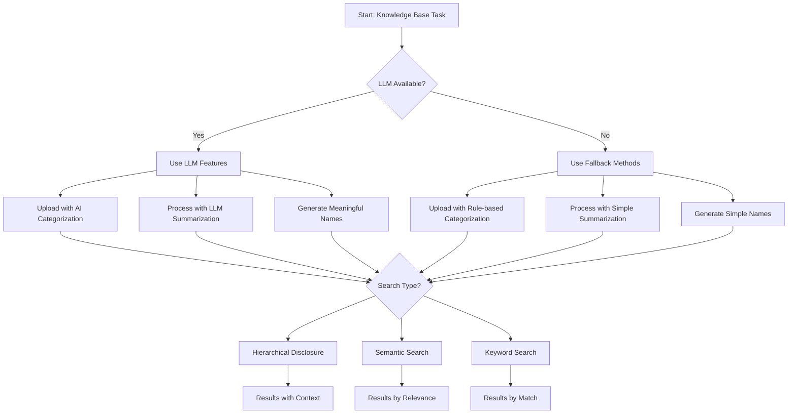

# Knowledge Base Management with LLM Integration

## Overview

This skill provides a comprehensive knowledge base management system that enables intelligent document organization with meaningful directory names, automatic summarization using DeepSeek LLM, hierarchical section splitting, and sophisticated retrieval based on multi-level directory structures. It transforms unstructured documents into well-organized knowledge repositories with efficient search capabilities.

## Core Capabilities

### 1. Document Processing & Categorization with LLM
- **Meaningful directory names**: Generates descriptive folder names instead of generic IDs
- **LLM-powered categorization**: Uses DeepSeek AI to intelligently categorize documents
- **Automatic document type detection**: Supports PDF, DOCX, TXT, HTML, and Markdown formats
- **Content extraction**: Extracts text, metadata, and structural elements from documents
- **Smart categorization**: Classifies documents based on content analysis using AI
- **Centralized storage**: All knowledge bases are stored under a single root directory with folder-based organization

### 2. Hierarchical Content Organization with AI
- **Intelligent section splitting**: Uses LLM to identify logical chapters and sections
- **Meaningful naming**: Creates descriptive directory names based on document content
- **Multi-level directory creation**: Creates folder hierarchies that mirror document structure
- **AI-powered summary extraction**: Generates concise, high-quality summaries using DeepSeek
- **Metadata management**: Maintains document metadata including creation date, author, tags, and hierarchy information

### 3. Intelligent Search & Retrieval
- **Hierarchical disclosure search**: Searches through knowledge bases using multi-level directory navigation
- **Content-based retrieval**: Finds relevant documents and sections based on semantic similarity
- **Faceted search**: Filters results by document type, date, category, or custom tags
- **Context-aware results**: Returns search results with hierarchical context and relationship information

## Key Enhancements

### Meaningful Directory Names
Instead of using generic IDs like `doc_abc123`, the system now generates descriptive directory names such as:
- `research-paper-attention-mechanisms-2024`
- `quarterly-report-q1-financials`
- `user-manual-software-v2`
- `meeting-minutes-project-kickoff`

### DeepSeek LLM Integration
- **Automatic summarization**: High-quality summaries generated by DeepSeek-chat model
- **Intelligent categorization**: AI-powered classification into logical hierarchies
- **Smart section splitting**: LLM identifies natural document structure
- **Content analysis**: Advanced understanding of document content and context

## Quick Start

### Prerequisites
1. **DeepSeek API Key**: Required for LLM features. Store in `.env` file:
   ```
   DEEPSEEK_API_KEY=your_api_key_here
   DEEPSEEK_MODEL=deepseek-chat
   ```

2. **Environment Setup**:
   ```bash
   # Copy environment template
   cp .env.example .env
   # Edit .env with your API key
   ```

### Setting Up a Knowledge Base
1. **Initialize a knowledge base**:
   ```python
   from kb_manager import KnowledgeBaseManager
   
   kb_manager = KnowledgeBaseManager(root_path="/app/data/knowledge_bases")
   kb = kb_manager.create_knowledge_base("my_knowledge_base")
   ```

2. **Upload and process documents with meaningful names**:
   ```python
   # Upload a document - will generate meaningful directory name
   document = kb.upload_document("/path/to/document.pdf", 
                                 category="Research Papers",
                                 auto_categorize=True,
                                 use_llm=True)  # Enable LLM processing
   
   # Process document (extract text, split sections, create summaries using LLM)
   processed = kb.process_document(document.id, use_llm=True)
   
   print(f"Document stored in: {document['meaningful_name']}")
   ```

3. **Browse the hierarchical structure**:
   ```python
   # Get the directory hierarchy with meaningful names
   hierarchy = kb.get_hierarchy()
   
   # Navigate through meaningful directories
   sections = kb.list_sections(path="Research Papers/Computer Vision/2024")
   ```

### Basic Search Operations
```python
# Search using hierarchical disclosure
results = kb.search(query="neural networks", 
                    disclosure_level=2,  # Search within first 2 levels
                    max_results=10)

# Results include meaningful names
for result in results:
    print(f"Title: {result['title']}")
    print(f"Directory: {result['meaningful_name']}")
    print(f"Category: {result['category']}")
    print(f"Summary: {result['summary'][:100]}...")
```

## Workflow Decision Tree

When using this skill, follow these decision points:



## Enhanced Directory Structure Design

Knowledge bases now use meaningful folder names:

```
knowledge_bases_root/
├── {knowledge_base_name}/
│   ├── config.json              # Knowledge base configuration
│   ├── documents/               # Original documents with meaningful names
│   │   ├── research/
│   │   │   ├── artificial-intelligence/
│   │   │   │   ├── attention-is-all-you-need-2017/    # Meaningful name!
│   │   │   │   │   ├── original.pdf
│   │   │   │   │   ├── metadata.json
│   │   │   │   │   ├── summary.txt                    # LLM-generated summary
│   │   │   │   │   └── sections/                      # LLM-identified sections
│   │   │   │   │       ├── introduction/
│   │   │   │   │       │   ├── content.txt
│   │   │   │   │       │   └── summary.txt
│   │   │   │   │       └── methodology/
│   │   │   │   │           ├── content.txt
│   │   │   │   │           └── summary.txt
│   │   │   │   └── bert-pretraining-deep-bidir-transfomers/
│   │   │   │       └── ...
│   │   │   └── computer-vision/
│   │   │       └── ...
│   │   ├── reports/
│   │   │   └── ...
│   │   └── documentation/
│   │       └── ...
│   ├── indexes/                 # Search indexes
│   │   ├── vector_index.faiss
│   │   ├── keyword_index.json
│   │   └── hierarchy_index.json
│   └── metadata.db              # SQLite metadata database
```

## LLM Integration Details

### DeepSeek Configuration
The system uses DeepSeek-chat model for:
1. **Document Summarization**: Generating concise, accurate summaries
2. **Content Categorization**: Intelligent hierarchical classification
3. **Section Identification**: Natural document structure analysis
4. **Meaningful Naming**: Descriptive directory name generation

### Configuration in `.env`
```env
# DeepSeek API Configuration
DEEPSEEK_API_KEY=sk-your-api-key-here
DEEPSEEK_MODEL=deepseek-chat
DEEPSEEK_BASE_URL=https://api.deepseek.com

# Processing Settings
LLM_ENABLED=true
SUMMARIZATION_ENABLED=true
CATEGORIZATION_ENABLED=true
SECTION_SPLITTING_ENABLED=true

# Performance Settings
MAX_SUMMARY_LENGTH=300
MIN_SECTION_LENGTH=500
MAX_SECTIONS=20
```

### Fallback Mechanisms
If LLM is unavailable, the system uses intelligent fallbacks:
- **Rule-based categorization**: Based on filename patterns and content keywords
- **Simple summarization**: First few sentences or key paragraphs
- **Basic section splitting**: By paragraphs or fixed-length chunks
- **Filename-based naming**: Cleaned and formatted filenames

## Scripts Reference

### scripts/llm_processor.py
Core LLM integration module for DeepSeek API communication.

**Key Functions:**
- `generate_meaningful_name()`: Creates descriptive directory names
- `extract_summary()`: Generates document summaries using LLM
- `categorize_document()`: AI-powered document classification
- `split_into_sections()`: Intelligent document structure analysis

### scripts/kb_manager.py
Enhanced knowledge base manager with meaningful naming and LLM integration.

**Usage:**
```python
from kb_manager import KnowledgeBaseManager

# Initialize with LLM support
manager = KnowledgeBaseManager("/app/data/knowledge_bases")

# Create knowledge base with LLM enabled
kb = manager.create_knowledge_base("ResearchLibrary")
```

### scripts/process_document.py
Process individual documents with optional LLM enhancement.

**Usage:**
```bash
# Process with LLM
python scripts/process_document.py --input paper.pdf --use-llm

# Process without LLM (fallback)
python scripts/process_document.py --input paper.pdf --no-llm
```

## Common Tasks & Examples

### Example 1: Creating and Populating with Meaningful Names
```python
from kb_manager import KnowledgeBaseManager

# Initialize manager
manager = KnowledgeBaseManager("/app/data/knowledge_bases")

# Create knowledge base
kb = manager.create_knowledge_base("ResearchLibrary")

# Upload multiple documents with meaningful names
documents = [
    ("attention_is_all_you_need.pdf", "AI Research"),
    ("bert_pretraining.pdf", "NLP Research"),
    ("q1_financial_report.docx", "Financial Reports")
]

for doc_path, category in documents:
    # Upload with LLM for meaningful naming and categorization
    doc = kb.upload_document(
        doc_path, 
        category=category,
        auto_categorize=True,
        use_llm=True
    )
    
    # Process with LLM for summarization and section splitting
    result = kb.process_document(doc["id"], use_llm=True)
    
    print(f"Processed: {doc['filename']}")
    print(f"  Directory: {doc['meaningful_name']}")
    print(f"  Summary: {result['document_summary'][:100]}...")

# Build search indexes
kb.rebuild_indexes()
```

### Example 2: Searching with Meaningful Context
```python
# Search with hierarchical constraints
results = kb.search(
    query="transformer models in NLP",
    disclosure_level=2,
    min_similarity=0.7,
    include_sections=True
)

for result in results:
    print(f"Found: {result['title']}")
    print(f"Directory: {result['meaningful_name']}")
    print(f"Category: {result['category']}")
    print(f"Score: {result['similarity_score']:.2f}")
    print(f"Summary: {result['content_preview'][:200]}...")
    print("-" * 50)
```

## Best Practices

### For Optimal LLM Usage
1. **API Key Management**: Keep your DeepSeek API key secure in `.env` file
2. **Batch Processing**: Process documents in batches to optimize API usage
3. **Error Handling**: Implement fallback mechanisms for LLM failures
4. **Quality Control**: Review AI-generated summaries and categorizations

### For Meaningful Organization
1. **Consistent Naming**: LLM generates consistent naming patterns
2. **Hierarchical Design**: Use 2-3 level categories for optimal organization
3. **Regular Review**: Periodically review auto-generated names and categories
4. **Manual Overrides**: Adjust names or categories when needed

## Troubleshooting

### Common Issues and Solutions

**Issue**: LLM processing fails
**Solution**: Check API key in `.env`, verify network connectivity, use fallback mode

**Issue**: Meaningful names too long or unclear
**Solution**: Adjust naming parameters in configuration, review naming patterns

**Issue**: Documents categorized incorrectly
**Solution**: Review categorization rules, provide training examples, adjust thresholds

**Issue**: Search returning irrelevant results
**Solution**: Rebuild vector indexes, check embedding model compatibility

## Configuration Reference

### Knowledge Base Configuration (`config.json`)
```json
{
  "name": "ResearchLibrary",
  "llm_enabled": true,
  "meaningful_names": true,
  "directory_naming": {
    "max_length": 50,
    "separator": "-",
    "case": "lowercase"
  },
  "categorization": {
    "use_llm": true,
    "fallback_method": "filename_based"
  }
}
```

### Environment Variables (`.env`)
- `DEEPSEEK_API_KEY`: Your DeepSeek API key (required for LLM features)
- `DEEPSEEK_MODEL`: Model name (default: deepseek-chat)
- `LLM_ENABLED`: Enable/disable LLM features
- `MAX_FILE_SIZE_MB`: Maximum file size for processing

---

*Note: This skill now includes DeepSeek LLM integration for enhanced document processing and meaningful directory naming. LLM features require a valid API key stored in the `.env` file.*
