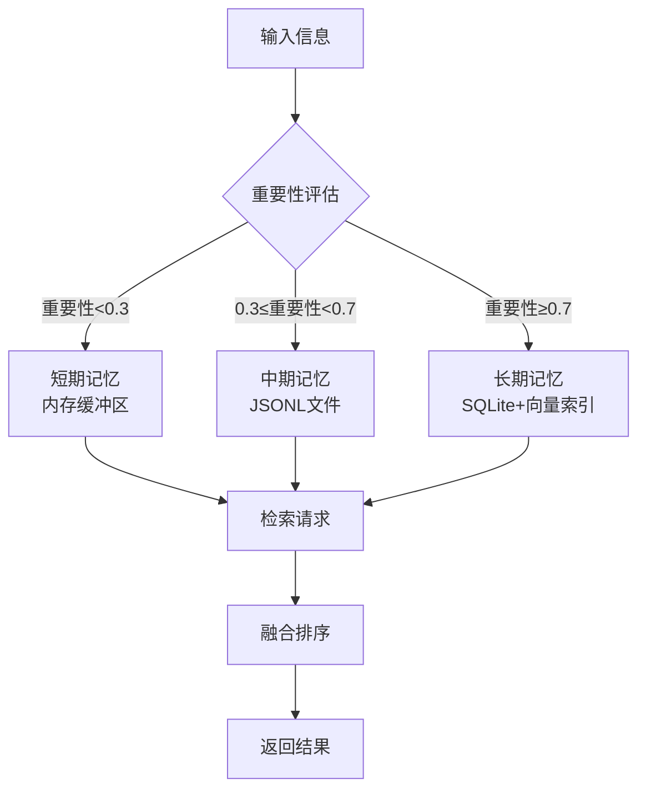

> **重要更新**: 记忆系统的嵌入模型现在只支持Ollama，不支持其他方式。
> - Ollama服务地址: `http://host.docker.internal:11434` (适用于Docker环境)
> - 默认模型: `bge-m3` (推荐用于中文)
> - 配置已自动更新，初始化脚本会生成正确的配置

# Memory System Skill


> **重要提示**：记忆系统对外仅支持CLI（命令行）调用方式，所有操作均应通过`memory_cli.py`脚本完成。不再提供直接的Python API调用。

## 🚀 初始化与检测

### 1. 初始化检测
在使用记忆系统之前，**必须确保系统已正确初始化**。系统会自动检测初始化状态：

```bash
# 手动检查初始化状态
python scripts/memory_cli.py stats
```

### 3. 一键初始化
```bash
# 运行初始化脚本（自动检测和修复）
python scripts/init_memory_system.py --storage-base /app/data/memory
```

### 4. 初始化标志文件
初始化完成后，系统会在存储目录下创建初始化标志文件：
- 标志文件：`/app/data/memory/.initialized`
- 配置文件：`/app/data/memory/config.yaml`
- 目录结构：自动创建所有必要的子目录

### 5. 初始化验证
初始化完成后，您可以验证系统状态：

```bash
# 验证初始化
python scripts/memory_cli.py stats

# 测试存储功能
python scripts/memory_cli.py store --content "初始化测试记忆" --importance 0.5
```

### 6. 自动检测机制
每次启动记忆系统时，系统会自动：
1. 检查存储目录是否存在
2. 验证配置文件完整性
3. 确认数据库和向量存储可用性
4. 如果检测到问题，会给出明确的修复建议

---

## 📋 快速开始

### CLI优先 - 纯命令行接口

记忆系统现已优化为纯CLI调用方式，无需在代码中初始化MemoryManager类。所有操作均可通过命令行直接完成。

#### 1. 命令行接口 (memory_cli.py)

直接通过命令行执行记忆操作：

```bash
# 存储记忆
python scripts/memory_cli.py store \
  --content "用户喜欢黑咖啡，每天早上一杯" \
  --importance 0.8 \
  --tags "饮食,偏好"

# 检索记忆
python scripts/memory_cli.py retrieve \
  --query "咖啡" \
  --limit 5

# 获取统计信息
python scripts/memory_cli.py stats
```

**常用命令示例：**

| 场景 | 命令 |
|------|------|
| 存储用户偏好 | `python scripts/memory_cli.py store --content "用户不喜欢甜食" --importance 0.7 --tags "饮食,偏好"` |
| 检索近期记忆 | `python scripts/memory_cli.py retrieve --query "饮食" --memory-types "short_term,medium_term"` |
| 仅语义搜索 | `python scripts/memory_cli.py retrieve --query "健康习惯" --no-semantic` |
| 查看系统状态 | `python scripts/memory_cli.py stats` |

#### 2. 从任何位置调用

记忆操作脚本设计为可直接从任何位置调用，无需设置环境：

```python
import subprocess

# 通过命令行存储记忆
result = subprocess.run([
    "python", "/app/.proteus/skills/memory-system/scripts/memory_cli.py",
    "store",
    "--content", "通过子进程存储的记忆",
    "--importance", "0.6"
], capture_output=True, text=True)

print(result.stdout)
```

### 脚本优势

1. **零初始化**：无需创建和管理MemoryManager实例
2. **配置自动加载**：自动查找配置文件，支持环境变量
3. **错误处理完善**：内置异常捕获和友好错误提示
4. **输出格式化**：命令行输出美观易读
5. **向后兼容**：完全兼容现有API

### 配置文件自动发现

脚本会自动查找配置文件，优先级如下：
1. 通过`--config`参数指定
2. 环境变量`MEMORY_CONFIG_PATH`
3. `/app/data/memory/config.yaml`
4. 技能目录下的默认模板配置

## 🚀 直接脚本执行

### 无需初始化的记忆操作

记忆系统现在提供了直接执行脚本的方式，无需在代码中初始化类，简化了使用流程。

### 1. 命令行接口 (memory_cli.py)

```bash
# 存储记忆
python scripts/memory_cli.py store \
  --content "用户喜欢黑咖啡，每天早上一杯" \
  --importance 0.8 \
  --tags "饮食,偏好"

# 检索记忆  
python scripts/memory_cli.py retrieve \
  --query "咖啡" \
  --limit 5

# 获取统计信息
python scripts/memory_cli.py stats
```

## 🏗️ 核心架构

### 三层记忆体系



### 1. 短期记忆 (Short-Term Memory)
- **用途**：当前会话上下文，工作记忆
- **存储**：内存缓冲区（最大20条）
- **生命周期**：当前会话期间
- **典型用例**：对话历史、临时计算状态

### 2. 中期记忆 (Medium-Term Memory)
- **用途**：近期重要信息，会话摘要
- **存储**：按日期分片的JSONL文件
- **生命周期**：7-30天（可配置）
- **典型用例**：用户近期偏好、任务状态、会话摘要

### 3. 长期记忆 (Long-Term Memory)
- **用途**：永久知识，用户画像
- **存储**：SQLite（结构化）+ Chroma（向量）
- **生命周期**：永久存储
- **典型用例**：用户身份信息、长期偏好、专业知识

### 存储后端对比

| 特性 | JSON文件存储（旧版） | SQLite + Chroma（推荐） |
|------|---------------------|------------------------|
| **结构化查询** | 线性搜索，性能差 | 索引查询，高性能 |
| **语义搜索** | 基本向量计算 | 专业向量数据库 |
| **扩展性** | 手动管理，有限 | 自动管理，支持百万级 |
| **数据一致性** | 容易出错 | ACID事务保证 |
| **安装复杂度** | 简单 | 需要额外依赖 |

## 🚀 主要特性

### 5. AOF持久化日志（Redis风格）
记忆存储操作会自动记录到AOF（Append-Only File）日志中，确保数据持久化和可恢复性：

```bash
# 查看AOF日志
tail -f /app/data/memory/logs/memory_aof.log

# 实时监控日志
tail -n 20 /app/data/memory/logs/memory_aof.log
```

**日志格式（JSON行格式）：**
```json
{"op": "STORE", "id": "stm_abc123", "timestamp": "2026-02-02T10:30:00.123456", "data": {"content": "用户喜欢黑咖啡", "importance": 0.8, "tags": ["饮食", "偏好"], "memory_type": "long_term"}}
{"op": "STORE", "id": "ltm_def456", "timestamp": "2026-02-02T10:31:00.456789", "data": {"content": "用户的工作时间是9点到18点", "importance": 0.9, "tags": ["工作", "作息"], "memory_type": "medium_term"}}
```

**AOF日志特性：**
- ✅ **实时追加**：每个存储操作立即写入日志文件
- ✅ **幂等性**：日志记录包含完整信息，支持重放恢复
- ✅ **可审计**：完整记录所有存储操作、时间戳和元数据
- ✅ **故障恢复**：系统重启时可通过重放日志恢复数据
- ✅ **日志轮转**：自动管理日志大小（默认100MB），避免无限增长
- ✅ **JSON格式**：每行一个完整的JSON对象，易于解析和处理

**日志文件位置：**
- 主日志文件：`/app/data/memory/logs/memory_aof.log`
- 轮转备份：`/app/data/memory/logs/memory_aof.log.{timestamp}.bak`

**恢复工具：**
系统提供了 `scripts/recover_from_aof.py` 工具，可以从AOF日志恢复记忆数据：
```bash
python scripts/recover_from_aof.py --aof-file /app/data/memory/logs/memory_aof.log
```
### 1. 统一存储接口
```bash
# 通过CLI统一存储
python scripts/memory_cli.py store \
  --content "任何记忆内容" \
  --memory-type "auto"  # 自动根据重要性判断 \
  --importance 0.8 \
  --tags "标签1,标签2"
```

### 2. 智能检索
- **关键词搜索**：传统文本匹配
- **语义搜索**：基于向量相似度
- **混合检索**：两者结合，智能排序
- **过滤能力**：按标签、重要性、时间范围

### 3. LLM增强（可选）
```bash
# 启用LLM增强记忆内容
python scripts/memory_cli.py store \
  --content "原始文本内容" \
  --importance 0.8 \
  --tags "llm_enhanced" \
  --metadata '{"use_llm": true}'
```

### 4. 向量嵌入支持
```yaml
# 配置嵌入模型
embedding:
  enabled: true
  providers:
    ollama:
      base_url: "http://host.docker.internal:11434"
      default_model: "bge-m3"
    openai:
      api_key: "${OPENAI_API_KEY}"
      default_model: "text-embedding-3-small"
```

## 🔧 配置指南

### 最小配置
```yaml
# /app/data/memory/config.yaml
memory:
  short_term:
    max_items: 20
    
  medium_term:
    retention_days: 30
    
  long_term:
    database_path: "/app/data/memory/long/memory.db"
    use_chroma: true
```

### 高级配置
```yaml
# 启用所有高级功能
llm:
  enabled: true
  default_provider: "openai"
  
embedding:
  enabled: true
  default_provider: "ollama"

chroma:
  persist_directory: "/app/data/memory/chroma"
  collection_name: "memories"
```

## 📚 API参考

### 核心CLI命令

#### `python scripts/memory_cli.py store`
```bash
python scripts/memory_cli.py store \
  --content "记忆内容" \
  --memory-type "auto"          # auto|short_term|medium_term|long_term \
  --importance 0.5             # 0.0-1.0 \
  --tags "标签1,标签2" \
  --metadata '{"key": "value"}'  # 自定义元数据
```

#### `python scripts/memory_cli.py retrieve`
```bash
python scripts/memory_cli.py retrieve \
  --query "搜索词"              # 可选 \
  --memory-types "short_term,long_term"  # 指定记忆类型 \
  --limit 10                   # 返回数量限制 \
  --no-semantic               # 禁用语义搜索
```

#### `python scripts/memory_cli.py stats`
```bash
python scripts/memory_cli.py stats
```

## 💡 使用场景

### 场景1：记住用户偏好
```bash
# 通过CLI存储用户偏好
python scripts/memory_cli.py store \
  --content "我喜欢喝黑咖啡，不加糖" \
  --importance 0.8 \
  --tags "preference,饮食" \
  --metadata '{"category": "food_preference"}'
```

### 场景2：跨会话上下文保持
```python
# 会话结束时保存摘要
import subprocess

session_summary = "会话摘要: 讨论了5个主题"
result = subprocess.run([
    "python", "/app/.proteus/skills/memory-system/scripts/memory_cli.py",
    "store",
    "--content", session_summary,
    "--memory-type", "medium_term",
    "--importance", "0.6",
    "--tags", "session_summary"
], capture_output=True, text=True)
```

### 场景3：智能问答增强
```bash
# 检索相关记忆作为上下文
python scripts/memory_cli.py retrieve \
  --query "用户喜欢什么饮料" \
  --limit 5 \
  --memory-types "long_term" \
  --no-semantic
```

## 📈 高级主题

### 多用户支持
```bash
# 通过元数据区分用户
python scripts/memory_cli.py store \
  --content "用户偏好" \
  --metadata '{"user_id": "user_123", "session_id": "session_456"}'
```

### 数据迁移
```bash
# 从旧版迁移到新版
python scripts/migrate_to_chroma.py --source old_memories.json --target memory.db
```

## 📝 最佳实践

1. **重要性评分策略**
   - 0.9-1.0：身份信息、安全相关
   - 0.7-0.9：强烈偏好、重要技能
   - 0.5-0.7：一般偏好、一次性事件
   - 0.3-0.5：临时信息、可能变化
   - 0.0-0.3：闲聊内容、无关细节

2. **标签使用规范**
   - 使用一致的标签命名（小写、用下划线）
   - 建立分类体系：`category:subcategory`
   - 避免过多标签（3-5个为宜）

3. **定期维护**
   - 每周清理过期中期记忆
   - 每月备份长期记忆数据库
   - 定期检查存储使用情况

## 🆕 更新日志

### 初始化与维护
1. **环境准备**
   - 在新环境部署时，**首先运行初始化脚本**
   - 验证目录权限和依赖安装
   - 检查配置文件是否正确生成

2. **初始化检测**
   - 系统会自动检测初始化状态
   - 如果未初始化，CLI命令会给出明确提示
   - 建议在启动应用前先运行`python scripts/memory_cli.py stats`验证

3. **AOF日志管理**
   - 定期检查日志文件大小（默认最大100MB）
   - 重要操作前可手动备份日志文件
   - 日志轮转自动进行，无需手动干预

4. **故障恢复**
   - 如果数据损坏，可从AOF日志恢复
   - 使用`scripts/recover_from_aof.py`工具进行恢复
   - 定期备份配置和数据库文件
