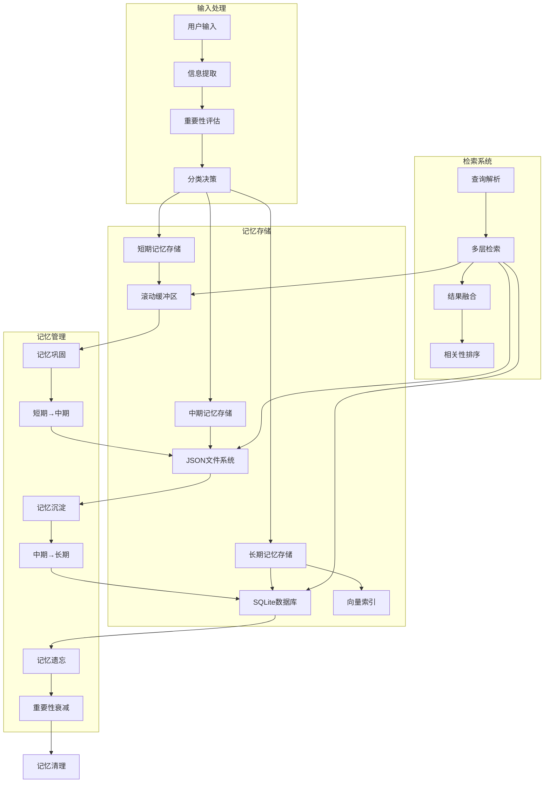
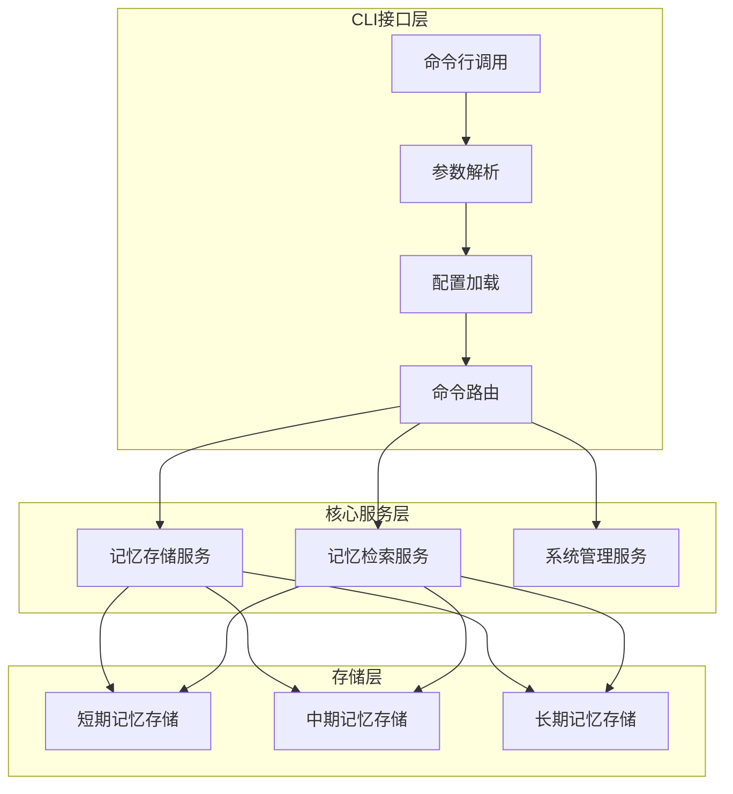

# 记忆系统架构设计

## 设计理念

本记忆系统借鉴了现代操作系统内存管理、人脑记忆机制和AI智能体记忆研究，旨在解决大语言模型上下文窗口有限导致的"失忆"问题。核心设计原则包括：

1. **分层存储**：不同时间尺度的记忆使用不同存储策略
2. **智能流转**：记忆在层级间自动迁移（巩固、遗忘）
3. **高效检索**：多维度索引支持快速相关记忆查找
4. **可扩展性**：支持插件式存储后端和检索算法

## 系统架构图



## 1. 短期记忆层

### 设计目标
- 维持当前会话连贯性
- 低延迟访问
- 有限资源占用

### 实现方案
短期记忆使用固定大小的队列（如Python的deque）在内存中存储最近交互。每个记忆项包含内容、时间戳和元数据。当队列满时，最旧的记忆被淘汰。

### 存储格式
- **内存存储**：Python对象，会话期间有效
- **文件备份**：可选JSON文件，用于会话恢复
- **容量管理**：固定大小队列，先进先出

## 2. 中期记忆层

### 设计目标
- 跨会话记忆保持
- 主题聚类和摘要
- 时间衰减管理

### 实现方案
中期记忆使用JSON文件按日期组织存储。每天一个文件，每行一个记忆项。系统定期（如每天）清理超过保留期（如30天）的文件。记忆项包含重要性评分、标签和内容摘要。

### 存储格式
- **JSON行文件**：每行一个记忆项
- **按日期组织**：便于时间范围查询
- **定期清理**：自动删除超过保留期的文件

## 3. 长期记忆层

### 设计目标
- 永久性知识存储
- 语义检索支持
- 结构化信息管理

### 实现方案
长期记忆使用SQLite数据库存储结构化数据，同时使用向量数据库（如FAISS）存储嵌入向量以支持语义检索。记忆项包含完整内容、重要性评分、访问统计和丰富元数据。

### 存储架构
```
长期记忆存储
├── SQLite数据库 (结构化数据)
│   ├── memories表 - 记忆元数据
│   ├── users表 - 用户信息
│   └── events表 - 重要事件
└── 向量存储 (语义检索)
    ├── FAISS索引 - 快速相似性搜索
    └── embedding缓存 - 减少重复计算
```

## 4. 记忆流转机制

### 记忆巩固 (Consolidation)
短期记忆 → 中期记忆的转换过程：
1. **会话结束触发**：自动生成会话摘要
2. **重要性过滤**：只保留重要性>0.3的内容
3. **主题聚类**：相似内容合并
4. **存储到中期记忆**

### 记忆沉淀 (Sedimentation)
中期记忆 → 长期记忆的转换过程：
1. **定期扫描**：每日检查中期记忆
2. **重要性评估**：重要性>0.7的内容升级
3. **结构化处理**：提取实体、关系
4. **存储到长期记忆**

### 记忆遗忘 (Forgetting)
- **时间衰减**：重要性 = 原始重要性 × exp(-衰减率 × 年龄)
- **访问频率**：频繁访问的记忆重要性增加
- **主动遗忘**：用户请求或系统策略

## 5. 检索系统

### 多层检索流程
1. **查询解析**：提取关键词、意图、时间范围
2. **并行搜索**：同时查询三层记忆
3. **结果融合**：基于相关性、时效性、重要性加权
4. **返回Top-K**：最相关的K个记忆项

### 检索算法
检索系统支持多种检索模式：
- **关键字检索**：在短期和中期记忆中搜索
- **语义检索**：在长期记忆中使用向量相似度搜索
- **混合检索**：结合多种检索策略的结果

## 6. 性能优化

### 缓存策略
- **热点记忆缓存**：频繁访问的记忆缓存在内存
- **查询结果缓存**：相同查询缓存一段时间
- **向量索引分片**：大规模数据时分片存储

### 存储优化
- **记忆压缩**：定期压缩相似记忆
- **增量索引**：向量索引增量更新
- **冷热分离**：不常访问的数据归档存储

## 7. 监控与维护

### 关键指标
- **存储使用率**：各层记忆占用量
- **检索命中率**：各层检索成功率
- **响应时间**：平均检索延迟
- **记忆质量**：用户反馈记忆准确性

### 维护任务
- **每日**：清理过期中期记忆，备份重要数据
- **每周**：重新计算记忆重要性，优化索引
- **每月**：全面系统检查，生成使用报告

---

## 参考文献

1. MemoryOS: 大模型记忆操作系统 (北邮百家AI团队)
2. AI Agent记忆体系与架构设计 (知乎技术文章)
3. Human Memory Models for Artificial Intelligence (Neuroscience Review)
4. Vector Databases for Semantic Search (FAISS Documentation)


## CLI接口层

### 设计原则
记忆系统对外仅提供CLI（命令行接口）调用方式，遵循以下设计原则：
1. **零初始化**：无需创建和管理类实例，开箱即用
2. **配置自动发现**：自动查找配置文件，简化部署
3. **标准化输出**：统一格式的输出，便于脚本处理
4. **错误处理完善**：友好的错误提示和退出码

### CLI架构图


### 接口设计
- **统一入口**：所有功能通过`memory_cli.py`脚本访问
- **命令结构**：动词-名词结构（如`store`, `retrieve`, `stats`）
- **参数规范**：POSIX风格长参数（`--parameter`）
- **输出格式**：人类可读文本 + 可选的机器可读格式

### 调用示例
```bash
# 存储记忆（无需初始化类）
python scripts/memory_cli.py store --content "用户偏好" --importance 0.8

# 检索记忆（直接命令行操作）
python scripts/memory_cli.py retrieve --query "偏好" --limit 5

# 系统统计（纯CLI调用）
python scripts/memory_cli.py stats
```

### 集成方式
CLI接口支持多种集成方式：
1. **直接命令行调用**：交互式使用或脚本调用
2. **子进程调用**：从Python、Node.js等语言通过子进程调用
3. **定时任务**：通过cron等调度系统定期执行
4. **管道处理**：与其他命令行工具通过管道组合

### 优势
1. **简化使用**：无需学习API，直接命令行操作
2. **环境无关**：可在任何支持Python的环境运行
3. **易于调试**：标准输出输入，便于问题排查
4. **脚本友好**：易于集成到自动化脚本和流水线

---

**注**：本系统不再提供直接的Python API调用，所有外部访问均应通过CLI接口进行。详细CLI使用请参考`cli_reference.md`（原`api_reference.md`）。
