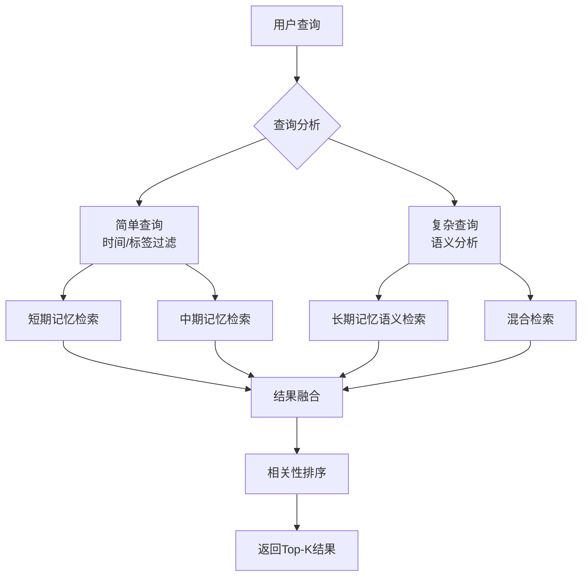

# 记忆管理最佳实践

## CLI使用最佳实践

记忆系统现已优化为纯命令行接口(CLI)，所有操作均通过`memory_cli.py`脚本完成。以下是在CLI模式下使用记忆系统的最佳实践。

### 1. 命令行调用模式

#### 直接交互式使用
```bash
# 存储记忆 - 交互式
python /app/.proteus/skills/memory-system/scripts/memory_cli.py store \
  --content "用户偏好信息" \
  --importance 0.8 \
  --tags "偏好,用户画像"

# 检索记忆 - 交互式
python /app/.proteus/skills/memory-system/scripts/memory_cli.py retrieve \
  --query "用户偏好" \
  --limit 5
```

#### 脚本自动化调用
```bash
#!/bin/bash
# 自动化脚本示例
MEMORY_SCRIPT="/app/.proteus/skills/memory-system/scripts/memory_cli.py"

# 批量存储用户数据
for user_data in "喜欢咖啡" "讨厌甜食" "习惯早起"; do
    python "$MEMORY_SCRIPT" store \
        --content "用户$user_data" \
        --importance 0.6 \
        --tags "自动化收集"
done
```

#### 通过子进程调用（从其他语言）
```python
# Python子进程调用
import subprocess
import json

result = subprocess.run([
    "python", "/app/.proteus/skills/memory-system/scripts/memory_cli.py",
    "store",
    "--content", "通过Python子进程存储的记忆",
    "--importance", "0.7"
], capture_output=True, text=True)

if result.returncode == 0:
    print("存储成功:", result.stdout)
else:
    print("存储失败:", result.stderr)
```

### 2. 配置管理最佳实践

#### 环境变量配置
```bash
# 推荐：使用环境变量管理配置
export MEMORY_CONFIG_PATH="/app/data/memory/config.yaml"
export OPENAI_API_KEY="sk-..."  # 如果需要OpenAI

# 所有后续CLI调用都会自动使用这些配置
python memory_cli.py stats
```

#### 配置文件版本控制
```bash
# 将配置文件纳入版本控制
cp /app/.proteus/skills/memory-system/assets/templates/config.yaml /app/data/memory/config.yaml
git add /app/data/memory/config.yaml
```

#### 多环境配置
```bash
# 为不同环境使用不同配置
# 开发环境
MEMORY_CONFIG_PATH="./config_dev.yaml" python memory_cli.py store --content "开发测试"

# 生产环境  
MEMORY_CONFIG_PATH="/etc/memory/config_prod.yaml" python memory_cli.py store --content "生产数据"
```

### 3. 性能优化CLI技巧

#### 批量操作优化
```bash
# 避免频繁调用，使用批量处理
# 不推荐：循环中频繁调用
for i in {1..100}; do
    python memory_cli.py store --content "项目$i" --importance 0.5
done

# 推荐：生成批量数据后一次处理
(
for i in {1..100}; do
    echo "项目$i"
done
) | while read content; do
    python memory_cli.py store --content "$content" --importance 0.5
done
```

#### 输出处理优化
```bash
# 将输出重定向到文件以便后续处理
python memory_cli.py retrieve --query "重要" --limit 50 > important_memories.txt

# 使用JSON格式输出（如果支持）
python memory_cli.py retrieve --query "数据" --limit 10 --format json | jq '.'
```

#### 缓存利用
```bash
# 频繁查询结果可缓存到本地
query="用户偏好"
cache_file="/tmp/memory_cache_$(echo "$query" | md5sum | cut -d' ' -f1)"

if [ ! -f "$cache_file" ] || [ $(find "$cache_file" -mmin +60) ]; then
    python memory_cli.py retrieve --query "$query" --limit 10 > "$cache_file"
fi

cat "$cache_file"
```

### 4. 错误处理与监控

#### 检查退出码
```bash
# 总是检查命令退出码
python memory_cli.py store --content "测试"
exit_code=$?

if [ $exit_code -eq 0 ]; then
    echo "操作成功"
else
    echo "操作失败，退出码: $exit_code"
    exit 1
fi
```

#### 日志记录
```bash
# 记录所有CLI操作到日志文件
log_file="/var/log/memory_cli.log"

python memory_cli.py "$@" 2>&1 | tee -a "$log_file"
```

#### 监控与告警
```bash
# 监控记忆系统健康状态
stats=$(python memory_cli.py stats 2>/dev/null)
total=$(echo "$stats" | grep "总计" | awk '{print $2}')

if [ "$total" -lt 1 ]; then
    echo "警告：记忆系统无数据" | mail -s "记忆系统告警" admin@example.com
fi
```

### 5. 安全性最佳实践

#### 敏感信息处理
```bash
# 不要在命令行直接传递敏感信息
# 不推荐：密码直接出现在命令行历史中
python memory_cli.py store --content "密码是123456" --importance 0.9

# 推荐：从文件或环境变量读取敏感信息
sensitive_content=$(cat /path/to/secure/file.txt)
python memory_cli.py store --content "$sensitive_content" --importance 0.9
```

#### 权限控制
```bash
# 设置适当的文件权限
chmod 750 /app/.proteus/skills/memory-system/scripts/memory_cli.py
chmod 600 /app/data/memory/config.yaml
```

#### 访问审计
```bash
# 记录所有CLI调用
echo "$(date): $(whoami) 执行了: python memory_cli.py $@" >> /var/log/memory_access.log
```

### 6. 维护与备份

#### 定期备份
```bash
# 每日备份记忆数据
backup_dir="/backups/memory/$(date +%Y%m%d)"
mkdir -p "$backup_dir"

# 导出所有记忆
python memory_cli.py retrieve --limit 1000 > "$backup_dir/all_memories.json"

# 备份配置文件
cp /app/data/memory/config.yaml "$backup_dir/"
```

#### 清理策略
```bash
# 定期清理低重要性记忆
# 可以结合cron定时执行
0 3 * * * python /app/.proteus/skills/memory-system/scripts/memory_cli.py retrieve --importance 0.3 --limit 1000 | grep "重要性: 0.[0-2]" | wc -l >> /var/log/memory_cleanup.log
```

#### 性能监控
```bash
# 监控CLI响应时间
start_time=$(date +%s.%N)
python memory_cli.py retrieve --query "测试" --limit 1 > /dev/null
end_time=$(date +%s.%N)

response_time=$(echo "$end_time - $start_time" | bc)
echo "响应时间: ${response_time}秒"
```

---


## LLM生成记忆最佳实践

### 1. 何时使用LLM生成记忆

| 场景 | 推荐使用LLM | 说明 | 示例 |
|------|-------------|------|------|
| **高重要性内容** | ✅ 推荐 | 重要性>0.7的内容值得LLM优化 | 用户长期目标、重要决定 |
| **用户偏好提取** | ✅ 推荐 | 从自由文本中提取结构化偏好 | "我喜欢喝黑咖啡" → 偏好记录 |
| **会话摘要** | ✅ 推荐 | 长对话的智能摘要 | 30轮对话 → 关键点总结 |
| **矛盾检测** | ✅ 推荐 | 检测和解决矛盾信息 | "喜欢咖啡" vs "从不喝咖啡" |
| **一般聊天内容** | ❌ 不推荐 | 重要性<0.3的闲聊内容 | "今天天气不错" |
| **简单事实陈述** | ⚠️ 可选 | 明确的事实信息 | "北京是中国的首都" |

### 2. LLM提示词设计原则

#### 结构化输出提示
```python
# 好的提示词示例
prompt = """
请从以下对话中提取重要信息：

对话: {conversation}

请以JSON格式返回：
{
  "summary": "对话摘要",
  "key_points": ["要点1", "要点2"],
  "preferences": ["偏好1", "偏好2"],
  "importance": 0.0-1.0
}
"""

# 避免的提示词
bad_prompt = "告诉我这个对话说了什么"  # 太模糊，没有结构
```

#### 重要性评分指导
```python
# 重要性评分标准提示
importance_guidance = """
请根据以下标准评估重要性：
- 0.9-1.0: 关键身份信息、安全相关、长期承诺
- 0.7-0.9: 强烈偏好、重要技能、重复提及
- 0.5-0.7: 一般偏好、一次性重要事件
- 0.3-0.5: 临时偏好、可能变化的信息
- 0.0-0.3: 闲聊内容、无关细节

当前内容: {content}
建议的重要性评分: 
"""
```

#### 标签生成提示
```python
# 标签生成提示词
tag_prompt = """
请为以下内容生成3-5个相关标签：

内容: {content}

标签要求:
1. 使用中文，简洁明确
2. 涵盖主要主题和实体
3. 包括类别标签（如"饮食"、"工作"）
4. 包括情感标签（如"积极"、"担忧"）

标签列表（逗号分隔）:
"""
```

### 3. LLM配置优化

#### 温度参数设置
```yaml
# 不同场景的温度设置
llm:
  models:
    openai:
      # 记忆生成需要稳定性
      memory_generation:
        temperature: 0.3  # 低温度，更确定
      
      # 创意性任务可提高温度
      creative_tasks:
        temperature: 0.7  # 较高温度，更多样化
      
      # 默认设置
      default_temperature: 0.3
```

#### 成本控制策略
1. **缓存机制**：相同提示词缓存结果，减少重复调用
2. **批量处理**：累积多个请求后批量发送
3. **重要性过滤**：只对重要性>0.5的内容使用LLM
4. **长度限制**：限制生成内容的最大长度
5. **模型选择**：根据任务复杂度选择合适模型

#### 降级策略配置
```yaml
llm:
  fallback_strategy:
    # 网络错误处理
    network_errors:
      retry_count: 2
      retry_delay: 1  # 秒
      
    # API限制处理  
    rate_limits:
      wait_and_retry: true
      max_wait_seconds: 60
      
    # 内容降级
    content_fallback:
      use_keyword_extraction: true  # 使用关键词提取
      use_simple_summary: true     # 使用简单摘要
      preserve_original: true      # 保留原始内容
```

### 4. 隐私与安全考虑

#### 敏感信息处理
```python
# LLM调用前的敏感信息过滤
def sanitize_for_llm(content):
    """过滤敏感信息后再发送给LLM"""
    import re
    sensitive_patterns = [
        r'\d{3}-\d{2}-\d{4}',  # SSN
        r'\d{16}',  # 信用卡
        r'[A-Za-z0-9._%+-]+@[A-Za-z0-9.-]+\.[A-Z|a-z]{2,}',  # 邮箱
    ]
    
    for pattern in sensitive_patterns:
        content = re.sub(pattern, '[REDACTED]', content)
    
    return content

# 使用前过滤
safe_content = sanitize_for_llm(user_content)
llm_response = llm_client.generate(safe_content)
```

#### 数据保留策略
1. **API日志**：记录LLM调用元数据，但不存储完整内容
2. **用户同意**：明确告知用户哪些信息会发送给LLM
3. **数据最小化**：只发送必要的信息给LLM
4. **本地处理优先**：能在本地处理的不发送给外部API

### 5. 性能监控与调优

#### 关键监控指标
```python
# LLM性能指标
llm_metrics = {
    "response_time_ms": 150,      # 平均响应时间
    "success_rate": 0.98,         # 成功率
    "cache_hit_rate": 0.65,       # 缓存命中率
    "cost_per_request": 0.002,    # 平均每次请求成本
    "tokens_per_minute": 45000,   # token使用率
}
```

#### 性能优化技巧
1. **提示词压缩**：移除不必要的上下文，保持提示词简洁
2. **响应限制**：设置合理的max_tokens，避免过长响应
3. **异步处理**：非实时任务使用异步LLM调用
4. **模型分片**：不同任务使用不同大小的模型
5. **本地缓存**：频繁使用的提示词结果本地缓存

### 6. 测试与验证

#### LLM输出验证
```python
def validate_llm_output(memory_data):
    """验证LLM生成的记忆数据"""
    validation_errors = []
    
    # 检查必需字段
    required_fields = ["content", "importance", "tags"]
    for field in required_fields:
        if field not in memory_data:
            validation_errors.append(f"缺少必需字段: {field}")
    
    # 检查重要性范围
    importance = memory_data.get("importance", 0)
    if not 0 <= importance <= 1:
        validation_errors.append(f"重要性超出范围: {importance}")
    
    # 检查内容长度
    content = memory_data.get("content", "")
    if len(content) > 1000:
        validation_errors.append("内容过长")
    
    return validation_errors

# 使用验证
errors = validate_llm_output(generated_memory)
if errors:
    logger.warning(f"LLM输出验证失败: {errors}")
    # 使用降级方案
```

#### A/B测试策略
1. **对照组**：不使用LLM的基本记忆存储
2. **实验组**：使用LLM增强的记忆存储
3. **评估指标**：记忆检索准确率、用户满意度、响应时间
4. **逐步推广**：从10%流量开始，逐步增加

## 设计原则

### 1. 分层存储原则
- **短期记忆**：只保留必要上下文，避免信息过载
- **中期记忆**：注重摘要和质量，而非原始数据堆积
- **长期记忆**：强调结构和语义，支持高效检索

### 2. 重要性驱动原则
- 所有记忆都应分配重要性评分(0.0-1.0)
- 重要性决定记忆的保留时间和检索优先级
- 定期重新评估重要性，反映信息价值变化

### 3. 隐私保护原则
- 敏感信息（密码、身份证号等）不应存储
- 用户可请求查看、修改或删除自己的记忆
- 提供记忆遗忘机制，支持数据保护法规

## 记忆分类指南

### 应存储在短期记忆的内容
✅ **适合存储**：
- 当前对话的最近几条消息
- 临时计算中间结果
- 工作状态和进度
- 尚未确认的假设

❌ **不适合存储**：
- 用户个人身份信息
- 长期有效的信息
- 重要决策依据
- 需要跨会话保留的内容

### 应存储在中期记忆的内容
✅ **适合存储**：
- 会话摘要和关键结论
- 用户近期偏好变化
- 任务执行上下文
- 需要保持数天到数周的信息

❌ **不适合存储**：
- 原始对话完整记录
- 永久性知识
- 高度敏感的个人信息
- 不重要的闲聊内容

### 应存储在长期记忆的内容
✅ **适合存储**：
- 用户身份和基本信息
- 长期偏好和习惯
- 专业领域知识
- 重要事件和里程碑
- 已验证的事实信息

❌ **不适合存储**：
- 临时性、易变的信息
- 未经核实的主张
- 可能侵犯隐私的内容
- 法律或道德上有问题的信息

## 重要性评分指南

### 评分标准矩阵

| 重要性范围 | 描述 | 示例 | 保留策略 |
|------------|------|------|----------|
| **0.9-1.0** | 关键信息 | 用户安全凭据、医疗紧急情况、法律承诺 | 永久保留，高优先级备份 |
| **0.7-0.9** | 重要信息 | 用户强烈偏好、专业技能、重要联系人 | 长期保留，定期备份 |
| **0.5-0.7** | 有用信息 | 一般偏好、常见问题答案、工作计划 | 中期保留，可压缩 |
| **0.3-0.5** | 一般信息 | 闲聊内容、临时安排、一次性提及 | 短期保留，可快速清理 |
| **0.0-0.3** | 无关信息 | 测试数据、错误输入、无关细节 | 立即或快速清理 |

### 重要性计算因素

```python
# 重要性计算示例
def calculate_importance(content, context):
    score = 0.5  # 基础分
    
    # 1. 内容特征
    if contains_personal_info(content):
        score += 0.2
    if contains_preference(content):
        score += 0.15
    if contains_fact(content):
        score += 0.1
        
    # 2. 上下文特征
    if user_emphasized(context):
        score += 0.1
    if repeated_in_conversation(content, context):
        score += 0.05 * repetition_count
        
    # 3. 时间特征
    if is_recent(content, context):
        score += 0.05
        
    # 4. 用户反馈
    if user_positive_feedback(context):
        score += 0.1
        
    return min(max(score, 0.0), 1.0)  # 限制在0-1范围内
```

### 动态重要性调整
- **访问频率**：频繁访问的记忆重要性增加
- **时间衰减**：久未访问的记忆重要性降低
- **相关性验证**：与后续信息一致的重要性增加
- **用户确认**：用户明确确认的重要性设为最高

## 检索优化策略

### 多层检索策略



### 检索性能优化

1. **查询预处理**
   ```python
   # 提取关键词和意图
   keywords = extract_keywords(query)
   intent = classify_intent(query)
   time_constraints = extract_time_constraints(query)
   ```

2. **智能路由**
   ```python
   # 根据查询类型选择检索策略
   if is_simple_query(query):
       # 优先搜索短期和中期记忆
       return search_short_and_medium(query)
   elif needs_semantic_search(query):
       # 使用向量搜索
       return semantic_search(query)
   else:
       # 混合搜索
       return hybrid_search(query)
   ```

3. **结果融合算法**
   ```python
   def fuse_results(short_results, medium_results, long_results):
       # 加权融合
       all_results = []
       
       # 短期记忆结果权重较高（时效性）
       for r in short_results:
           r['final_score'] = r['relevance'] * 1.2
           all_results.append(r)
           
       # 中期记忆结果中等权重
       for r in medium_results:
           r['final_score'] = r['relevance'] * r['importance']
           all_results.append(r)
           
       # 长期记忆结果基于重要性调整
       for r in long_results:
           age_factor = calculate_age_factor(r['created_at'])
           r['final_score'] = r['relevance'] * r['importance'] * age_factor
           all_results.append(r)
           
       # 排序并去重
       return sorted(all_results, key=lambda x: x['final_score'], reverse=True)
   ```

## 存储优化技巧

### 1. 记忆压缩
- **文本摘要**：长内容生成简洁摘要
- **相似合并**：相似记忆合并为一条
- **冗余删除**：删除重复或高度重叠的内容

### 2. 索引优化
- **分层索引**：为不同记忆类型建立专用索引
- **增量更新**：避免全量重建索引
- **缓存热点**：频繁访问的记忆缓存到内存

### 3. 存储格式选择
| 数据类型 | 推荐格式 | 优点 | 注意事项 |
|----------|----------|------|----------|
| 短期记忆 | 内存数据结构 | 访问速度快 | 需要会话持久化时可序列化到文件 |
| 中期记忆 | JSON行文件 | 易于追加和按时间查询 | 需要定期清理过期文件 |
| 长期记忆 | SQLite + 向量索引 | 支持复杂查询和语义搜索 | 需要定期维护和备份 |

## 隐私与安全

### 敏感信息处理
1. **识别敏感信息**
   ```python
   sensitive_patterns = [
       r'\d{3}-\d{2}-\d{4}',  # SSN格式
       r'\d{16}',  # 信用卡号
       r'[A-Za-z0-9._%+-]+@[A-Za-z0-9.-]+\.[A-Z|a-z]{2,}',  # 邮箱
   ]
   ```

2. **脱敏存储**
   ```python
   def sanitize_content(content):
       for pattern in sensitive_patterns:
           content = re.sub(pattern, '[REDACTED]', content)
       return content
   ```

3. **访问控制**
   - 实现基于角色的访问控制
   - 记录所有记忆访问日志
   - 支持用户查看自己的记忆访问记录

### 合规性考虑
- **GDPR/CCPA**：支持"被遗忘权"，可彻底删除用户记忆
- **数据最小化**：只存储必要信息
- **目的限制**：明确记忆使用目的
- **透明度**：向用户解释记忆系统如何工作

## 系统维护

### 日常维护任务

| 任务 | 频率 | 操作 | 预期结果 |
|------|------|------|----------|
| 短期记忆清理 | 每次会话结束 | 删除低重要性项目 | 保持缓冲区高效 |
| 中期记忆归档 | 每天 | 压缩旧文件，删除过期数据 | 控制存储增长 |
| 长期记忆优化 | 每周 | 重建索引，清理无效数据 | 保持检索性能 |
| 完整备份 | 每周 | 备份所有记忆数据 | 灾难恢复准备 |
| 健康检查 | 每天 | 验证系统完整性 | 及时发现问题 |

### 监控指标

1. **性能指标**
   - 平均检索响应时间 (< 100ms)
   - 存储使用增长率 (< 10MB/天)
   - 缓存命中率 (> 80%)

2. **质量指标**
   - 记忆检索准确率 (> 90%)
   - 用户满意度评分
   - 记忆一致性检查通过率

3. **系统指标**
   - 错误率 (< 0.1%)
   - 系统可用性 (> 99.9%)
   - 备份完整性验证

### 故障处理

1. **常见问题及解决方案**
   - **存储空间不足**：自动清理低重要性记忆，发出警报
   - **检索性能下降**：优化索引，增加缓存
   - **数据不一致**：运行一致性检查，修复损坏数据
   - **系统崩溃**：从备份恢复，分析日志找出根本原因

2. **灾难恢复流程**
   ```python
   def disaster_recovery():
       1. 评估损坏范围
       2. 恢复最近备份
       3. 重放事务日志（如果有）
       4. 验证数据完整性
       5. 逐步恢复服务
   ```

## 用户体验优化

### 1. 记忆透明度
- 让用户知道什么被记住了
- 提供记忆查看和编辑界面
- 解释记忆如何影响响应

### 2. 记忆控制
- 允许用户删除特定记忆
- 提供记忆重要性反馈渠道
- 支持记忆导出功能

### 3. 个性化平衡
- 基于记忆提供个性化，但不让人感到"被监视"
- 尊重用户隐私边界
- 提供记忆系统开关选项

## 扩展与定制

### 插件系统设计
```python
class MemoryPlugin:
    """记忆插件基类"""
    def process_before_store(self, memory):
        """存储前处理"""
        pass
        
    def process_after_retrieve(self, memories):
        """检索后处理"""
        pass
        
    def custom_retrieval(self, query):
        """自定义检索逻辑"""
        pass
```

### 扩展方向
1. **存储后端扩展**：支持MySQL、PostgreSQL、MongoDB等
2. **检索算法扩展**：集成更多相似度算法
3. **分析功能扩展**：记忆趋势分析、模式识别
4. **集成扩展**：与其他AI系统、知识图谱集成

---

## 总结

有效的记忆管理需要在以下方面取得平衡：
1. **功能性与性能**：丰富功能 vs 快速响应
2. **个性化与隐私**：精准服务 vs 数据保护
3. **持久性与效率**：长期保留 vs 存储成本
4. **自动化与控制**：智能管理 vs 用户控制

遵循上述最佳实践，可以构建既强大又可靠的记忆管理系统，为用户提供连贯、个性化的AI体验。
