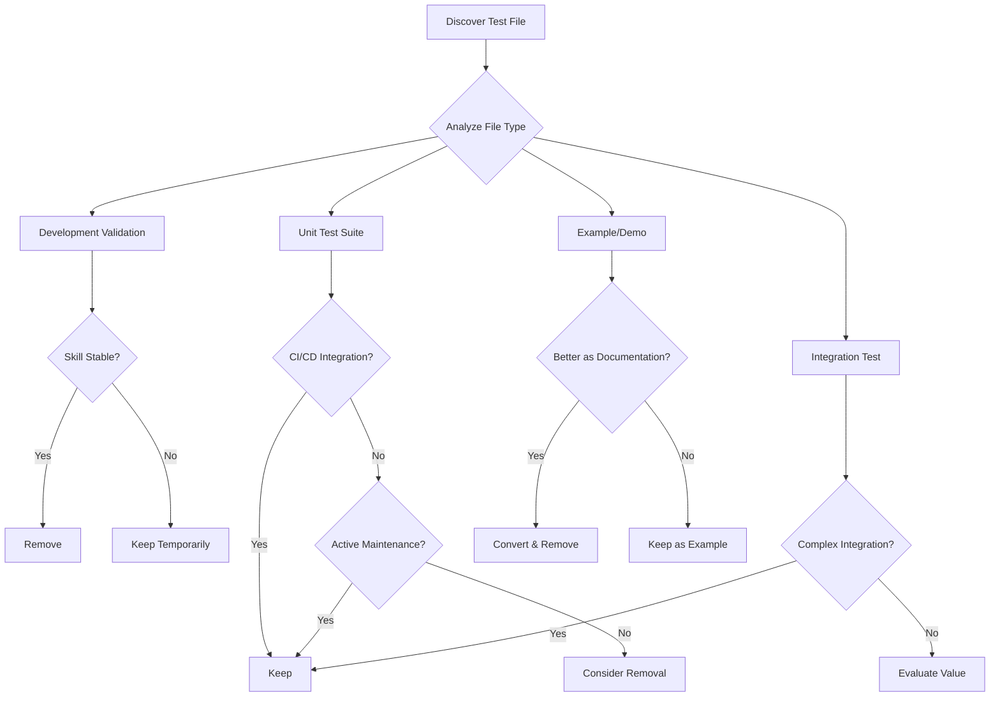

# Test File Management Guide

This guide provides best practices for managing test files within skills, including when to create, keep, and remove test files to maintain clean and efficient skill directories.

## Core Principles

### 1. Skill-as-Product Mindset
- Skills are **production artifacts**, not development projects
- Test files should serve ongoing value, not just development convenience
- Every file in a skill should justify its presence with clear utility

### 2. Context Window Conservation
- Unnecessary files increase cognitive load and token usage
- Test files that aren't actively used waste valuable context space
- Keep only essential resources that directly support skill functionality

### 3. Progressive Disclosure
- Separate development-time testing from user-time functionality
- Development tests belong in source control, not necessarily in distributed skills
- Users typically don't need to see or run internal tests

## Types of Test Files

### 1. Development Validation Tests
**Purpose**: Verify basic functionality during skill development
**Characteristics**:
- Simple import tests (`test_import.py`)
- Environment verification scripts
- Basic functionality smoke tests
**Retention Value**: **Low**
**Recommendation**: Remove after development is complete and skill is stable

### 2. Unit Test Suites
**Purpose**: Ensure code quality and prevent regressions
**Characteristics**:
- Use testing frameworks (unittest, pytest)
- Comprehensive test coverage
- CI/CD integration potential
**Retention Value**: **Medium to High**
**Recommendation**: Keep if actively maintained, otherwise consider removal

### 3. Integration & System Tests
**Purpose**: Verify multi-component interactions
**Characteristics**:
- Test end-to-end workflows
- Require external dependencies or services
- Longer execution time
**Retention Value**: **High** if skill has complex integrations
**Recommendation**: Keep if they provide ongoing value

### 4. Example & Demonstration Tests
**Purpose**: Show users how to use the skill
**Characteristics**:
- Demonstrative rather than verification-focused
- Educational value
- May duplicate documentation
**Retention Value**: **Medium**
**Recommendation**: Consider converting to documentation examples

## Decision Framework



## Best Practices

### File Naming Conventions
```
# Good naming patterns
test_unit_*.py          # Unit tests
test_integration_*.py   # Integration tests
test_e2e_*.py           # End-to-end tests
demo_*.py              # Demonstration scripts
validate_*.py          # Validation scripts (temporary)

# Avoid
temp_test_*.py         # Unclear purpose
test123.py             # Non-descriptive
debug_*.py             # Debugging artifacts
```

### Directory Structure
```
skill-name/
├── SKILL.md
├── scripts/           # Production scripts
├── references/        # Documentation
├── assets/           # Resources
└── tests/            # OPTIONAL: Formal test directory (only if needed)
    ├── unit/         # Unit tests
    ├── integration/  # Integration tests
    └── fixtures/     # Test data
```

**Note**: The `tests/` directory should only be included if:
1. Tests provide ongoing value to users
2. Tests are part of the skill's documented functionality
3. The skill is designed to be extended or modified by users

### When to Create Test Files

**Create test files during development when:**
- Verifying complex functionality
- Testing edge cases
- Ensuring cross-platform compatibility
- Validating integration with external services

**DO NOT create test files for:**
- Simple import statements (Claude can verify imports dynamically)
- Basic syntax checking (use linting instead)
- Temporary debugging (use print statements or logging)

### When to Remove Test Files

**Immediate removal criteria:**
- Single-use validation scripts
- Development environment setup scripts
- Debugging artifacts
- Temporary test harnesses

**Consider removal when:**
- Test files haven't been modified in 6+ months
- Tests no longer run successfully
- Functionality has significantly changed
- Better alternatives exist (e.g., documentation examples)

## Practical Examples

### Example 1: Development Validation Test (Remove)
**File**: `scripts/test_import.py`
```python
# Single-use import validation - REMOVE after skill is stable
import sys
sys.path.insert(0, '.')
try:
    import my_module
    print("Import successful")
except ImportError as e:
    print(f"Import failed: {e}")
```

### Example 2: Unit Test Suite (Keep or Remove Based on Value)
**File**: `tests/test_processor.py`
```python
# Comprehensive unit tests - EVALUATE retention value
import unittest
from processor import DataProcessor

class TestDataProcessor(unittest.TestCase):
    def test_basic_processing(self):
        processor = DataProcessor()
        result = processor.process("test data")
        self.assertEqual(result, "PROCESSED: test data")
    
    # Multiple test methods...
```

### Example 3: Example Script (Convert to Documentation)
**File**: `demo_basic_usage.py`
```python
# Demonstration script - CONSIDER converting to documentation example
from skill_module import main_function

# Example usage
result = main_function(input_data="example")
print(f"Result: {result}")
```
**Better approach**: Move this example to `references/examples.md` as markdown.

## Skill Publication Checklist

Before packaging a skill for distribution, verify:

- [ ] All temporary test files have been removed
- [ ] Remaining test files provide clear user value
- [ ] Test files are properly organized (preferably in `tests/` directory)
- [ ] Documentation references test files appropriately (if kept)
- [ ] No debug prints or development artifacts remain
- [ ] All scripts run successfully in clean environment

## Maintenance Strategy

### Regular Review Schedule
1. **Monthly**: Quick scan for obvious temporary files
2. **Quarterly**: Review test file usage and value
3. **Annually**: Comprehensive skill cleanup

### Automated Detection Script
```python
# Example script to identify potential test files for review
import os
import re

def find_test_files(skill_path):
    test_files = []
    for root, dirs, files in os.walk(skill_path):
        for file in files:
            if (re.search(r'(test|demo|debug|temp|validate)', file.lower()) 
                and file.endswith('.py')):
                rel_path = os.path.relpath(os.path.join(root, file), skill_path)
                test_files.append(rel_path)
    return test_files
```

## References

- [Python unittest documentation](https://docs.python.org/3/library/unittest.html)
- [Skill Creator Main Guide](../SKILL.md)
- [Workflow Patterns](./workflows.md)
- [Output Patterns](./output-patterns.md)
