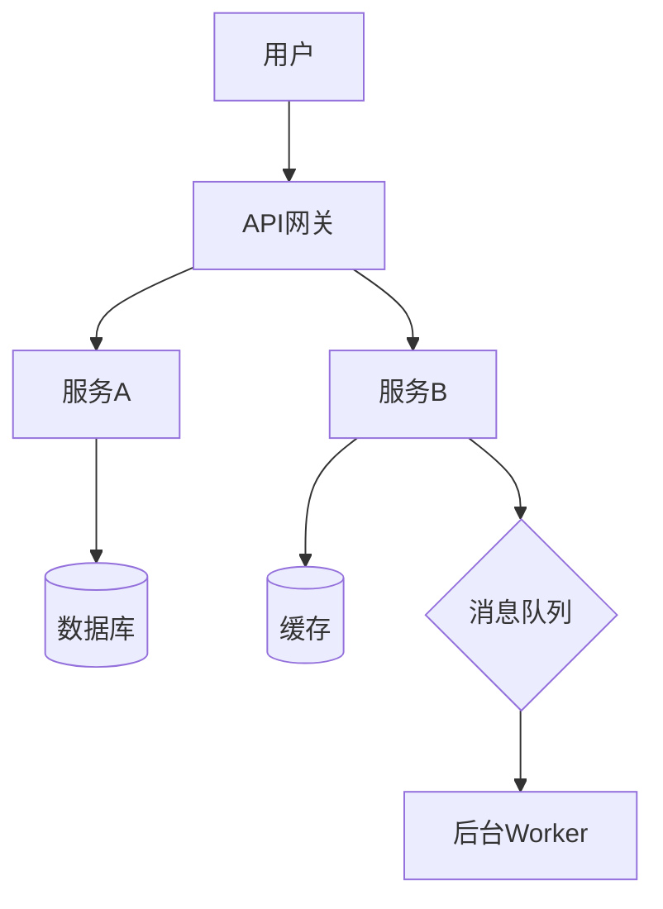
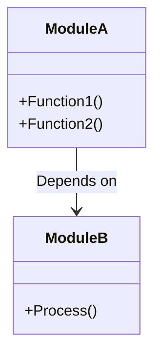
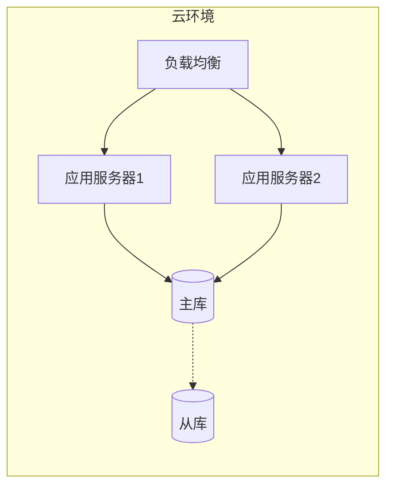

# 🏗️ 系统架构设计文档

# [系统名称]

**[版本号] | [日期]**

---

## 1. 简介（Introduction）

### 1.1 系统目标
[简要描述系统的核心目标、解决的问题以及预期的业务价值。]

### 1.2 范围
[界定系统包含的功能模块以及不包含的部分。]

### 1.3 核心约束
- **技术约束**：[如：必须使用Python 3.10+, 必须部署在AWS等]
- **业务约束**：[如：必须符合GDPR合规, 响应时间<200ms等]

---

## 2. 架构概览（Architecture Overview）

### 2.1 高层架构图（High-Level Architecture）

### 2.2 核心组件说明
| 组件名称 | 职责描述 | 技术选型 |
|----------|----------|----------|
| [组件1] | [描述] | [技术栈] |
| [组件2] | [描述] | [技术栈] |
| [组件3] | [描述] | [技术栈] |

### 2.3 设计原则
- [原则1，例如：高内聚低耦合]
- [原则2，例如：水平扩展优先]

---

## 3. 详细架构设计（Detailed Architecture）

### 3.1 模块视图（Module View）
[描述系统内部各模块的划分及其依赖关系]

### 3.2 数据架构（Data Architecture）
- **数据流向**：[描述数据如何在系统中流动]
- **存储方案**：
    - **关系型数据**：[Schema设计概要]
    - **非关系型数据**：[Key-Value/Document结构]
    - **文件存储**：[对象存储策略]

### 3.3 接口设计（Interface Design）
- **API风格**：[RESTful / GraphQL / gRPC]
- **鉴权机制**：[OAuth2 / JWT / API Key]
- **关键接口定义**：
    - `GET /resource` : [描述]
    - `POST /resource` : [描述]

---

## 4. 非功能性设计（Non-Functional Requirements）

### 4.1 性能（Performance）
- **吞吐量**：[预期QPS/TPS]
- **延迟**：[P95/P99延迟目标]
- **并发**：[支持的最大并发用户数]

### 4.2 可靠性与可用性（Reliability & Availability）
- **SLA目标**：[例如：99.9%]
- **容灾策略**：[多活/主备/冷备]
- **故障恢复**：[自动重试/降级/熔断机制]

### 4.3 安全性（Security）
- **数据安全**：[加密存储/传输加密]
- **访问控制**：[RBAC/ABAC]
- **网络安全**：[防火墙/WAF/VPC隔离]

### 4.4 可观测性（Observability）
- **日志（Logging）**：[日志规范与收集]
- **监控（Monitoring）**：[关键指标监控]
- **追踪（Tracing）**：[分布式链路追踪]

---

## 5. 部署架构（Deployment Architecture）

- **环境规划**：[Dev / Test / Staging / Prod]
- **CI/CD流程**：[构建、测试、部署流水线]
- **容器化与编排**：[Docker / Kubernetes配置]

---

## 6. 技术债务与风险（Technical Debt & Risks）

| 风险/债务 | 影响 | 缓解措施 |
|-----------|------|----------|
| [风险1] | [描述] | [方案] |
| [风险2] | [描述] | [方案] |

---

## 7. 附录（Appendix）

- **参考文档**：[链接]
- **术语表**：[术语定义]

---
*文档维护者：[姓名]*