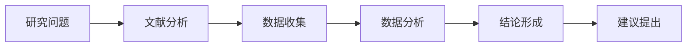
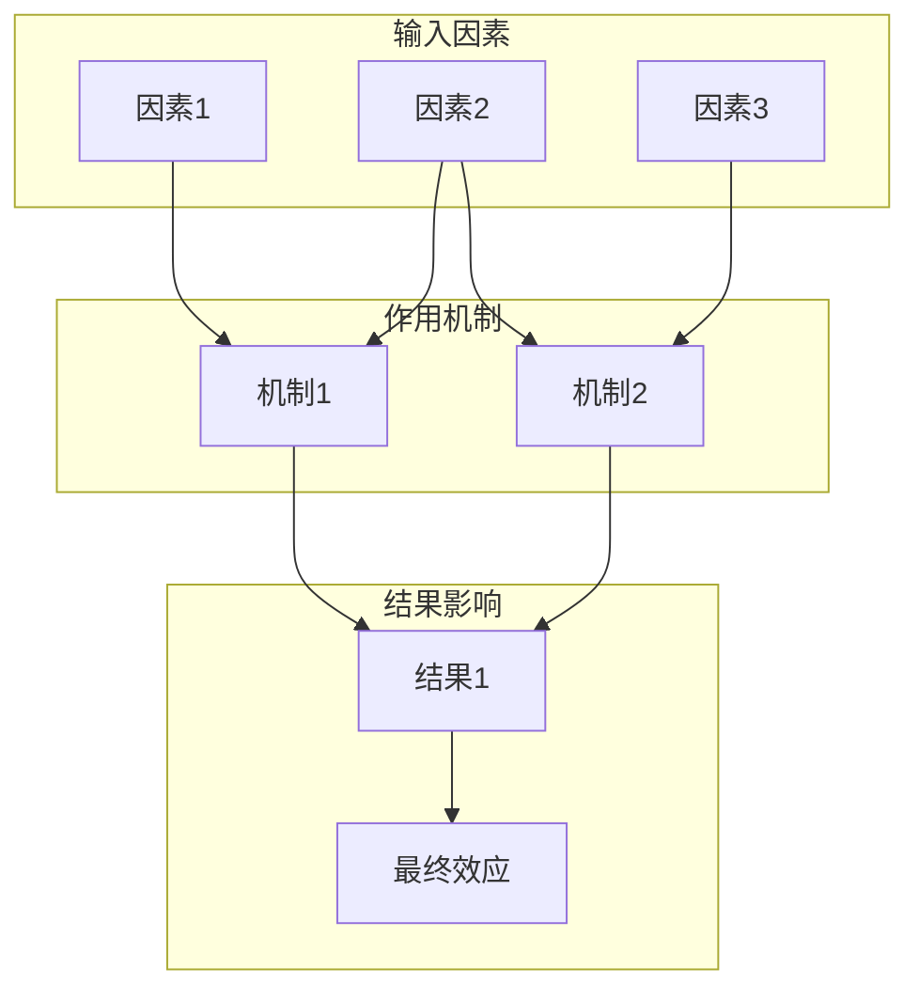
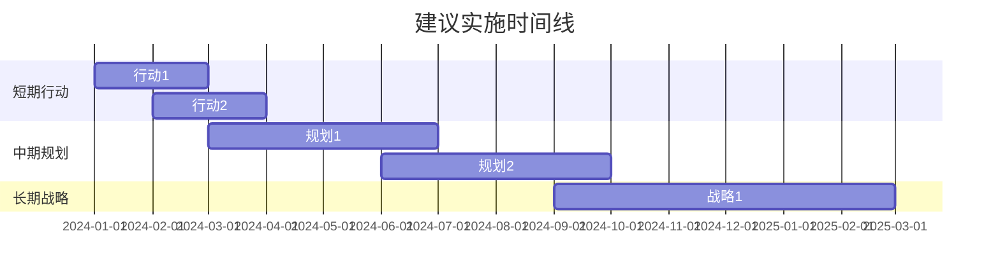

# 📊 研究报告模板

# [研究主题]

**[副标题：核心研究问题或研究视角]**

---

## 摘要（Abstract）

> **研究目的**：[简要说明本研究要解决的核心问题]
>
> **研究方法**：[采用的研究方法和数据来源]
>
> **主要发现**：[2-3个核心发现的概括]
>
> **结论**：[核心结论和建议的简要陈述]

**关键数据摘要**：
| 指标 | 数值 | 来源 | 时间 |
|------|------|------|------|
| [指标1] | [数值] | [来源] | [时间] |
| [指标2] | [数值] | [来源] | [时间] |
| [指标3] | [数值] | [来源] | [时间] |

**关键词**：[关键词1]；[关键词2]；[关键词3]；[关键词4]；[关键词5]

---

## 1. 引言（Introduction）

### 1.1 研究背景

[描述研究主题的宏观背景、行业现状和发展趋势。说明该主题为何重要，以及当前面临的主要挑战或机遇。]

### 1.2 研究问题

本研究旨在回答以下核心问题：

1. **主要研究问题**：[明确陈述本研究要回答的核心问题]
2. **子问题1**：[细化的具体问题]
3. **子问题2**：[细化的具体问题]

### 1.3 研究意义

- **理论意义**：[本研究对该领域理论发展的贡献]
- **实践意义**：[本研究对实际应用的指导价值]

### 1.4 研究范围与边界

| 维度 | 范围界定 |
|------|----------|
| 时间范围 | [研究涵盖的时间段] |
| 地域范围 | [研究涉及的地区/市场] |
| 对象范围 | [研究聚焦的主体/领域] |
| 排除项 | [明确不在本研究讨论范围内的内容] |

---

## 2. 文献综述（Literature Review）

### 2.1 理论基础

[介绍与研究主题相关的核心理论和概念框架，包括：]

- **核心概念定义**：[对关键术语的学术定义和本研究的操作性定义]
- **理论框架**：[支撑本研究的主要理论]

### 2.2 现有研究回顾

| 研究方向 | 主要观点 | 代表性研究 | 局限性 |
|----------|----------|------------|--------|
| [方向1] | [核心观点] | [作者/机构, 年份] | [不足] |
| [方向2] | [核心观点] | [作者/机构, 年份] | [不足] |
| [方向3] | [核心观点] | [作者/机构, 年份] | [不足] |

### 2.3 研究空白

基于现有文献分析，本研究识别出以下空白：

1. [现有研究未充分探讨的领域1]
2. [现有研究未充分探讨的领域2]
3. [本研究将如何填补这些空白]

---

## 3. 研究方法（Methodology）

### 3.1 研究设计

### 3.2 数据来源

| 数据类型 | 来源 | 可靠性评估 | 时效性 |
|----------|------|------------|--------|
| 一级数据 | [官方文档/学术论文/白皮书] | ⭐⭐⭐⭐⭐ 高 | [截止日期] |
| 二级数据 | [权威媒体/行业报告] | ⭐⭐⭐⭐ 中高 | [截止日期] |
| 三级数据 | [社区讨论/用户反馈] | ⭐⭐⭐ 中（交叉验证） | [截止日期] |

### 3.3 分析方法

- **定性分析**：[采用的定性分析方法]
- **定量分析**：[采用的定量分析方法，如有]
- **对比分析**：[横向/纵向对比的维度和标准]

---

## 4. 研究发现（Findings）

### 4.1 发现一：[发现主题]

#### 4.1.1 核心洞察

> **关键发现**：[一句话总结该发现]

[详细阐述该发现的具体内容]

#### 4.1.2 数据支撑

| 证据类型 | 具体内容 | 来源 |
|----------|----------|------|
| 统计数据 | [具体数值和趋势] | [来源, 时间] |
| 案例证据 | [具体案例描述] | [来源, 时间] |
| 专家观点 | [专家或权威机构的看法] | [来源, 时间] |

#### 4.1.3 深度分析

[对该发现的原因分析、机制解读和影响评估]

---

### 4.2 发现二：[发现主题]

[采用与4.1相同的结构...]

---

### 4.3 发现三：[发现主题]

[采用与4.1相同的结构...]

---

### 4.4 比较分析

#### 4.4.1 多维度对比矩阵

| 对比维度 | 选项A | 选项B | 选项C | 评估说明 |
|:--------:|:-----:|:-----:|:-----:|:--------:|
| **维度1** | ⭐⭐⭐⭐⭐ | ⭐⭐⭐ | ⭐⭐⭐⭐ | [评估依据] |
| **维度2** | ✅ 完全支持 | ⚠️ 部分支持 | ❌ 不支持 | [评估依据] |
| **维度3** | [数据A] | [数据B] | [数据C] | [评估依据] |
| **维度4** | [特征A] | [特征B] | [特征C] | [评估依据] |
| **综合评分** | [分数] | [分数] | [分数] | [总体评价] |

#### 4.4.2 对比结论

[基于对比分析得出的关键结论]

---

## 5. 讨论（Discussion）

### 5.1 研究发现的解读

[将研究发现置于更宏观的背景下进行解读，讨论其含义和重要性]

### 5.2 与现有研究的对比

| 比较点 | 本研究发现 | 现有研究观点 | 差异分析 |
|--------|------------|--------------|----------|
| [观点1] | [本研究结论] | [已有结论] | [一致/补充/修正] |
| [观点2] | [本研究结论] | [已有结论] | [一致/补充/修正] |

### 5.3 机制分析

[对图中各环节的详细说明和因果关系分析]

### 5.4 SWOT分析

| 维度 | 分析内容 |
|:----:|:---------|
| **S - 优势** | • [优势1] • [优势2] • [优势3] |
| **W - 劣势** | • [劣势1] • [劣势2] • [劣势3] |
| **O - 机遇** | • [机遇1] • [机遇2] • [机遇3] |
| **T - 威胁** | • [威胁1] - 风险等级：🔴高/🟡中/🟢低 • [威胁2] - 风险等级：🔴高/🟡中/🟢低 |

---

## 6. 结论（Conclusion）

### 6.1 主要结论

基于本研究的系统分析，得出以下核心结论：

| 序号 | 结论 | 证据支撑度 |
|:----:|:-----|:----------:|
| 1 | [结论一的明确陈述] | ⬤⬤⬤⬤⬤ 强 |
| 2 | [结论二的明确陈述] | ⬤⬤⬤⬤○ 较强 |
| 3 | [结论三的明确陈述] | ⬤⬤⬤○○ 中等 |

### 6.2 回答研究问题

| 研究问题 | 答案摘要 |
|----------|----------|
| 主要研究问题 | [简明扼要的回答] |
| 子问题1 | [简明扼要的回答] |
| 子问题2 | [简明扼要的回答] |

---

## 7. 建议（Recommendations）

### 7.1 策略建议矩阵

| 时间维度 | 建议内容 | 优先级 | 预期效果 |
|:--------:|:---------|:------:|:---------|
| **短期** (0-3月) | 1. [具体可执行建议] 2. [具体可执行建议] | 🔴 高 | [预期成效] |
| **中期** (3-12月) | 1. [策略性建议] 2. [策略性建议] | 🟡 中 | [预期成效] |
| **长期** (1年+) | 1. [战略性建议] 2. [战略性建议] | 🟢 规划 | [预期成效] |

### 7.2 场景化决策指南

| 场景/需求 | 推荐选择 | 推荐理由 | 注意事项 |
|:---------:|:--------:|:---------|:---------|
| [场景1] | [选项] | [选择该选项的逻辑依据] | [实施时的关键注意点] |
| [场景2] | [选项] | [选择该选项的逻辑依据] | [实施时的关键注意点] |
| [场景3] | [选项] | [选择该选项的逻辑依据] | [实施时的关键注意点] |

### 7.3 实施路径图

---

## 8. 研究局限与未来方向（Limitations & Future Research）

### 8.1 研究局限性

| 局限性类型 | 具体说明 | 影响评估 |
|:----------:|:---------|:--------:|
| 数据局限 | [具体说明] | 🟡 中等 |
| 方法局限 | [具体说明] | 🟢 较低 |
| 范围局限 | [具体说明] | 🟡 中等 |
| 时效局限 | [数据截止日期及可能的变化] | 🔴 需关注 |

### 8.2 未来研究方向

1. **[研究方向1]**：[该方向的研究价值和可能的研究问题]
2. **[研究方向2]**：[该方向的研究价值和可能的研究问题]
3. **[研究方向3]**：[该方向的研究价值和可能的研究问题]

### 8.3 持续关注建议

> ⚡ **关键不确定性**：以下因素可能影响本研究结论的有效性，建议持续监测
>
> - [不确定因素1]：[原因和监测建议]
> - [不确定因素2]：[原因和监测建议]

---

## 参考文献（References）

### 学术来源

1. [作者]. ([年份]). [文献标题]. *[期刊/出版物名称]*, [卷号]([期号]), [页码]. [DOI/链接]
2. [作者]. ([年份]). [文献标题]. *[期刊/出版物名称]*, [卷号]([期号]), [页码]. [DOI/链接]

### 行业报告

1. [机构名称]. ([年份]). *[报告标题]*. [链接]
2. [机构名称]. ([年份]). *[报告标题]*. [链接]

### 新闻与媒体

1. [作者/媒体]. ([日期]). [文章标题]. *[媒体名称]*. [链接]
2. [作者/媒体]. ([日期]). [文章标题]. *[媒体名称]*. [链接]

### 官方文档

1. [官方机构]. ([日期]). [文档标题]. [链接]
2. [官方机构]. ([日期]). [文档标题]. [链接]

---

## 附录（Appendix）

### 附录A：术语表

| 术语 | 定义 |
|------|------|
| [术语1] | [定义说明] |
| [术语2] | [定义说明] |

### 附录B：补充数据

[如有详细数据表格、调查问卷等补充材料，放置于此]

### 附录C：研究声明

> **免责声明**：本研究基于截至 [日期] 的公开信息进行分析，所有结论仅供参考。研究者已尽力确保信息的准确性和完整性，但不对因使用本研究结论而产生的任何后果承担责任。建议读者结合实际情况和最新信息做出决策。

---

*报告完成日期：[日期]*
*研究执行：Proteus Deep Research Agent*