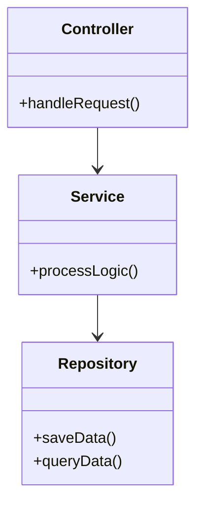
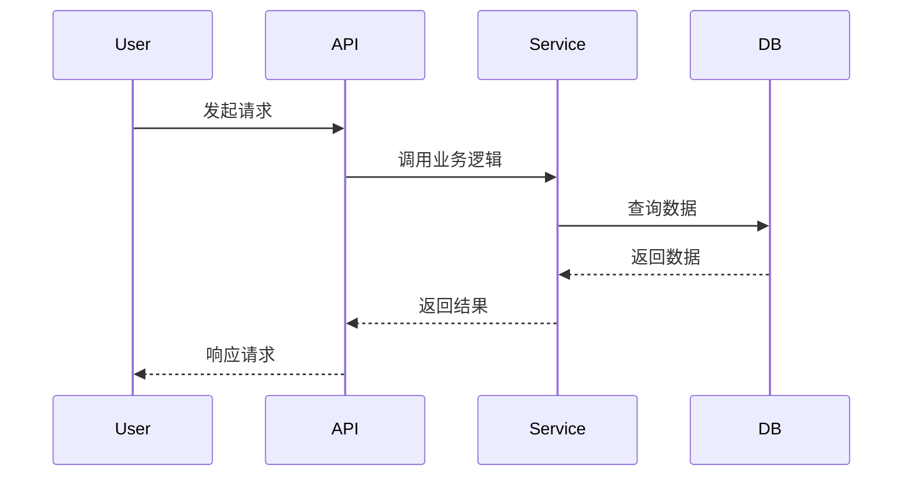
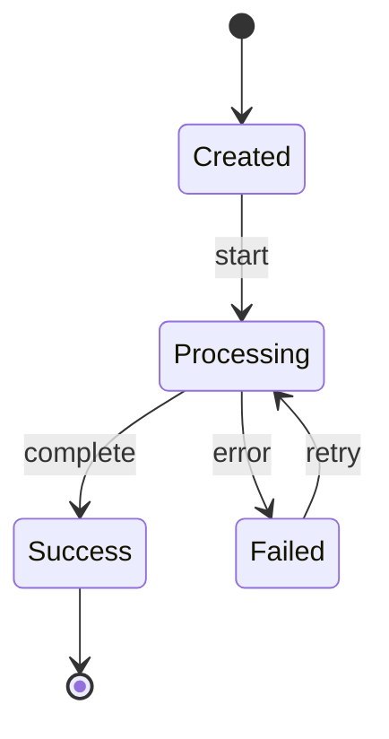

# 📝 详细设计文档

# [模块/功能名称]

**[版本号] | [日期]**

---

## 1. 引言（Introduction）

### 1.1 目的
[说明编写本详细设计文档的目的，主要面向开发人员和测试人员。]

### 1.2 范围
[明确本文档覆盖的具体功能点或模块范围。]

### 1.3 依赖
[列出该模块依赖的其他模块、服务或库。]

---

## 2. 总体设计（High-Level Design）

### 2.1 模块结构
[描述模块内部的类、包或组件结构。]



### 2.2 核心流程图
[描述核心业务逻辑的执行流程。]



---

## 3. 接口设计（Interface Design）

### 3.1 内部接口
- **接口名称**：[方法名/函数名]
- **输入参数**：
    | 参数名 | 类型 | 必填 | 说明 |
    |--------|------|------|------|
    | [param1] | [type] | 是/否 | [desc] |
- **返回值**：[类型及说明]
- **异常抛出**：[可能抛出的异常类型]

### 3.2 外部接口（API）
- **URL**: `[METHOD] /path/to/resource`
- **请求头**：[Headers]
- **请求体**：
```json
{
  "field1": "value1",
  "field2": 123
}
```
- **响应体**：
```json
{
  "code": 200,
  "data": { ... },
  "message": "success"
}
```

---

## 4. 数据结构设计（Data Structure Design）

### 4.1 数据库设计（Database Schema）

#### 表名：[Table Name]
| 字段名 | 类型 | 长度 | 主键 | 非空 | 默认值 | 说明 |
|--------|------|------|------|------|--------|------|
| id | bigint | 20 | Y | Y | - | 主键ID |
| name | varchar | 64 | N | Y | - | 名称 |
| status | tinyint | 4 | N | Y | 0 | 状态 |

### 4.2 缓存设计（Cache Design）
- **Key模式**：`prefix:entity:id`
- **Value结构**：[JSON/String/Hash]
- **过期策略**：[TTL时间/LRU]

### 4.3 消息队列设计（Message Queue）
- **Topic/Exchange**：[名称]
- **Payload格式**：
```json
{
  "eventId": "uuid",
  "timestamp": 1678888888,
  "data": { ... }
}
```

---

## 5. 核心逻辑与算法（Core Logic & Algorithms）

### 5.1 [功能点1] 实现逻辑
1. [步骤1]
2. [步骤2]
    - 如果 [条件A]，则 [操作X]
    - 否则 [操作Y]
3. [步骤3]

### 5.2 状态机（State Machine）
[如果涉及复杂状态流转，使用状态机图描述]



---

## 6. 错误处理与日志（Error Handling & Logging）

### 6.1 异常处理
- [异常类型1]：[处理策略，如重试、回滚、报警]
- [异常类型2]：[处理策略]

### 6.2 日志规范
- **关键日志点**：[列出必须打日志的地方，如入口、出口、异常点]
- **日志级别**：[INFO/WARN/ERROR的使用标准]

---

## 7. 测试计划（Test Plan）

### 7.1 单元测试
- **覆盖率要求**：[例如：行覆盖率 > 80%]
- **核心测试用例**：
    - [Case 1]: [输入] -> [预期输出]
    - [Case 2]: [输入] -> [预期输出]

### 7.2 集成测试
- [测试场景描述]

---

## 8. 安全与性能考量（Security & Performance）

- **SQL注入防护**：[使用预编译语句/ORM]
- **XSS/CSRF防护**：[框架机制/Token]
- **性能优化**：[索引优化/缓存策略/异步处理]

---
*文档作者：[姓名]*