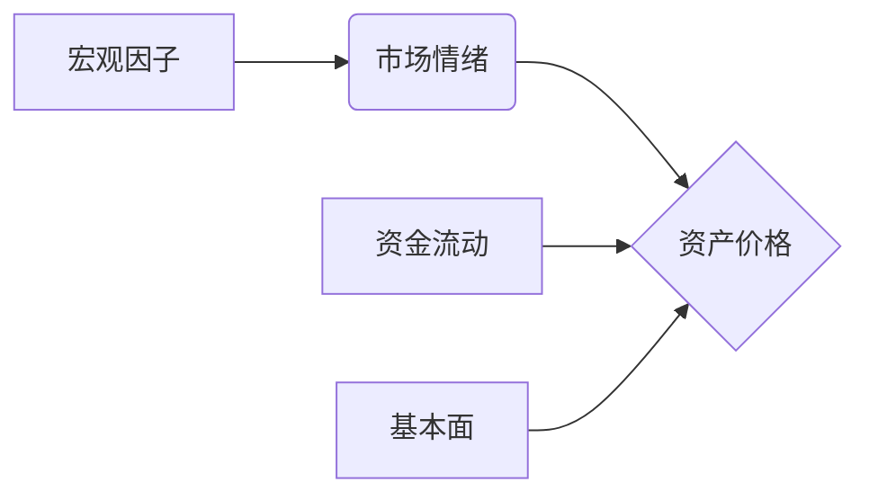
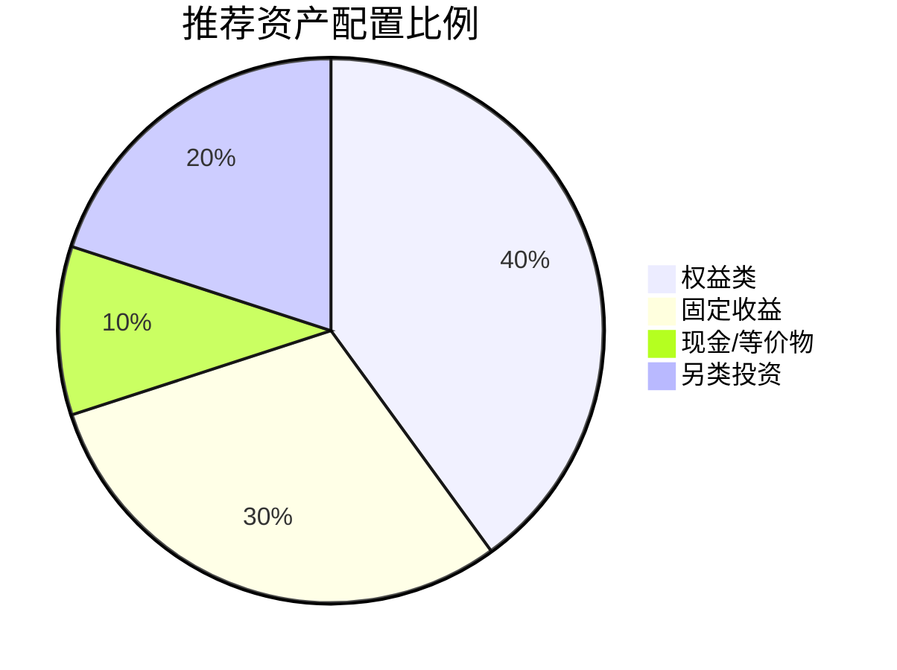

# 📈 金融趋势研究报告

# [报告主题/市场领域]

**[副标题：核心趋势或投资视角]**

---

## 摘要（Executive Summary）

> **市场概况**：[简要描述当前市场所处的阶段和核心特征]
>
> **关键趋势**：[列出2-3个主导市场的核心趋势]
>
> **风险提示**：[最主要的一两个风险点]
>
> **投资建议**：[核心策略方向]

**核心市场指标摘要**：
| 指标名称 | 当前数值 | 变动(%) | 趋势信号 | 备注 |
|----------|----------|---------|----------|------|
| [指标1] | [数值] | [变动] | 🟢看涨 / 🔴看跌 / 🟡中性 | [简评] |
| [指标2] | [数值] | [变动] | 🟢看涨 / 🔴看跌 / 🟡中性 | [简评] |
| [指标3] | [数值] | [变动] | 🟢看涨 / 🔴看跌 / 🟡中性 | [简评] |

---

## 1. 宏观经济环境（Macroeconomic Environment）

### 1.1 全球/区域经济概况
[分析GDP增长、通胀率（CPI/PPI）、就业数据等核心宏观指标。]

### 1.2 货币与财政政策
- **央行政策**：[利率决议、流动性操作、政策指引]
- **财政政策**：[政府支出、税收政策、刺激计划]

### 1.3 地缘政治与监管
[分析可能影响市场的地缘政治事件或监管政策变化。]

---

## 2. 市场趋势分析（Market Trend Analysis）

### 2.1 资产类别表现

#### 2.1.1 权益市场（Equities）
- **整体表现**：[主要指数走势分析]
- **估值水平**：[PE/PB等估值指标分析]
- **资金流向**：[机构/散户资金动向]

#### 2.1.2 固定收益（Fixed Income）
- **收益率曲线**：[国债收益率曲线形态及含义]
- **信用利差**：[投资级/高收益债利差变化]

#### 2.1.3 大宗商品与外汇（Commodities & FX）
- **关键商品**：[黄金、原油等关键商品走势]
- **汇率波动**：[主要货币对走势及影响]

### 2.2 关键图表分析

> *[在此处插入关键技术分析图表或数据可视化图表]*
> *图表说明：[对图表的解读]*

---

## 3. 行业/板块深度解析（Sector Analysis）

### 3.1 领涨/领跌板块
| 板块 | 涨跌幅 | 驱动因素 | 持续性评估 |
|------|--------|----------|------------|
| [板块A] | [数值] | [原因] | ⭐⭐⭐ |
| [板块B] | [数值] | [原因] | ⭐⭐ |

### 3.2 焦点行业研究：[行业名称]
- **行业逻辑**：[行业增长的核心驱动力]
- **竞争格局**：[主要玩家及市场份额变化]
- **催化剂**：[近期可能触发估值变化的事件]

---

## 4. 风险评估（Risk Assessment）

### 4.1 风险矩阵

| 风险因素 | 发生概率 | 潜在影响 | 风险等级 | 应对措施 |
|----------|:--------:|:--------:|:--------:|----------|
| [风险1] | 高/中/低 | 高/中/低 | 🔴 高危 | [对冲/规避策略] |
| [风险2] | 高/中/低 | 高/中/低 | 🟡 中等 | [监控/减仓] |
| [风险3] | 高/中/低 | 高/中/低 | 🟢 低 | [接受/忽略] |

### 4.2 尾部风险情景
[描述可能发生的“黑天鹅”或“灰犀牛”事件及其潜在后果。]

---

## 5. 投资策略与建议（Investment Strategy）

### 5.1 资产配置建议

- **超配（Overweight）**：[资产/板块] - [理由]
- **标配（Neutral）**：[资产/板块] - [理由]
- **低配（Underweight）**：[资产/板块] - [理由]

### 5.2 具体交易机会
1. **[机会1]**：[买入/卖出] [标的]，目标价 [价格]，止损价 [价格]。
   - *逻辑*：[简述交易逻辑]
2. **[机会2]**：[买入/卖出] [标的]，目标价 [价格]，止损价 [价格]。
   - *逻辑*：[简述交易逻辑]

---

## 6. 结论与展望（Conclusion & Outlook）

[总结核心观点，对未来市场走势进行展望。]

---

## 附录：数据来源与声明

- **数据来源**：[Bloomberg, Wind, 官方统计局, etc.]
- **免责声明**：本报告仅供参考，不构成投资建议。市场有风险，投资需谨慎。

---
*报告生成时间：[日期]*
*分析师/Agent：Proteus Financial Agent*